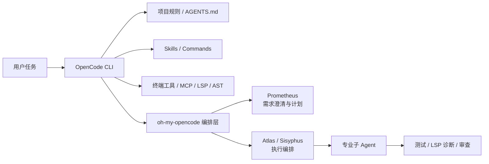

# OpenCode
## 知识点入口

- 本模块先看宏观流程，再看文章：[流程化知识点总览](knowledge/02_Agent与AI工程/0205_AI编程工具/OpenCode/核心知识点/流程化知识点总览.md)。
- 新文章必须先归入流程节点，再判断是补充、冲突、不同层次还是降权。
- `文章/` 只保留原文锚点，长期知识必须沉淀到 `核心知识点/`。

## 技术定位

| 项 | 内容 |
|---|---|
| 技术名 | OpenCode |
| 一级类目 | Agent 与 AI 工程 |
| 二级类目 | AI 编程工具 |
| 技术本体 | 面向软件工程任务的终端 Coding Agent 工具，可通过命令、Skill、MCP、LSP/AST 工具和多 Agent 编排进入开发流程 |
| 全局架构位置 | 位于终端 Agent 层，连接本地仓库、命令行工具、模型提供方、项目规则和扩展框架 |
| 主要使用者 | 工程师、平台工程师、AI 编程工具重度使用者 |
| 主要产出 | 代码修改、计划执行结果、Skill、Agent 编排配置、验证记录 |

## 官方锚点

- 官网：后续补证
- GitHub：后续补证
- 官方文档：后续补证
- 架构文档：后续补证

## 架构图

## 核心模块

| 模块 | 职责 | 重点问题 |
|---|---|---|
| CLI Agent | 在终端中执行代码理解、修改和验证 | 与 IDE Agent 的边界是什么 |
| Skill / Command | 把流程、领域知识和操作封装为可复用能力 | Skill 是否过大、是否与规则冲突 |
| oh-my-opencode | 为 OpenCode 增加多 Agent 编排、模型路由、Hooks 和 LSP/AST 能力 | 编排收益是否大于配置和治理成本 |
| Prometheus | 负责需求澄清、计划和风险确认 | 是否避免 Agent 过早编码 |
| Atlas / Sisyphus | 负责执行计划、并行委派和失败恢复 | 是否有验证和回滚机制 |
| LSP / AST 工具 | 提供确定性代码理解和重构能力 | 是否比纯文本替换更可靠 |

## 上下游

| 方向 | 对象 | 关系 |
|---|---|---|
| 上游 | 用户需求、AGENTS.md、计划文档、现有代码 | 提供目标、约束和代码上下文 |
| 下游 | 代码变更、测试结果、提交、复盘文档 | 作为工程交付物和后续记忆来源 |
| 依赖 | 模型提供方、MCP、LSP、AST-Grep、终端命令 | 支撑搜索、执行、验证和编排 |

## 横向对标

| 对标技术 | 对标点 | 优势 | 劣势 | 使用判断 |
|---|---|---|---|---|
| Claude Code | 终端 Coding Agent | OpenCode 更强调开放工具链和多模型组合 | 生态成熟度、官方能力边界需后续补证 | 需要开放编排和多模型时关注 OpenCode |
| Cursor | IDE Agent | OpenCode 更适合终端自动化和脚本化 | 缺少 IDE 原生交互连续性 | 交互式编辑选 Cursor，命令式执行选 OpenCode |
| Codex CLI | 终端 Agent | OpenCode 生态更强调 Skill 与 oh-my-opencode 编排 | 具体权限、安全、稳定性需实测 | 仓库级自动化任务可对标 |
| OpenSpec / Spec Kit | 规范驱动流程 | OpenCode 更偏执行入口 | 规范治理能力不应完全靠 Agent 自觉 | 可组合使用：规范先行，OpenCode 执行 |

## 已沉淀核心知识点

| 主题 | 文件 | 问题指纹 | 解决什么问题 | 认知增量 |
|---|---|---|---|---|
| OpenCode 与 oh-my-opencode 编排边界 | [OpenCode与oh-my-opencode编排边界](核心知识点/OpenCode与oh-my-opencode编排边界.md) | OpenCode + 终端 Agent + Categories/Skills/Prometheus/Atlas + 多 Agent 编排与失败恢复 + 配置治理边界 | OpenCode 如何从单 Agent 执行进入工程编排 | 把“开源版 Cursor”校准为“终端 Agent 本体 + 编排增强层” |

## 后续追查

- 关键词：OpenCode、oh-my-opencode、Sisyphus、Prometheus、Atlas、LSP、AST-Grep、Skill。
- 待读资料：后续补证 OpenCode 官方文档、oh-my-opencode GitHub、版本兼容性和权限模型。
- 待补实验：本地用一个小仓库验证 Skill 调用、LSP 重命名、失败恢复和计划执行日志。
