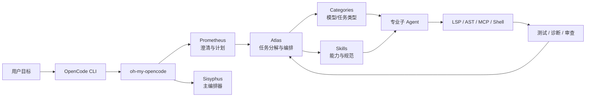

# OpenCode 与 oh-my-opencode 编排边界

## 原文锚点

- 本地文件：
  - [OpenCode + oh-my-opencode：开箱即用的 AI 智能体协作框架，像人类开发者一样编码.md](../文章/OpenCode + oh-my-opencode：开箱即用的 AI 智能体协作框架，像人类开发者一样编码.md)
  - [oh-my-opencode 3.0.0 深入解析：从单代理到编排革命的演进.md](../文章/oh-my-opencode 3.0.0 深入解析：从单代理到编排革命的演进.md)
  - [玩转 OpenCode(七)：Oh-My-OpenCode 完全指南.md](../文章/玩转 OpenCode%28七%29：Oh-My-OpenCode 完全指南.md)
  - [用好OpenCode：定制符合自己习惯的Skill（三）.md](../文章/用好OpenCode：定制符合自己习惯的Skill（三）.md)
  - [用好OpenCode：增量开发（七）.md](../文章/用好OpenCode：增量开发（七）.md)
- 原文链接：见各本地文件 frontmatter；本轮不联网校验。
- 关键段落：
  - `OpenCode + oh-my-opencode`：OpenCode 本体、Sisyphus 主编排器、后台 Agent、LSP/AST 工具、MCP、Hooks。
  - `oh-my-opencode 3.0.0`：Categories + Skills、Prometheus、Atlas、验证恢复和模型路由。
  - `玩转 OpenCode(七)`：Sisyphus、Oracle、Prometheus、Atlas、Ultrawork、Ralph Loop、命令系统、Hooks、LSP/AST。
  - `定制符合自己习惯的 Skill`：执行计划 Skill 改造、三方对齐、测试门禁和本地收尾。
  - `增量开发`：定架构、拆任务、给参照、严审查。
- 关键图：部分文章在文章来源中标记原图缺失，正文没有可用图片路径；本笔记使用 Mermaid 重建简化架构。

## 图片处理

| 图片 | 类型 | 是否保留 | 理由 | 处理方式 |
|---|---|---|---|---|
| OpenCode / oh-my-opencode 编排结构 | 架构图 | 重建 | 原文以文字和配置说明主编排器、规划者、执行者、工具层关系，缺少可用图片路径 | Mermaid 重建 |
| OMO 命令和 Agent 列表 | 说明图 | 删除 | 主要是命令清单，不能直接解释机制 | 不进入核心知识点 |
| 安装配置终端截图 | 配图 / 截图 | 删除 | 对机制理解帮助有限，且本轮不执行安装 | 不进入核心知识点 |

## 一句话结论

OpenCode 不应只被理解成“开源版 Cursor”；本轮值得吸收的是它通过 oh-my-opencode 把终端 Agent 扩展成规划、并行委派、Skill 注入、工具增强和失败恢复的编排系统。

## 用户相关性判断

| 项 | 内容 |
|---|---|
| 用户当前认知层级 | OpenCode / Cursor / AI 编程工具 L2 |
| 认知成熟度 | draft |
| 阅读投入建议 | 精读 |
| 阅读投入理由 | 文章能补 OpenCode 与 Claude Code、Cursor 的工作流边界，尤其是多 Agent 编排、Skill 定制和 LSP/AST 工具化；但安装、版本、官方能力和性能数字未补证 |
| 对用户的新信息 | oh-my-opencode 是 OpenCode 之上的编排增强层，核心不是多一个命令，而是把规划者、执行协调者、专业子 Agent 和验证恢复分层 |
| 问题指纹 | OpenCode + 终端 Agent + Categories/Skills/Prometheus/Atlas + 多 Agent 编排与失败恢复 + 配置治理边界 |
| 排重判断 | 新建。重复的 `_1` 原文与主文件完全相同，只记录为排重冲突，不单独沉淀 |
| 置信度 | 中 |

## 认知校准点

| 校准点 | 文章观点/信息 | 与用户认知或价值观的关系 | 处理建议 |
|---|---|---|---|
| OpenCode 本体和 oh-my-opencode 增强层要分开 | OpenCode 是终端 Agent 入口，oh-my-opencode 提供 Sisyphus、Prometheus、Atlas、Categories、Skills 等编排能力 | 防止把插件层能力误写成 OpenCode 本体能力 | 技术定位写成“OpenCode + 编排增强层”，官网/版本后续补证 |
| 多 Agent 编排不是越多越好 | 文章强调并行、专业分工、模型路由，但配置复杂、成本和审计压力也会上升 | 符合用户重边界和工程治理的偏好 | 只有任务可拆、可验证、可恢复时才值得引入编排 |
| Categories + Skills 是组合式能力注入 | Categories 偏任务类型和模型选择，Skills 偏领域知识、流程和工具约束 | 有助于区分 Skill、Agent、模型路由三者 | 后续整理 OpenCode Skill 文章时按“能力封装”排重 |
| Prometheus/Atlas 的价值是分离规划与执行 | Prometheus 负责澄清和计划，Atlas 负责分解、委派、验证、失败恢复 | 校准“Agent 边写边改计划”的风险 | 高风险任务先规划确认，再执行 |
| LSP/AST 工具比纯文本替换更接近工程操作 | 原文强调 `lsp_rename`、引用查找、AST 搜索替换 | 补足 AI 编程工具进入真实代码库的机制边界 | 重构类任务优先关注是否有结构化代码工具 |
| 夸张效率数字需要降权 | 多篇文章出现“速度提升”“成本降低”“输出大幅增加”等数字 | 缺少环境、任务、基线，不能作为长期结论 | 只沉淀机制，不采信数字 |

## 冲突点

| 冲突类型 | 具体表现 | 影响 | 处理 |
|---|---|---|---|
| 原目录冲突 | 多篇 OpenCode 文章原在 `09_其他` 或工程与架构目录 | 会把 AI 编程工具工作流误放到通用工具或工程架构 | 重路由到 Agent 与 AI 工程 / AI 编程工具 / OpenCode |
| 排重冲突 | `oh-my-opencode 3.0.0 ...` 与 `_1` 文件完全相同 | 如果逐篇写会重复沉淀 | 只保留一个原文锚点，重复文件跳过 |
| 标题降权 | “像人类开发者一样”“编排革命”“全职司机”等标题包装较强 | 容易高估能力成熟度 | 降权标题，只保留机制 |
| 证据不足 | 速度、成本、成功率、真实影响多为经验或引用 | 会误导投入判断 | 标为待验证 |
| 实践资讯混杂 | 安装命令、配置截图、角色清单和工程机制混在一起 | 容易写成工具教程 | 只沉淀编排边界、失败恢复和 Skill 定制 |

## 待吸收点

| 分级 | 内容 | 为什么值得吸收 | 后续动作 |
|---|---|---|---|
| 理解 | oh-my-opencode 的有效抽象是规划者、编排者、执行者、工具层、验证层 | 能解释它和单 Agent OpenCode 的差异 | 后续 OpenCode 文章优先归并到该问题指纹 |
| 理解 | Categories + Skills 把“用哪个模型”和“注入什么能力”拆开 | 避免把 Agent 角色硬编码成一堆静态身份 | 后续对比 Claude Code 的 subagent + skills frontmatter |
| 理解 | Atlas 的验证恢复机制本质是把 Agent 执行变成可重试任务 | 这是长任务稳定性的关键 | 后续追查真实失败日志和恢复策略 |
| 记住 | 终端 Agent 适合命令式、批量、脚本化任务；IDE Agent 适合交互式增量开发 | 会反复影响 Cursor / OpenCode / Claude Code 选型 | 写入横向对标 |
| 记住 | 自定义 Skill 的核心不是“让 AI 多知道”，而是补齐业务主流程、三方对齐、测试门禁和收尾策略 | 对用户项目规则和 Skill 沉淀有直接价值 | 后续创建项目 Skill 时按这个清单检查 |
| 实践 | 用一个小仓库验证 OpenCode Skill、LSP 重构、失败恢复日志 | 当前只是文章证据，缺少本地实测 | 后续补证后再升级实践成熟度 |

## 已知可跳过

| 内容 | 跳过理由 |
|---|---|
| 安装命令和版本操作 | 本轮不联网、不安装，且易过时 |
| 角色名称清单 | 名称本身价值低，关键是角色职责和权限边界 |
| 效率和成本百分比 | 缺少基线和可复现实验 |
| 宣传式对比 Cursor、Claude Code | 需要后续官方和实测补证，不能直接采信 |

## 实践门槛

| 门槛 | 判断 | 证据 |
|---|---|---|
| 可运行 | 部分 | 文章给出安装、配置、Skill 目录和命令示例，但本轮未联网安装 |
| 可验证 | 部分 | 文章描述测试、LSP 诊断、失败重试，但未提供本地验收记录 |
| 可排障 | 部分 | 有中途停止、token 高、文档缺失等故障提示，但缺少真实日志 |
| 可迁移 | 是 | Skill 定制、三方对齐、增量开发方法可迁移到用户项目 |
| 结论 | 降为精读 | 机制值得吸收；实践需要后续本地验证和官方补证 |

## 归类判断

| 项 | 内容 |
|---|---|
| 技术本体 | OpenCode 终端 Coding Agent；oh-my-opencode 是其编排增强层 |
| 文章主问题 | 如何让 OpenCode 从单 Agent 执行扩展为多 Agent 协作和计划执行 |
| 使用场景 | 复杂重构、功能开发、增量开发、Skill 定制、终端自动化 |
| 关键词干扰 | Cursor、Claude Code、MCP、LSP、模型路由、成本优化等词会抢分类 |
| 最终归类 | Agent 与 AI 工程 / AI 编程工具 / OpenCode |
| 归类理由 | 主问题是 AI 编程工具在工程流程里的执行和编排能力，不是模型能力或通用 CLI 工具 |

## 技术定位

| 项 | 内容 |
|---|---|
| 技术类型 | 产品 / CLI Agent / 编排框架生态 |
| 所属领域 | Agent 与 AI 工程 |
| 二级类目 | AI 编程工具 |
| 全局架构位置 | 终端 Agent 层和执行编排层 |
| 涉及模块 | CLI、AGENTS.md、Skills、Commands、MCP、LSP、AST、Hooks、多 Agent 编排 |
| 解决问题 | 让 AI 编程任务可规划、可拆分、可并行、可验证、可恢复 |
| 原文局限 | 官方能力、版本状态、安全权限和性能数字均未补证 |
| 我的结论 | 以后关注；适合和 Claude Code、Cursor 作为“终端编排型 AI 编程工具”横向对标 |

## 纵向理解

| 维度 | 判断 |
|---|---|
| 全局架构 | 用户任务进入 OpenCode，oh-my-opencode 将任务交给规划者、编排者和专业子 Agent，并通过 LSP/AST/MCP/终端工具执行 |
| 本文位置 | 本主题只覆盖 OpenCode 编排增强，不覆盖 OpenCode 全部产品能力 |
| 核心机制 | Categories + Skills 组合、Prometheus 深度访谈、Atlas 并行执行与失败恢复、LSP/AST 确定性代码工具 |
| 使用链路 | 需求澄清 -> 计划确认 -> 任务拆分 -> 子 Agent 执行 -> 验证恢复 -> 总结/提交 |
| 前置条件 | 项目有清晰规则、可运行测试、可分解任务、可接受多模型和工具配置成本 |
| 边界 | 小任务、低风险临时修改、没有测试的仓库，不一定值得引入重编排 |

## 横向对标

| 对标技术 | 实现方式 | 优势 | 劣势 | 适合场景 |
|---|---|---|---|---|
| Claude Code | 官方终端 Agent，含项目规则、Hooks、Skill、权限模式 | 生态和权限治理更清晰，官方能力集中 | 多模型开放编排需后续对标 | 高可信本地仓库任务、规则化流程 |
| Cursor | IDE 内 Agent，Plan、Rules、动态上下文 | 编辑器体验强，交互式修改顺 | 终端编排和脚本化不如 CLI 自然 | 前端、IDE 内增量开发 |
| Codex CLI | 终端代码 Agent | 适合自动化代码任务和本地工具链 | 具体 Skill/编排能力需另行对标 | 仓库级修改、命令行工作流 |
| OpenSpec | 规范驱动开发 | 规范和变更记录可追踪 | 不是执行 Agent 本体 | 存量项目规范变更，可与 OpenCode 组合 |
| 传统脚本 / CI | 确定性执行 | 稳定、可审计 | 不能自动理解模糊需求 | 质量门禁和重复操作 |

## 后续追查

- 关键词：OpenCode、oh-my-opencode、Sisyphus、Prometheus、Atlas、Categories、Skills、LSP、AST-Grep。
- 相关技术：Claude Code、Cursor、Codex CLI、OpenSpec、MCP、Hooks。
- 需要补读的文章：
  - 后续补证 OpenCode 官方文档和 GitHub。
  - 后续补证 oh-my-opencode 官方仓库、版本和权限模型。
  - 本地实验：用小仓库验证 Skill 定制、LSP 重命名、失败恢复和执行日志。
