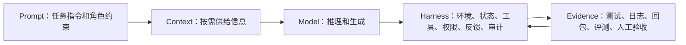

# Harness 边界与演进准则

> 本页只保留长期可复用判断：Harness 不是热词，也不是把 Prompt、工具和流程重新命名；它是模型外部的运行控制面。

## 来源

- [Agent Harness ：2026年AI工程的核心范式](<../文章/done-Agent Harness ：2026年AI工程的核心范式.md>)
- [Anthropic说：网传的Harness思路过时了，做这3件事就够！](<../文章/done-Anthropic说：网传的Harness思路过时了，做这3件事就够！.md>)
- [Claude 4.7 内建了 Harness：你的 AI 平台还要自研吗？](<../文章/done-Claude 4.7 内建了 Harness：你的 AI 平台还要自研吗？.md>)
- [Harness is the New Dataset：模型智能提升的下一个关键方向](<../文章/done-Harness is the New Dataset：模型智能提升的下一个关键方向.md>)
- [从玩具到生产力：用真实项目讲透 AI Agent 的 Harness Engineering](<../文章/done-从玩具到生产力：用真实项目讲透 AI Agent 的 Harness Engineering.md>)
- [提示词工程、上下文工程都过时了，现在是 Harness Engineering 的时代](<../文章/done-提示词工程、上下文工程都过时了，现在是 Harness Engineering 的时代.md>)
- [最新！Claude Code创始人：编程已经解决了，Harness重要性持续降低，cc未来只有100行代码](<../文章/done-最新！Claude Code创始人：编程已经解决了，Harness重要性持续降低，cc未来只有100行代码.md>)
- [未来十年的数据工程：从 Modern Data Stack 到 Data Engineering Harness](<../文章/done-未来十年的数据工程：从 Modern Data Stack 到 Data Engineering Harness.md>)
- [驯服大模型：从“玩具”到工业级 Agent 的 Harness 工程实践解析。](<../文章/done-驯服大模型：从“玩具”到工业级 Agent 的 Harness 工程实践解析。.md>)

## 核心问题

判断一篇文章讲的是 Harness 本体，还是把 Agent 框架、AI 编程工具、Prompt、Context、Workflow 或垂直业务方案包装成 Harness。

## 判断准则

| 判断项 | 可进入 0209 的条件 | 应降权或迁出的情况 |
|---|---|---|
| 控制面 | 明确讨论模型外部的环境、状态、工具、反馈、权限和治理 | 只是说“写好 Prompt”或“给更多工具” |
| 约束强度 | 约束能被系统执行、审计、回滚或验证 | 只靠自然语言约束模型自觉遵守 |
| 可交接性 | 有外部状态、工件、日志、任务记录或证据链 | 只保存在聊天上下文里 |
| 可演进性 | 能说明哪些 Harness 能力会因模型变强而删减 | 把某个当下工具特性当永久架构 |
| 私域价值 | 私有业务不变式、权限边界、知识资产、测试和治理闭环 | 通用能力已经被平台内建，继续自研只增加维护成本 |

## 认知校准点

- Harness 的价值不是“让模型更聪明”，而是把非确定性执行压进确定的工程轨道。
- “Prompt Engineering / Context Engineering 过时了”是标题话术；真实关系是：Prompt 是指令层，Context 是信息供给层，Harness 是运行控制面。
- Harness 越成熟，不一定越重。模型已经稳定掌握的能力应从 Harness 中移除，保留高风险、私域、合规、审计和质量门禁。
- 自建 Harness 的边界不在通用交互体验，而在私有资产：业务不变式、内部权限、数据链路、专属工具、审计策略、知识仓和评测集。
- 版本号、能力发布、性能数字和“官方内建”类结论都需要后续官方补证，不能只凭文章固化到版本记录。

## 架构定位

## 待验证缺口

- 官方资料确认：Managed Agents、Claude Code、Codex、DeepAgents 等平台到底内建了哪些 Harness 能力。
- 最小实验确认：同一任务下，单纯 Prompt、Context 加强、完整 Harness 三种方案的失败模式差异。
- 跨域确认：Data Engineering Harness 应独立进入数据工程目录，还是仅作为 0209 的业务化案例。
