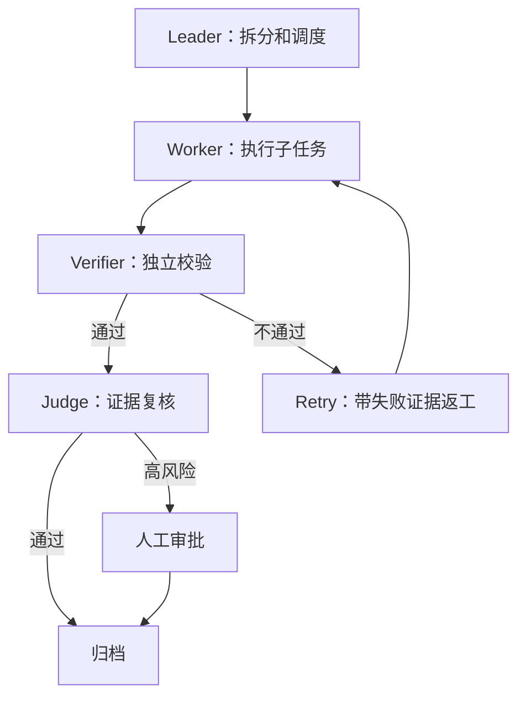

# 多角色编排与权限隔离

> 多 Agent 不是角色 Prompt 数量问题，而是状态机、权限、通信、验证和收敛指标问题。

## 来源

- [AI Agent 工程化提效实战：Compound-Engineering-Plugin 如何把 ECC 流程落到真实业](<../文章/done-AI Agent 工程化提效实战：Compound-Engineering-Plugin 如何把 ECC 流程落到真实业.md>)
- [Agent Harness 架构真相：Prompt Cache 如何决定 Skill、MCP 与 SubAgent 设计](<../文章/done-Agent Harness 架构真相：Prompt Cache 如何决定 Skill、MCP 与 SubAgent 设计.md>)
- [Anthropic最新harness工程技术：Managed Agents](<../文章/done-Anthropic最新harness工程技术：Managed Agents.md>)
- [Harness 驱动的企业级Agent工程交付方法论——GPT5.5赋能OpenSpec管规格，Ling-2.5赋能Wo](<../文章/done-Harness 驱动的企业级Agent工程交付方法论——GPT5.5赋能OpenSpec管规格，Ling-2.5赋能Wo.md>)
- [刚刚，Anthropic官方Harness被LangChain悄悄开源了~](<../文章/done-刚刚，Anthropic官方Harness被LangChain悄悄开源了~.md>)
- [逆天的架构： 用 Harness+Langgraph+A2A 写一个 Agent Team，实现一支硅基团队。程序员 开](<../文章/done-逆天的架构： 用 Harness+Langgraph+A2A 写一个 Agent Team，实现一支硅基团队。程序员 开.md>)
- [项目越大，Agent 越乱——我用这套harness agent 把它管住了](<../文章/done-项目越大，Agent 越乱——我用这套harness agent 把它管住了.md>)
- [驯服大模型：从“玩具”到工业级 Agent 的 Harness 工程实践解析。](<../文章/done-驯服大模型：从“玩具”到工业级 Agent 的 Harness 工程实践解析。.md>)

## 核心问题

如何让多个 Agent 在同一任务中分工、互审、重试、恢复和收敛，而不是并行制造更多不确定性。

## 判断准则

| 机制 | 可用设计 | 风险 |
|---|---|---|
| 角色隔离 | Planner / Developer / Tester / Reviewer / Security / Judge 权责分明 | 角色边界只写在 Prompt 里，没有权限和状态支撑 |
| 上下文隔离 | SubAgent 独立上下文，用结果和证据回传主线 | 子任务把无关细节带回主上下文 |
| 权限分层 | Reviewer 只读，执行者可写，安全角色可拦截 | 所有 Agent 都有同等写权限 |
| 对抗门禁 | Worker 输出后由独立 Verifier 校验，不通过打回 | 自己生成、自己验收 |
| 状态机 | producing -> verifying -> retry -> done 等状态显式流转 | 多 Agent 只靠聊天接力 |
| 人机介入 | 高风险、低置信、越权、冲突时触发人工确认 | 人类只在事故后补救 |

## 认知偏差

- LangGraph、A2A、Orchestrator-Worker 都是实现模式；Harness 是更上层的运行时治理问题。
- 多 Agent 只适合复杂、长程、高风险、需要独立验收的任务；简单任务启动团队只会增加成本。
- 对抗式评审不是为了“多一个意见”，而是为了把完成标准、失败证据和返工路径外部化。
- 多角色系统必须有权限差异；没有权限隔离的 Reviewer 很容易变成另一个执行者。

## 典型状态流

## 待验证缺口

- 需要整理多 Agent 启动阈值：任务复杂度、风险等级、验证成本、并行收益。
- 需要补权限矩阵模板：角色、可读范围、可写范围、可调用工具、审批条件、输出证据。
