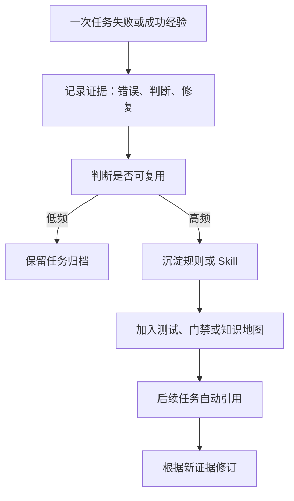

# 知识沉淀与私域资产

> Harness 本身不是护城河，能持续沉淀到规则、Skill、测试、知识仓和私域资产的闭环才是长期价值。

## 来源

- [AI Agent 工程化提效实战：Compound-Engineering-Plugin 如何把 ECC 流程落到真实业](<../文章/done-AI Agent 工程化提效实战：Compound-Engineering-Plugin 如何把 ECC 流程落到真实业.md>)
- [Harness 工程 Skill：使用 Entrix 技能开始你的代码熵治理](<../文章/done-Harness 工程 Skill：使用 Entrix 技能开始你的代码熵治理.md>)
- [Harness不是目的，知识才是护城河 —— 一个AI工程交付团队的知识沉淀实践](<../文章/done-Harness不是目的，知识才是护城河 —— 一个AI工程交付团队的知识沉淀实践.md>)
- [Harness｜14 Everything Claude Code 解剖：把 Harness 做成性能优化系统](<../文章/done-Harness｜14 Everything Claude Code 解剖：把 Harness 做成性能优化系统.md>)
- [oh-my-claudecode：Claude Code 的Harness](<../文章/done-oh-my-claudecode：Claude Code 的Harness.md>)
- [万字长文 _ Spec 驱动开发实战：半年踩坑，我们如何让 AI 编码的交付真正闭环](<../文章/done-万字长文 _ Spec 驱动开发实战：半年踩坑，我们如何让 AI 编码的交付真正闭环.md>)
- [技术教科书：顶级开发团队设计的Harness工程项目源码什么样](<../文章/done-技术教科书：顶级开发团队设计的Harness工程项目源码什么样.md>)
- [提示词工程、上下文工程都过时了，现在是 Harness Engineering 的时代](<../文章/done-提示词工程、上下文工程都过时了，现在是 Harness Engineering 的时代.md>)

## 核心问题

如何把一次 Agent 交付中的经验、失败、规则和上下文资产变成后续任务可复用的私域能力，而不是停留在聊天记录里。

## 判断准则

| 资产类型 | 应沉淀内容 | 不应沉淀内容 |
|---|---|---|
| 规则 | 稳定边界、禁止事项、验收准则、目录入口 | 临时偏好、一次性命令输出 |
| Skill | 可复用流程、模板、脚本、触发条件 | 单篇文章摘要或泛泛建议 |
| 测试/门禁 | 可机器执行的不变式、质量规则、架构约束 | 人工才懂的含糊判断 |
| 知识仓 | 业务概念、系统边界、排障路径、来源锚点 | 易过期的行号、临时日志全文 |
| 评测集 | 真实失败样例、边界用例、回归场景 | 只展示成功的演示案例 |

## 认知偏差

- 知识沉淀不是“写更多文档”，而是把高频判断变成 Agent 会主动调用的入口。
- 经验先允许粗粒度沉淀，再逐步演化成正式 Skill 或规则；一开始就要求完美标准化会抬高维护成本。
- 记忆适合存稳定偏好和判断，不适合存容易漂移的代码事实；代码事实应通过 live search、测试和接口回包确认。
- 私域资产需要版本化、审查和冲突处理，否则很快变成新的上下文噪音。

## 转化路径

## 待验证缺口

- 需要建立“任务经验进入 Skill / AGENTS / Memory / 知识点”的分流规则。
- 需要补一个私域 Skill Registry 的最小字段：触发场景、输入、输出、脚本、证据、维护者、失效条件。
