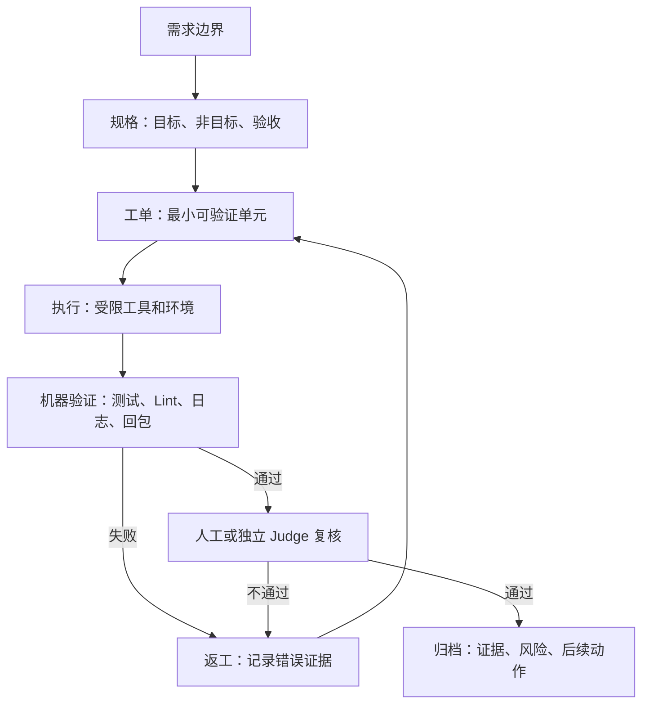

# 规格驱动与验证门禁

> 规格不是厚文档，门禁也不是流程装饰。Harness 里的规格必须能驱动执行、验证、返工和归档。

## 来源

- [1个场景(618促销)5种范式(Spec_Vibe_Glue_TDD_Harness) ，企业级AI Coding经验分](<../文章/done-1个场景(618促销)5种范式(Spec_Vibe_Glue_TDD_Harness) ，企业级AI Coding经验分.md>)
- [AI Agent 工程化提效实战：Compound-Engineering-Plugin 如何把 ECC 流程落到真实业](<../文章/done-AI Agent 工程化提效实战：Compound-Engineering-Plugin 如何把 ECC 流程落到真实业.md>)
- [AI Coding 与 Harness 实践精髓：让AI高效干活、持续交付](<../文章/done-AI Coding 与 Harness 实践精髓：让AI高效干活、持续交付.md>)
- [Harness 驱动的企业级Agent工程交付方法论——GPT5.5赋能OpenSpec管规格，Ling-2.5赋能Wo](<../文章/done-Harness 驱动的企业级Agent工程交付方法论——GPT5.5赋能OpenSpec管规格，Ling-2.5赋能Wo.md>)
- [万字长文 _ Spec 驱动开发实战：半年踩坑，我们如何让 AI 编码的交付真正闭环](<../文章/done-万字长文 _ Spec 驱动开发实战：半年踩坑，我们如何让 AI 编码的交付真正闭环.md>)
- [用 Linter 驾驭 AI：机械化执行的艺术](<../文章/done-用 Linter 驾驭 AI：机械化执行的艺术.md>)
- [阿里云这场分享，讲透了企业怎么做AI原生开发](<../文章/done-阿里云这场分享，讲透了企业怎么做AI原生开发.md>)
- [项目越大，Agent 越乱——我用这套harness agent 把它管住了](<../文章/done-项目越大，Agent 越乱——我用这套harness agent 把它管住了.md>)

## 核心问题

如何把需求、任务、实现、测试、审查、发布和归档变成 Agent 可执行且可验证的状态机。

## 判断准则

| 环节 | 好的 Harness 做法 | 低价值做法 |
|---|---|---|
| 需求 | 写明目标、非目标、验收标准、业务不变式 | 让 Agent 自己猜“应该差不多” |
| 任务 | 拆成最小可验证工单，保留状态和证据 | 一次性丢给模型一个大目标 |
| 实现 | 每步有边界，重要操作前确认基线 | 边写边改，无分支、无回滚点 |
| 验证 | Judge / Reviewer 只认可测试、日志、回包、diff、现场结果 | 让执行者自评“看起来可以” |
| 返工 | 失败证据进入下一轮输入，避免重复尝试 | 把完整日志反复塞回上下文 |
| 归档 | 状态、结论、剩余风险和后续动作可追踪 | 完成后只留一句总结 |

## 关键技术点

- Spec Form Follows Reviewer：规格格式由验证者需要什么证据决定，而不是由写作者表达习惯决定。
- Evidence Before Claims：先拿测试、日志、回包、diff、发布记录，再声明完成。
- Linter / 静态规则是机械化门禁，不是建议；错误信息应写成 Agent 可直接修复的指令。
- Drift Check 用于防止实现偏离原始目标，尤其适合跨文件、跨天、跨团队任务。
- 高风险任务需要人类审批节点；审批节点的输入应是差异、风险、证据和回滚方案，而不是完整上下文。

## 流程图

## 待验证缺口

- 需要补一个本知识库可复用的 Agent 工单模板，字段覆盖规格、门禁、证据和归档。
- 需要区分轻任务和重任务：什么时候只要 checklist，什么时候必须引入 Judge / Reviewer / 安全评审。
