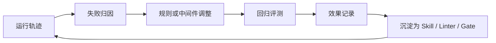

# 评测观测与质量治理

> Harness 的质量不靠口号判断，必须把运行轨迹、测试、日志、指标、可视化和反馈闭环做成可分析对象。

## 来源

- [Harness Engineering实践，做了一个平台让AI一晚上自动评测和优化你的系统](<../文章/done-Harness Engineering实践，做了一个平台让AI一晚上自动评测和优化你的系统.md>)
- [Harness Monitor：当多个 Agent 同时写代码时，如何看住质量](<../文章/done-Harness Monitor：当多个 Agent 同时写代码时，如何看住质量.md>)
- [Harness 工程 Skill：使用 Entrix 技能开始你的代码熵治理](<../文章/done-Harness 工程 Skill：使用 Entrix 技能开始你的代码熵治理.md>)
- [Harness 工程可视化：在 Vibe Coding 中重建工程可控性](<../文章/done-Harness 工程可视化：在 Vibe Coding 中重建工程可控性.md>)
- [Harness｜14 Everything Claude Code 解剖：把 Harness 做成性能优化系统](<../文章/done-Harness｜14 Everything Claude Code 解剖：把 Harness 做成性能优化系统.md>)
- [LangChain：如何通过 Harness Engineering 提升 Agent 表现](<../文章/done-LangChain：如何通过 Harness Engineering 提升 Agent 表现.md>)
- [提示词工程、上下文工程都过时了，现在是 Harness Engineering 的时代](<../文章/done-提示词工程、上下文工程都过时了，现在是 Harness Engineering 的时代.md>)
- [用 Linter 驾驭 AI：机械化执行的艺术](<../文章/done-用 Linter 驾驭 AI：机械化执行的艺术.md>)
- [阿里云这场分享，讲透了企业怎么做AI原生开发](<../文章/done-阿里云这场分享，讲透了企业怎么做AI原生开发.md>)

## 核心问题

如何知道 Agent 真正变稳了，而不是只在某次演示里跑通了。

## 判断准则

| 观察对象 | 应记录什么 | 用途 |
|---|---|---|
| Trace | 推理步骤、工具调用、失败点、耗时、成本 | 定位失败发生在规划、工具、环境还是验证 |
| Test / Lint | 通过率、失败行、规则类别、修复建议 | 把质量要求机械化 |
| Git / Diff | 修改范围、热点文件、重复修改、回滚点 | 识别偏航和并行冲突 |
| Browser / UI | 页面状态、控制台、网络、截图、用户路径 | 证明前端和真实系统行为 |
| Fitness | 架构约束、依赖方向、模块边界、复杂度 | 防止长期架构退化 |
| Review Trigger | 触发人工复核或安全评审的条件 | 控制高风险变更 |

## 认知偏差

- 可观测性不是做漂亮面板，而是给 Agent 和人类共同使用的反馈面。
- Trace 分析的价值在于定位失败类型：推理错误、工具误用、权限不足、超时、环境缺失、验证不充分。
- 多 Agent 并行时，质量治理比速度更稀缺；需要 Test Mapping、Fitness、Review Trigger、分支隔离和冲突检测。
- “一晚上自动优化”类案例只能作为实践锚点；长期知识点应是评测集、反馈闭环和失败归因方法。

## 质量闭环

## 待验证缺口

- 需要整理一套 Agent 任务评测指标：任务成功率、返工轮数、人工介入次数、证据完整度、成本、耗时、回滚次数。
- 需要补真实样例：同一失败 trace 如何转化为规则、Skill、测试或工具边界。
