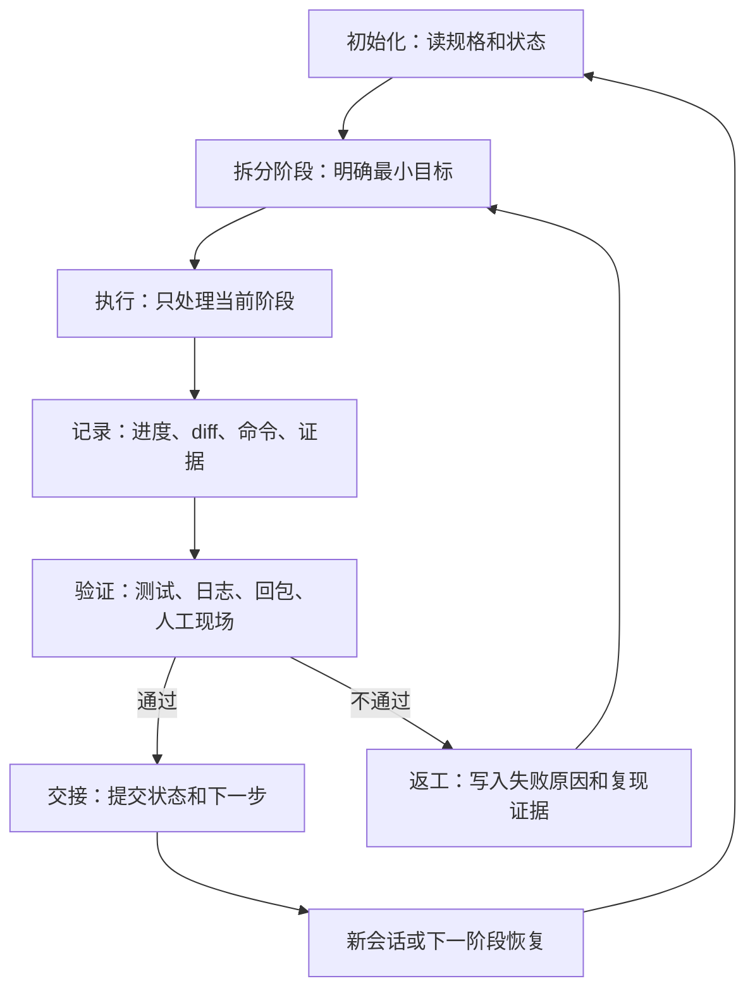

# 长任务状态与恢复闭环

> 长程 Agent 的核心失败不是“不会写”，而是跨会话失忆、目标漂移、过早宣布完成、失败后无法恢复。

## 来源

- [AI成功率从20%飙到100%！只需一个Harness文件](<../文章/done-AI成功率从20%飙到100%！只需一个Harness文件.md>)
- [Anthropic最新harness工程技术：Managed Agents](<../文章/done-Anthropic最新harness工程技术：Managed Agents.md>)
- [Harness Engineering：让AI Agent长程运行的秘密武器](<../文章/done-Harness Engineering：让AI Agent长程运行的秘密武器.md>)
- [Harness｜14 Everything Claude Code 解剖：把 Harness 做成性能优化系统](<../文章/done-Harness｜14 Everything Claude Code 解剖：把 Harness 做成性能优化系统.md>)
- [oh-my-claudecode：Claude Code 的Harness](<../文章/done-oh-my-claudecode：Claude Code 的Harness.md>)
- [《通过 Claude Code 源码“开源”：学习“harness engineering”方法论的 8 个模块》](<../文章/done-《通过 Claude Code 源码“开源”：学习“harness engineering”方法论的 8 个模块》.md>)
- [从玩具到生产力：用真实项目讲透 AI Agent 的 Harness Engineering](<../文章/done-从玩具到生产力：用真实项目讲透 AI Agent 的 Harness Engineering.md>)
- [项目越大，Agent 越乱——我用这套harness agent 把它管住了](<../文章/done-项目越大，Agent 越乱——我用这套harness agent 把它管住了.md>)

## 核心问题

如何让 Agent 在跨天、跨上下文、跨子任务和失败重试后仍能准确恢复目标、状态、证据和下一步。

## 判断准则

| 层级 | 应外化的状态 | 验收方式 |
|---|---|---|
| 任务目标 | 总目标、非目标、完成定义、风险边界 | 新会话能先复述范围再执行 |
| 阶段进度 | 已完成、未完成、阻塞项、证据链接 | 中断后能从具体节点恢复 |
| 执行现场 | 分支、diff、命令、日志、测试结果、回包 | 不能只说“已完成”，必须能回查 |
| 交接摘要 | 下一步、假设、待确认、回滚点 | 上下文压缩后不丢主线 |
| 失败记录 | 错误行、失败原因、尝试过的修复 | 避免重复踩同一个坑 |

## 典型闭环

## 认知偏差

- 记忆不是越多越好；长期记忆适合存用户偏好、决策原则和稳定约束，不适合存容易漂移的代码事实。
- 上下文压缩不是摘要越短越好，而是保留目标、阶段、证据、阻塞和下一步。
- Hook 不是附加检查，而是把状态恢复、批量格式化、结束验收、会话归档固化成系统行为。
- “成功率从多少到多少”的数字必须降权；可吸收的是失败模式：过早胜利、上下文焦虑、跨会话失忆。

## 待验证缺口

- 需要沉淀一份 Agent 长任务状态文件模板，区分任务级、阶段级、会话级字段。
- 需要对比 `PROGRESS.md`、Trellis task、Git commit、session summary、数据库状态机等几种恢复载体的边界。
