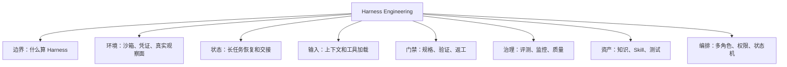

# Harness Engineering 知识地图

## 模块定位

| 项 | 内容 |
|---|---|
| 所属目录 | `02_Agent与AI工程/0209_Harness Engineering` |
| 解决的问题 | 判断 Agent 运行控制面如何通过环境、状态、上下文、工具、权限、评测、知识和编排约束长程执行。 |
| 典型输入 | 本地文章、规则文件、官方文档、真实任务执行证据 |
| 典型产出 | 可复用判断准则、机制边界、流程图、验收清单、待验证缺口 |

## 全景结构

## 已沉淀知识点

| 知识点 | 说明 |
|---|---|
| [Harness边界与演进准则.md](0209_核心知识点/Harness边界与演进准则.md) | 先判断正文主问题，避免把 Prompt、Context、框架、工具、Workflow 都塞进 Harness。 |
| [运行环境与沙箱底座.md](0209_核心知识点/运行环境与沙箱底座.md) | 梳理环境即代码、Brain/Runner 分离、凭证隔离、浏览器观察面和资源限制。 |
| [长任务状态与恢复闭环.md](0209_核心知识点/长任务状态与恢复闭环.md) | 沉淀任务目标、阶段进度、执行现场、交接摘要和失败记录。 |
| [上下文与工具加载边界.md](0209_核心知识点/上下文与工具加载边界.md) | 区分 System Prompt、Skill、MCP、代码模式和 SubAgent 的加载职责。 |
| [规格驱动与验证门禁.md](0209_核心知识点/规格驱动与验证门禁.md) | 将需求、工单、实现、测试、审查、返工和归档变成可验证闭环。 |
| [评测观测与质量治理.md](0209_核心知识点/评测观测与质量治理.md) | 用 Trace、Test、Lint、Diff、Browser、Fitness 和 Review Trigger 管住质量。 |
| [知识沉淀与私域资产.md](0209_核心知识点/知识沉淀与私域资产.md) | 把任务经验转化为规则、Skill、测试、知识仓和评测集。 |
| [多角色编排与权限隔离.md](0209_核心知识点/多角色编排与权限隔离.md) | 多 Agent 只有具备状态机、权限隔离、独立验证和收敛指标时才有工程价值。 |

## 本轮认知校准

| 原整理问题 | 修正 |
|---|---|
| 用单个收口文件 承接 42 篇文章 | 改成 8 个机制型知识点，每篇文章作为来源锚点被吸收到具体判断准则。 |
| 按标题和产品名粗分主题 | 改为按正文主问题识别：边界、环境、状态、输入、门禁、治理、资产、编排。 |
| 把生态资讯、框架教程、工具本体混入长期知识 | 在 `AGENTS.md` 中补错放边界；低价值内容只保留来源锚点，不扩展成知识点。 |
| 缺少可执行流程 | 每个机制页补判断准则、流程图、验收清单或待验证缺口。 |

## 待补缺口

- 官方补证：确认 Managed Agents、Claude Code、Codex、DeepAgents 等平台真实能力边界。
- 最小实验：对比 Prompt、Context、Harness 三种方案在相同任务上的失败模式。
- 模板化：补任务状态文件、权限矩阵、评测指标和 Judge 验收模板。
- 跨目录迁移：后续可把主问题明确属于工具、框架、Browser/GUI、Prompt、数据工程的来源物理迁出。
