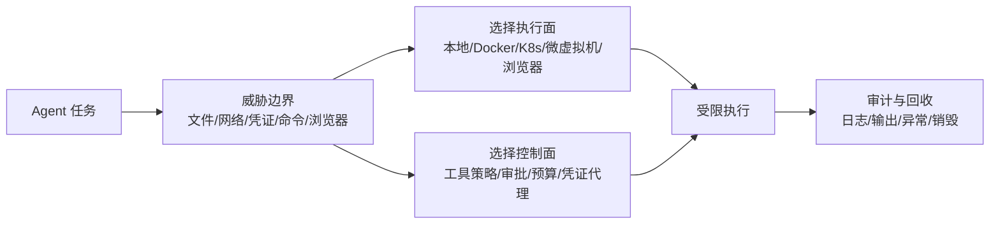

# AgentSandbox 威胁边界与控制面

## 来源

- [OpenClaw 安全模型：威胁边界、隔离策略与可审计执行控制](<../文章/done-OpenClaw架构-OpenClaw 安全模型：威胁边界、隔离策略与可审计执行控制.md>)
- [OpenClaw 彻底带火了沙箱，桌面 Agent 落地必看](<../文章/done-OpenClaw彻底带火了沙箱，桌面Agent落地必看.md>)
- [Agent 执行恶意脚本时沙箱怎么做](<../文章/done-阿里面试官问：_你的 Agent 能执行代码，用户传了个恶意脚本直接删库，沙箱怎么做的？exec() 直接用吗？白名单怎么定义？_.md>)
- [如何在 agent 中安全运行 python 代码](<../文章/done-如何在agent中安全的运行python代码.md>)

## 核心问题

Sandbox 要解决的是 Agent 执行副作用的环境边界：代码、命令、浏览器、文件和网络应该被限制在哪里、能访问什么、执行失败后如何追溯。它不是完整安全体系，不能替代 Prompt 注入防御、供应链治理、外部 IAM 和人工审批。

## 判断准则

| 判断项 | 准则 |
|---|---|
| 先定威胁边界 | 先列出 Agent 能触达的文件、网络、凭证、外部系统和不可逆操作，再决定是否需要沙箱。 |
| 区分执行面和控制面 | Sandbox 管执行环境；Tool Policy、审批、预算、凭证代理和审计属于配套控制面。 |
| 默认不信任生成代码 | `exec()` 直接跑模型生成代码不可接受；至少要有只读挂载、禁网/白名单、资源限制、超时和输出解析。 |
| 本地沙箱不等于强隔离 | `sandbox-exec` 这类本机沙箱依赖 profile，默认可读路径、网络和白名单命令都可能扩大边界。 |
| 安全结论必须可验证 | 文章没有说明默认 deny、挂载、网络、凭证、日志和失败模式时，只能作为资讯。 |

## 认知偏差

| 常见错误认知 | 正确理解 |
|---|---|
| 有 Docker 就安全 | Docker 只是运行时之一，还要看挂载、网络、capability、用户、资源限制和日志。 |
| 禁止危险命令就够了 | 代码执行、包安装、文件读取、网络请求和浏览器下载都可能绕开命令黑名单。 |
| 沙箱可以解决 Prompt 注入 | 沙箱只能限制注入成功后的副作用，不能替代输入隔离和工具输出治理。 |
| 产品宣称安全就能采信 | 安全能力必须落到可复验配置和日志事件。 |

## 架构/流程图

## 待验证缺口

- 用实际脚本验证 `sandbox-exec`、Docker 禁网、K8s NetworkPolicy 对文件读取、联网和子进程的差异。
- 补官方文档确认 OpenClaw、OpenSandbox、AgentRun、CubeSandbox 的默认策略和日志字段。
