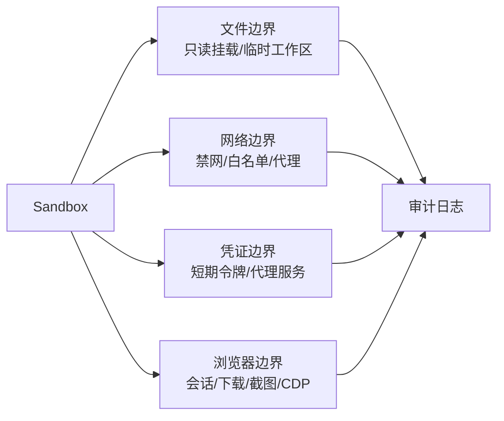

# Sandbox 凭证网络与审计边界

## 来源

- [开源 LiteLLM Agent 平台：K8s 沙箱 + 凭证库](<../文章/done-开源LiteLLM Agent平台：K8s沙箱+凭证库，让编程Agent永远拿不到真实API密钥.md>)
- [OpenClaw 安全模型：威胁边界、隔离策略与可审计执行控制](<../文章/done-OpenClaw架构-OpenClaw 安全模型：威胁边界、隔离策略与可审计执行控制.md>)
- [Codex CLI 的沙箱到底隔离了什么](<../文章/done-第四篇：Codex CLI 的沙箱到底隔离了什么——sandbox-exec 与 Docker 深度解析.md>)
- [BrowserUse + AgentRun Sandbox 最佳实践](<../文章/done-进阶指南：BrowserUse + AgentRun Sandbox 最佳实践.md>)
- [AIO Sandbox 如何用一个容器解决开发者痛点](<../文章/done-打破AI Agent开发困局：AIO Sandbox如何用一个容器解决开发者的所有痛点.md>)

## 核心问题

Sandbox 真正能否用于生产，取决于它是否把凭证、网络和审计一起收口。只把代码放进容器，但仍把真实 API Key、宿主配置、内网和不可追踪日志暴露给 Agent，仍然不是可靠边界。

## 判断准则

| 维度 | 准则 |
|---|---|
| 凭证 | 模型生成代码不应直接读取真实密钥；优先使用短期令牌、代理服务、按任务授权和日志脱敏。 |
| 网络 | 默认禁网或最小白名单；外部 API、内网、云元数据服务和代理要单独建策略。 |
| 文件 | 工作区只挂载必要路径；敏感配置目录、云凭证目录、宿主 home 目录默认拒绝。 |
| 审计 | 记录命令、文件、网络、凭证代理、审批、输出、异常和回收事件，便于复盘副作用链路。 |
| 回收 | 沙箱销毁不等于风险消失；要清理临时文件、浏览器状态、下载产物和日志索引。 |

## 认知偏差

| 常见错误认知 | 正确理解 |
|---|---|
| API Key 放环境变量很方便 | 对 Agent 生成代码来说，环境变量就是可读输入，应改成代理或短期凭证。 |
| 禁网会影响体验，所以默认放开 | 可以按任务白名单开放；默认全网出站会放大数据外流风险。 |
| 审计只需要保存最终输出 | 需要保存副作用过程，否则无法解释文件、网络和外部 API 是如何被触发的。 |
| 浏览器沙箱只要隔离进程 | 浏览器还涉及登录态、下载、截图、剪贴板、代理和 CDP 控制面。 |

## 架构/流程图

## 待验证缺口

- 补真实 Sandbox 产品的审计字段：命令、文件读写、网络请求、凭证调用、审批结果和回收事件是否结构化。
- 验证浏览器 Sandbox 对登录态、下载目录、代理凭证和截图数据的隔离方式。
