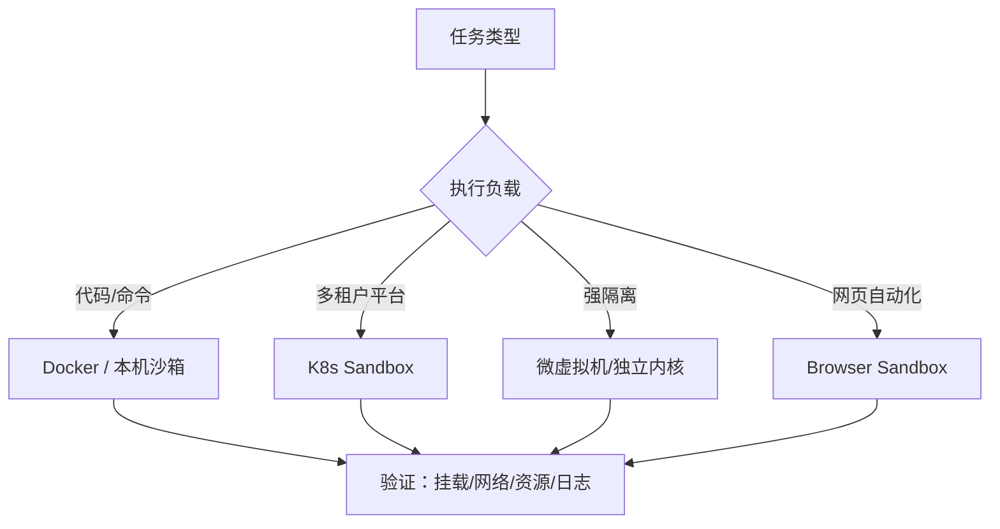

# Sandbox 运行时实现与选型

## 来源

- [10 分钟搭一个 AI Agent 沙盒：OpenSandbox（Docker 本地版）实操](<../文章/done-10 分钟搭一个 AI Agent 沙盒：OpenSandbox（Docker 本地版）实操.md>)
- [AgentRun Sandbox SDK 正式开源](<../文章/done-AgentRun Sandbox SDK 正式开源！集成 LangChain 等主流框架，一键开启智能体沙箱新体验.md>)
- [AIO Sandbox 如何用一个容器解决开发者痛点](<../文章/done-打破AI Agent开发困局：AIO Sandbox如何用一个容器解决开发者的所有痛点.md>)
- [Codex CLI 的沙箱到底隔离了什么](<../文章/done-第四篇：Codex CLI 的沙箱到底隔离了什么——sandbox-exec 与 Docker 深度解析.md>)
- [腾讯开源 CubeSandbox](<../文章/done-腾讯开源 CubeSandbox：给 AI Agent 一颗 60ms 冷启动的独立内核.md>)
- [BoxLite：轻量的智能体沙箱](<../文章/done-试试 BoxLite：轻量的智能体沙箱，方便嵌入和部署.md>)
- [在 Kubernetes 上使用 Agent Sandbox 运行智能体](<../文章/done-在 Kubernetes 上使用 Agent Sandbox 运行智能体.md>)
- [阿里 OpenSandbox：基于 K8s 的 AI Agent 安全沙箱](<../文章/done-阿里开源 OpenSandbox：基于 K8s 的 AI Agent 安全沙箱架构解析.md>)
- [实战指南：智能体的 Sandbox 环境如何让 AI 智能体更可靠](<../文章/done-实战指南：智能体的Sandbox环境如何让 AI 智能体更可靠！.md>)
- [OpenShell：安全沙箱隔离技术](<../文章/done-OpenShell：安全沙箱隔离的沙箱隔离技术.md>)

## 核心问题

Agent Sandbox 的选型不是“谁更火”，而是执行负载、隔离强度、生命周期、网络策略、冷启动、运维复杂度和审计能力之间的权衡。

## 判断准则

| 场景 | 优先运行时 | 判断边界 |
|---|---|---|
| 本地开发、短命令、低风险代码 | 本机沙箱或 Docker | 本机沙箱启动快但隔离弱；Docker 要显式处理挂载、用户、网络和资源限制。 |
| 多租户平台、并发任务 | K8s Pod Sandbox | 需要配额、NetworkPolicy、镜像治理、日志聚合和回收策略。 |
| 高风险不可信代码 | 微虚拟机或独立内核类沙箱 | 隔离更强，但要验证冷启动、镜像生态、调试和成本。 |
| 浏览器自动化 | Browser Sandbox + CDP/远程浏览器 | 要单独处理登录态、下载、截图、代理、会话模板和数据外流。 |
| 长任务 Agent | 可持久会话 + 快照/超时/回收 | 不能只看一次性执行，必须看会话恢复、空闲超时和残留清理。 |

## 认知偏差

| 常见错误认知 | 正确理解 |
|---|---|
| 产品功能多就是更好的 Sandbox | 功能多可能扩大副作用面，仍要看默认边界和审计。 |
| 冷启动数字可以直接比较 | 没有同口径硬件、镜像、并发和网络条件时只能作为待验证线索。 |
| K8s 天然更安全 | K8s 给调度和策略能力，不自动给正确的 NetworkPolicy、Secret 隔离和回收。 |
| 本地 Docker 教程可以直接上生产 | 生产还需要镜像供应链、资源配额、日志、告警、凭证代理和租户隔离。 |

## 架构/流程图

## 待验证缺口

- 建一张官方能力矩阵：OpenSandbox、AgentRun、CubeSandbox、BoxLite、AIO Sandbox、Codex sandbox。
- 用同一任务测冷启动、并发、禁网、文件挂载和日志字段，避免只引用宣传数字。
