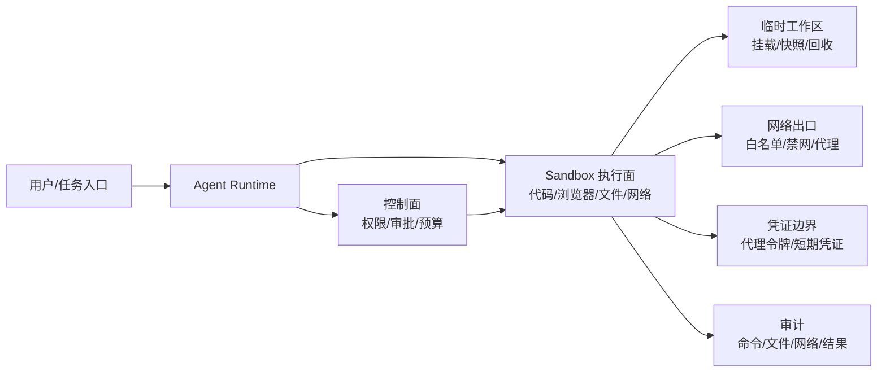

# AgentSandbox

## 知识点入口

- 先看宏观流程：[021001_知识地图.md](021001_知识地图.md)。
- 长期判断准则沉淀在 `021001_核心知识点/`，文章只作为来源锚点。
- 新文章必须先判断是否讨论 Sandbox 本体；只讲 Prompt 注入、Skill 审查、供应链投毒或通用权限系统时不进入本节点。

## 技术定位

| 项 | 内容 |
|---|---|
| 技术/主题名 | AgentSandbox |
| 一级类目 | Agent 与 AI 工程 |
| 二级类目 | Sandbox |
| 三级节点状态 | 已有节点重命名并重蒸馏 |
| 技术本体 | 为 Agent 执行代码、浏览器、文件、命令和网络访问提供可隔离、可回收、可审计的执行环境 |
| 全局架构位置 | 位于 Agent Runtime 与外部副作用之间，是执行面边界，不是完整安全治理体系 |
| 主要使用者 | Agent 平台工程师、AI 编程工具维护者、浏览器 Agent/代码执行 Agent 开发者 |
| 主要产出 | 沙箱实例、工作区、资源限制、网络策略、凭证边界、执行日志、审计事件和回收策略 |

## 官方锚点

- 本节点当前只使用本地文章蒸馏；官方能力和版本状态后续补证。
- 待补官方资料：OpenSandbox、AgentRun Sandbox、CubeSandbox、BoxLite、Codex sandbox、LangChain Deep Agents Sandboxes。

## 架构图

## 核心模块

| 模块 | 职责 | 重点问题 |
|---|---|---|
| 执行隔离 | 约束代码、命令、浏览器和文件操作的运行环境 | 本地进程、Docker、K8s、微虚拟机和浏览器沙箱的边界差异 |
| 生命周期 | 创建、复用、空闲回收、快照和销毁沙箱 | 冷启动、长任务、并发、会话恢复和残留清理 |
| 文件与挂载 | 控制工作区、只读挂载、临时目录和输出回传 | 是否能读到宿主敏感路径，输出如何可追溯 |
| 网络策略 | 控制出站访问、代理、内网和元数据服务 | 默认禁网、域名白名单、代理凭证和数据外流 |
| 凭证隔离 | 避免真实密钥进入模型可写环境 | 短期令牌、代理服务、环境变量脱敏和最小权限 |
| 审计观测 | 记录命令、文件、网络、审批、异常和结果 | 是否能复盘一次 Agent 副作用链路 |

## 横向对标

| 对标技术 | 对标点 | 优势 | 劣势 | 使用判断 |
|---|---|---|---|---|
| `sandbox-exec` / Seatbelt | 本机系统调用限制 | 本地启动快，适合 macOS CLI | Profile 边界复杂，网络和宿主读取容易误判 | 本地开发可用，但不能当强隔离 |
| Docker 容器 | 进程、文件系统、网络、资源限制 | 通用、易部署、可禁网 | 冷启动和镜像管理有成本 | 单机代码执行和本地实验首选 |
| K8s Pod Sandbox | 多租户调度、网络策略、资源配额 | 适合平台化和弹性扩缩 | 运维复杂，需要集群能力 | 企业 Agent 平台和多并发任务 |
| 微虚拟机/独立内核 | 更强内核隔离 | 隔离级别高，适合不可信代码 | 生态和成本依赖具体实现 | 高风险、多租户、强隔离场景 |
| 浏览器 Sandbox | 页面、登录态和自动化执行隔离 | 适合网页任务和 GUI Agent | 登录态、截图、下载和网络外流要额外治理 | BrowserUse/Computer Use 类任务必须单独评估 |

## 已沉淀核心知识点

| 主题 | 文件 | 问题指纹 | 解决什么问题 | 认知增量 |
|---|---|---|---|---|
| 威胁边界与控制面 | [AgentSandbox威胁边界与控制面](021001_核心知识点/AgentSandbox威胁边界与控制面.md) | AgentSandbox + 高权限执行 + 威胁模型/控制面 + 沙箱不是完整安全体系 + 边界先行 | 判断哪些风险该由 Sandbox 承担，哪些要交给权限、审批、Prompt 或供应链治理 | 纠偏“有沙箱就安全”的误解 |
| 运行时实现与选型 | [Sandbox运行时实现与选型](021001_核心知识点/Sandbox运行时实现与选型.md) | AgentSandbox + 代码/浏览器执行 + Docker/K8s/微虚拟机/本地沙箱 + 生命周期和成本边界 | 判断不同 Sandbox 实现适合什么 Agent 任务 | 从产品清单抽象为选型维度 |
| 凭证网络与审计边界 | [Sandbox凭证网络与审计边界](021001_核心知识点/Sandbox凭证网络与审计边界.md) | AgentSandbox + 凭证/网络/审计 + 数据外流和可追溯 + 最小权限 | 判断沙箱如何避免密钥泄露和不可追责副作用 | 把“隔离运行”推进到可复盘、可回收、可限权 |
| 来源与判断准则 | [AgentSandbox隔离与审计边界](021001_核心知识点/AgentSandbox隔离与审计边界.md) | 本轮 28 篇重判 + 16 篇保留 + 12 篇剔除 | 记录文章级吸收、降权和删除依据 | 防止再次把安全/权限大杂烩塞回 Sandbox |

## 后续追查

- 关键词：agent sandbox、code execution sandbox、browser sandbox、Docker sandbox、K8s sandbox、microVM、sandbox-exec、credential isolation、egress policy、audit log。
- 待读资料：OpenSandbox 官方文档、AgentRun Sandbox SDK 文档、CubeSandbox 官方仓库、BoxLite 仓库、Codex sandbox 官方实现说明。
- 待补实验：用同一个恶意脚本分别在本地进程、Docker 禁网、K8s 网络策略和浏览器沙箱中验证文件、网络、凭证和日志边界。
