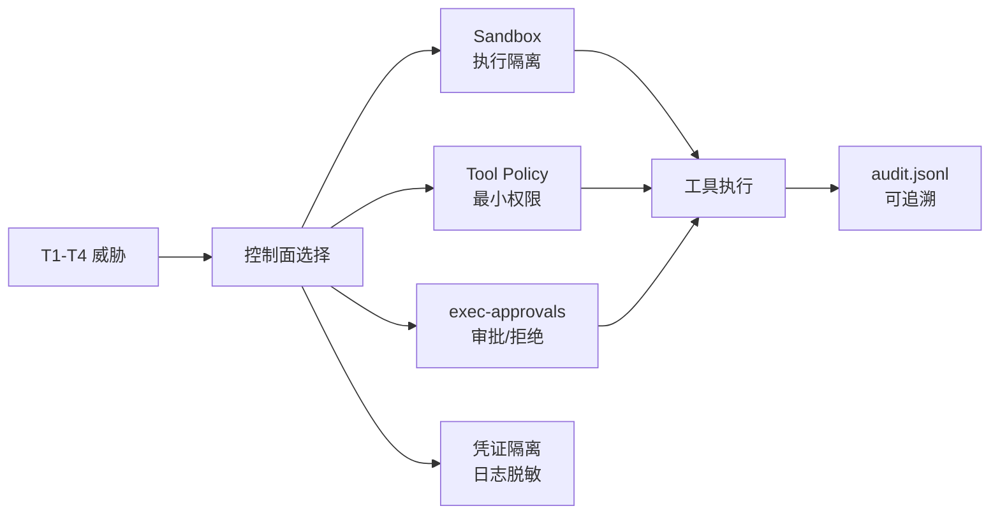

# OpenClaw 安全模型威胁边界与执行控制

## 原文锚点

- 本地文件：[OpenClaw架构-OpenClaw 安全模型：威胁边界、隔离策略与可审计执行控制](<../文章/OpenClaw架构-OpenClaw 安全模型：威胁边界、隔离策略与可审计执行控制.md>)
- 原文链接：https://mp.weixin.qq.com/s?__biz=Mzg5NDE1MzYxMg==&mid=2247484904&idx=1&sn=b3eb2190ad3cedc95be30a415c955a4c
- 关键段落：T1-T5 威胁模型、Sandbox、Tool Policy、`exec-approvals`、文件/网络控制、Prompt Injection、凭证与审计。
- 关键图：无技术图。

## 图片处理

| 图片 | 类型 | 是否保留 | 理由 | 处理方式 |
|---|---|---|---|---|
| 无 | 无图 | 不适用 | 原文以配置和控制面为主 | Mermaid 重建 |

## 一句话结论

这篇文章值得精读：它把 Agent 安全从抽象原则落到威胁模型、沙盒、最小权限、命令审批、凭证隔离和审计事件。

## 用户相关性判断

| 项 | 内容 |
|---|---|
| 用户当前认知层级 | Agent/AI 应用安全 L1-L2 draft |
| 认知成熟度 | draft |
| 阅读投入建议 | 精读 |
| 阅读投入理由 | 能补生产 Agent 的安全控制面；但 OpenClaw 文档和字段需要项目源码/官方文档复核 |
| 对用户的新信息 | Agent 高权限动作要按“可隔离、可审批、可追溯”设计，而不是只靠提示词约束 |
| 问题指纹 | Agent 安全 + 威胁模型 + Sandbox/Tool Policy/exec-approvals/凭证/审计 + 高权限动作控制 + 可隔离可审批可追溯 |
| 排重判断 | 新建 |
| 置信度 | 高 |

## 认知校准点

| 校准点 | 文章观点/信息 | 与用户认知或价值观的关系 | 处理建议 |
|---|---|---|---|
| 威胁模型要先定边界 | T1-T4 防误操作和外部入口，T5 本地攻击者不覆盖 | 补安全讨论前置条件 | 写入安全 index |
| 沙盒不是唯一控制面 | Sandbox、Tool Policy、exec approvals、凭证、审计叠加 | 纠偏：不能只说“跑沙盒” | 作为 Agent 安全主线 |
| 默认应收紧高危命令 | 未匹配命令默认 requireApproval，deny 优先 | 补命令审批准则 | 可迁移到本地工具 |
| Prompt Injection 需要工程隔离 | 来源标记、结构化包裹、审批兜底 | 防止只靠模型自觉 | 后续补 MCP/浏览器工具 |
| 审计必须结构化 | JSONL 记录工具、来源、沙盒、审批和结果 | 符合用户重证据偏好 | 后续用于质量报告 |

## 冲突点

| 冲突类型 | 具体表现 | 影响 | 处理 |
|---|---|---|---|
| 项目特定 | 配置字段、端口和路径来自 OpenClaw | 不能直接当通用标准 | 抽象为控制面 |
| 证据待核验 | 文中官方文档 URL 未在本地内容展开 | 需要源码/官方文档复核 | 标为 draft |
| 安全边界明确但有限 | 不覆盖本地攻击者 T5 | 防止误解为完整安全方案 | 写入边界 |

## 待吸收点

| 分级 | 内容 | 为什么值得吸收 | 后续动作 |
|---|---|---|---|
| 理解 | T1 幻觉、T2 Prompt Injection、T3 未授权入口、T4 恶意扩展对应不同控制面 | 建立安全分析框架 | 写入安全 index |
| 理解 | `non-main` 用入口来源区分主机执行和沙盒执行 | 兼顾本地可用性和外部风险 | 后续对比 Codex 沙盒 |
| 记住 | Tool Policy 要按 Agent 职责拆分，不要所有角色都有执行权限 | 降低权限面 | 可用于 subagent 设计 |
| 记住 | 命令审批规则要有 deny、requireApproval、autoApprove 和默认策略 | 防止绕过 | 后续固化到项目规则 |
| 实践 | 为知识库整理 Agent 定义只读/写入/执行三档工具权限和审计字段 | 可落地 | 待实验 |

## 已知可跳过

| 内容 | 跳过理由 |
|---|---|
| 安全很重要 | 常识 |
| 示例端口和路径 | OpenClaw 特定，除非后续用该项目 |
| 完整配置复制 | 字段需按实际运行时校准 |

## 实践门槛

| 门槛 | 判断 | 证据 |
|---|---|---|
| 可运行 | 否 | 无本地 OpenClaw 环境 |
| 可验证 | 部分 | 有配置字段和审计样例 |
| 可排障 | 部分 | 有降级、审批、审计路径 |
| 可迁移 | 是 | 控制面可迁移到 MCP/Skill/本地 Agent |
| 结论 | 降为精读 | 需要结合实际运行时验证 |

## 归类判断

| 项 | 内容 |
|---|---|
| 技术本体 | Agent 安全控制模型 |
| 文章主问题 | 自托管 Agent 如何约束高风险工具调用和外部入口 |
| 使用场景 | 文件读写、命令执行、网络访问、MCP/Skill 扩展 |
| 关键词干扰 | OpenClaw、Gateway、MCP、Skill |
| 最终归类 | Agent 与 AI 工程 / 安全与权限 / Agent 安全模型 |
| 归类理由 | 主问题是 Agent 工具执行安全，不是普通后端安全或 MCP 协议设计 |

## 技术定位

| 项 | 内容 |
|---|---|
| 技术类型 | 安全架构模式 |
| 所属领域 | Agent 与 AI 工程 |
| 二级类目 | 安全与权限 |
| 全局架构位置 | Agent Runtime 和工具执行层之间 |
| 涉及模块 | Sandbox、Tool Policy、exec approval、credential、audit |
| 解决问题 | 限制高权限 Agent 的误操作、注入和外部入口风险 |
| 原文局限 | 项目特定，缺本地验证 |
| 我的结论 | 需要长期吸收为 Agent 安全准则 |

## 纵向理解

| 维度 | 判断 |
|---|---|
| 全局架构 | 入口来源 -> Agent -> 权限策略 -> 沙盒/审批 -> 工具执行 -> 审计 |
| 本文位置 | 讲安全控制面总览，不讲具体 sandbox-exec/Docker 实现细节 |
| 核心机制 | 威胁映射、沙盒分级、最小权限、审批优先级、敏感路径和出站 deny、审计事件 |
| 使用链路 | 定威胁 -> 选沙盒模式 -> 配工具 allow/deny -> 配审批 -> 限文件/网络 -> 审计复盘 |
| 前置条件 | 明确入口来源、工具清单、敏感路径、外部域名和可接受降级策略 |
| 边界 | 不防已入侵主机的本地攻击者，不替代外部系统 IAM |

## Mermaid 重建

## 横向对标

| 对标技术 | 实现方式 | 优势 | 劣势 | 适合场景 |
|---|---|---|---|---|
| Sandbox | 限文件、网络、进程和资源 | 降低破坏面 | 降级和兼容性复杂 | 外部入口和高风险工具 |
| Tool Policy | allow/deny 工具列表 | 权限面可控 | 粒度依赖工具命名 | 多角色 Agent |
| exec approval | 命令级审批 | 阻断不可逆动作 | 影响自动化效率 | shell/部署/文件操作 |
| IAM/OAuth | 外部系统授权 | 成熟可审计 | 不覆盖模型行为 | API/MCP 接入 |

## 后续追查

- 关键词：Agent security、Prompt Injection、Tool Policy、sandbox、exec approval、audit.jsonl、credential isolation。
- 相关技术：MCP、Skill、Browser/Computer Use、Codex sandbox、OpenClaw。
- 需要补读的文章：MCP Auth、Skill Vetter、浏览器工具权限、OpenClaw 官方安全文档。
