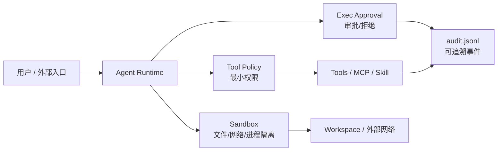

# Agent 安全模型
## 知识点入口

- 本模块先看宏观流程，再看文章：[知识地图](021001_核心知识点/知识地图.md)。
- 新文章必须先归入流程节点，再判断是补充、冲突、不同层次还是降权。
- `文章/` 只保留原文锚点，长期知识必须沉淀到 `021001_核心知识点/`。

## 技术定位

| 项 | 内容 |
|---|---|
| 技术名 | Agent 安全模型 |
| 一级类目 | Agent 与 AI 工程 |
| 二级类目 | 安全与权限 |
| 技术本体 | 用威胁模型、隔离、权限策略、人工审批、凭证保护和审计日志约束 Agent 的高风险动作 |
| 全局架构位置 | 位于 Agent Runtime、工具层、外部系统和用户审批之间，负责把不可逆动作收敛到可控边界内 |
| 主要使用者 | Agent 平台工程师、安全工程师、工具服务维护者、AI 应用负责人 |
| 主要产出 | 威胁模型、权限策略、沙盒配置、审批记录、审计日志、安全基线 |

## 官方锚点

- 方法来源：无单一官网，属于 Agent 工程安全模式。
- 参考案例：OpenClaw Gateway Security、OpenClaw Gateway Sandboxing。
- 相邻技术：[MCP](../../0202_工具调用/020202_MCP/AGENTS.md)

## 架构图

## 核心模块

| 模块 | 职责 | 重点问题 |
|---|---|---|
| 威胁模型 | 定义要防什么 | 幻觉、Prompt Injection、未授权入口、恶意扩展、本地攻击者边界 |
| 沙盒 | 限制执行位置、文件、网络和资源 | 降级策略、敏感路径、内网和元数据服务 |
| Tool Policy | 按 Agent 职责最小授权 | allow/deny 优先级、角色拆分 |
| 命令审批 | 对高风险命令审批或拒绝 | 默认收紧、链式命令、超时和审计 |
| 凭证保护 | 防止 token、密钥、环境变量泄露 | 子进程环境、日志脱敏、敏感路径拒绝 |
| 审计 | 记录工具调用、审批、失败和策略命中 | JSONL 字段、可检索、可复盘 |

## 横向对标

| 对标技术 | 对标点 | 优势 | 劣势 | 使用判断 |
|---|---|---|---|---|
| 传统 IAM | 权限控制 | 组织级权限成熟 | 不理解 Agent 行为链路 | 外部系统仍要用 IAM |
| DevOps 审批 | 高危动作控制 | 流程成熟，可追溯 | 不覆盖工具返回的提示注入 | 和 Agent 审批结合 |
| MCP 权限 | 工具接口边界 | 可在 Server 侧限权 | 不能单独覆盖本地文件和命令 | 外部系统接入必须做 |
| 沙盒 | 执行隔离 | 降低破坏面 | 降级和兼容性要处理 | 高权限工具默认使用 |

## 已沉淀核心知识点

| 主题 | 文件 | 问题指纹 | 解决什么问题 | 认知增量 |
|---|---|---|---|---|
| OpenClaw 安全模型 | [OpenClaw安全模型威胁边界与执行控制](021001_核心知识点/OpenClaw安全模型威胁边界与执行控制.md) | Agent 安全 + 威胁模型 + Sandbox/Tool Policy/exec-approvals/凭证/审计 + 高权限动作控制 + 可隔离可审批可追溯 | 判断生产 Agent 安全应该有哪些控制面 | Agent 安全不是一句“加权限控制”，而是威胁模型到审计事件的闭环 |

## 后续追查

- 关键词：Agent security、Prompt Injection、sandbox、tool policy、approval、audit log、credential isolation。
- 待读资料：MCP Auth、MCP Authorization、Skill 安全审查、Browser/Computer Use 安全边界。
- 待补实验：给本地知识库 MCP/脚本工具划分只读、写入、执行三类权限，并记录审批与审计字段。
