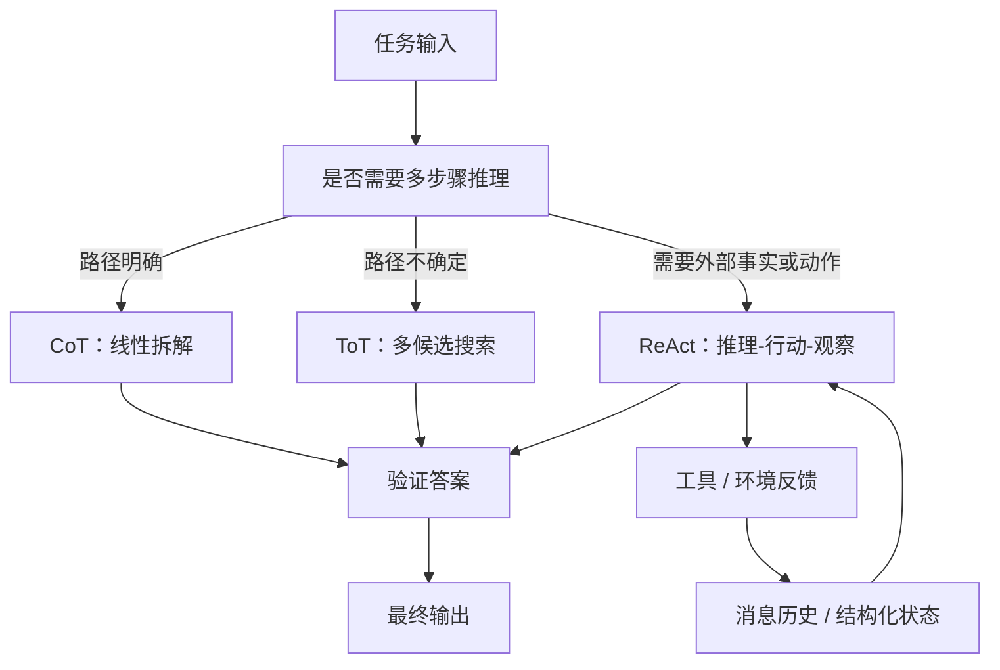

# CoT、ToT、ReAct 推理范式边界

## 原文锚点

- 本地文件：
  - [Prompt Engineering 技术体系全解析：从 Zero-shot 到 ToT 的完整指南](<../../0207_Prompt Engineering/文章/done-Prompt Engineering 技术体系全解析：从 Zero-shot 到 ToT 的完整指南.md>)
  - [你的提示词技巧可能过时了！最新版Claude 提示词工程最佳实践发布！](<../../0207_Prompt Engineering/文章/done-你的提示词技巧可能过时了！最新版Claude 提示词工程最佳实践发布！.md>)
  - [AI Agent 主流的设计模式（ReAct,Reflection,LATS）其实没有很复杂](<../文章/done-AI Agent 主流的设计模式（ReAct,Reflection,LATS）其实没有很复杂。.md>)
  - [Agent Loop的收敛：为什么OpenClaw、DeerFlow2.0和LangChain都放弃了显式ReAct](<../文章/done-Agent Loop的收敛：为什么OpenClaw、DeerFlow2.0和LangChain都放弃了显式ReAct.md>)
  - [国内首个 LangGraph Agent 模板！Multi-Agent框架最优解](<../../0201_Agent框架/020102_LangGraph/文章/done-国内首个 LangGraph Agent 模板！Multi-Agent框架最优解.md>)
- 原文链接：本轮使用本地 Markdown frontmatter 中保留的公众号链接，不联网补证。
- 关键段落：CoT 示例、ToT 对比、ReAct 的 Thought-Action-Observation 循环、显式 ReAct 强耦合 Prompt 的问题。
- 关键图：原文主要是文字和代码块；本文件用 Mermaid 重建范式关系图。

## 图片处理

| 图片 | 类型 | 是否保留 | 理由 | 处理方式 |
|---|---|---|---|---|
| CoT / ToT 文字对比 | 对比图 | 重建 | 有助于区分线性推理和多路径搜索 | 用本文件 Mermaid 重建 |
| ReAct 循环描述 | 流程图 | 重建 | 有助于理解推理、行动、观察的闭环 | 用本文件 Mermaid 重建 |

## 一句话结论

CoT、ToT、ReAct 不是三个“让模型更聪明”的万能提示词，而是三种不同的推理路径控制方式：CoT 适合线性拆解，ToT 适合候选路径搜索，ReAct 适合需要外部工具或环境反馈的闭环任务。

## 用户相关性判断

| 项 | 内容 |
|---|---|
| 用户当前认知层级 | L2-L3：已知道 Prompt 和 Agent 工具有用，当前更需要边界、对标、失败场景和工程迁移准则 |
| 认知成熟度 | draft |
| 阅读投入建议 | 精读 |
| 阅读投入理由 | 能补全 Prompt Engineering、Agent 框架、工具调用之间的边界，但本轮未做可运行对照实验 |
| 对用户的新信息 | ReAct 的核心价值应抽象成反馈闭环，而不是保留显式 `Thought/Action/Observation` 文本格式 |
| 问题指纹 | 推理范式 + 推理路径控制 + 线性拆解/多路径搜索/外部反馈 + 多步骤任务求解 + 成本、验证和稳定性边界 |
| 排重判断 | 新建主题；与普通 Prompt 技巧、Tool Calling、Agent 框架互链但不合并 |
| 置信度 | 中 |

## 认知校准点

| 校准点 | 文章观点/信息 | 与用户认知或价值观的关系 | 处理建议 |
|---|---|---|---|
| CoT 不是正确性证据 | 本地 Prompt 文章强调逐步思考能改善复杂推理 | 需要降权“展示了推理所以更可信”的误解 | 只有最终答案可验证时才提升可信度 |
| ToT 不是更长的 CoT | ToT 的重点是多候选、评估、回溯 | 补充横向边界 | 判断文章是否说明候选生成和剪枝，否则只算泛化提示词 |
| ReAct 的价值是外部反馈 | ReAct 把推理、工具调用和观察结果交替推进 | 补充 Agent 与 Prompt 的连接点 | 适合需要查证、执行、交互的任务，不适合纯文本小任务 |
| 显式 ReAct 文本协议要降权 | DeerFlow 相关文章指出现代 Agent Loop 正从显式 ReAct 走向隐式状态和结构化工具调用 | 纠偏：不要把早期 ReAct 格式当生产架构 | 生产实现应优先结构化 tool calling、状态机、Trace 和 Harness |
| 推理范式要服从任务边界 | 多篇文章容易把技巧包装成通用心法 | 符合用户反标题党偏好 | 先判任务复杂度和验证方式，再决定是否使用 |

## 冲突点

| 冲突类型 | 具体表现 | 影响 | 处理 |
|---|---|---|---|
| 关键词误导 | CoT/ToT 可归到 LLM 推理，也可归到 Prompt Engineering | 容易把模型能力和工程接口混在一起 | 本目录只吸收工程化用法；模型机制留在 LLM 与大模型 |
| 实践/资讯混杂 | 部分文章给出模板但没有对照实验 | 容易高估收益 | 判为精读，不判实践 |
| 证据不足 | 没有本地任务正确率、token、耗时对比 | 不能沉淀为强结论 | 后续补本地实验 |
| 排重冲突 | ReAct 也出现在 Agent 框架和工具调用文章中 | 容易重复建笔记 | 本文件只讲范式边界；具体框架实现留在对应技术目录 |

## 待吸收点

| 分级 | 内容 | 为什么值得吸收 | 后续动作 |
|---|---|---|---|
| 理解 | CoT 是沿一条路径拆解问题 | 适合步骤明确但直接回答容易跳步的任务 | 后续文章看是否有错误传播和验证机制 |
| 理解 | ToT 是候选路径搜索，不是单链推理 | 适合路径不确定、需要试探和回溯的任务 | 补评估器、剪枝和成本控制资料 |
| 记住 | ReAct = 推理 + 行动 + 观察，不等于固定文本格式 | 会反复影响 Agent 设计判断 | 生产实现优先结构化工具调用 |
| 记住 | 推理轨迹不能替代外部证据 | 避免被“过程很完整”误导 | 最终答案仍要接工具结果、单元测试、指标或人工验收 |
| 实践 | 用同一任务对比普通 Prompt、CoT、ToT、ReAct、结构化 tool calling | 能把边界从经验判断变成证据 | 后续补一个本地小评测 |

## 已知可跳过

| 内容 | 跳过理由 |
|---|---|
| “请一步步思考”这类基础模板 | 用户大概率已知，单独沉淀价值低 |
| 只解释 CoT 名词来源 | 不改变工程判断 |
| 没有外部工具或验证闭环的 ReAct 介绍 | 容易停留在概念科普 |

## 实践门槛

| 门槛 | 判断 | 证据 |
|---|---|---|
| 可运行 | 否 | 本轮没有设计最小任务和提示词对照 |
| 可验证 | 否 | 缺少输入、输出、指标、对照组 |
| 可排障 | 否 | 缺少格式偏移、工具误调、候选评估失败等失败样本 |
| 可迁移 | 是 | 可迁移到数据分析、代码排障、Agent 工具调用任务 |
| 结论 | 降为精读 | 先沉淀边界，后续再补实验 |

## 归类判断

| 项 | 内容 |
|---|---|
| 技术本体 | 推理路径控制和工具反馈闭环范式 |
| 文章主问题 | 如何让模型处理多步骤任务，并在必要时用外部观察纠偏 |
| 使用场景 | 复杂问答、数据分析、代码排障、工具调用、网页交互、长任务 Agent |
| 关键词干扰 | 模型推理、Agent 框架、工具调用、Prompt 技巧都会抢分类 |
| 最终归类 | Agent 与 AI 工程 / COT&TOT&REACT |
| 归类理由 | 本主题重点是工程中如何选择推理路径和反馈闭环，不是研究模型内部推理能力，也不是某个具体 Agent 框架 |

## 技术定位

| 项 | 内容 |
|---|---|
| 技术类型 | 架构模式 / Prompt 范式 / Agent Loop 思想 |
| 所属领域 | Agent 与 AI 工程 |
| 二级类目 | COT&TOT&REACT |
| 全局架构位置 | 位于任务定义、模型调用、工具调用和 Harness 状态机之间 |
| 涉及模块 | Prompt、上下文、工具调用、输出契约、评估、Harness |
| 解决问题 | 让模型在多步骤、不确定或需要外部反馈的任务中更可控地推进 |
| 原文局限 | 多数文章缺少本地评测和工程失败样本，容易把模板效果泛化 |
| 我的结论 | 以后关注并精读；在真实 Agent 中优先把 ReAct 思想结构化，而不是照搬显式文本协议 |

## 纵向理解

| 层次 | 必须写清楚 |
|---|---|
| 全局架构 | Prompt 负责激活推理策略，Tool Calling 负责动作接口，Harness 负责状态、门禁、恢复和观测 |
| 本文位置 | 本文只沉淀 CoT、ToT、ReAct 的范式边界，不展开具体框架源码 |
| 上下游 | 上游是任务、上下文和工具定义；下游是答案、工具结果、Trace 和评估 |
| 核心机制 | CoT 是线性分解，ToT 是搜索与评估，ReAct 是外部反馈闭环 |
| 运行链路 | 判定任务复杂度 -> 选择范式 -> 生成推理或动作 -> 验证结果 -> 必要时迁移到结构化 Harness |
| 边界条件 | token 成本、工具延迟、格式稳定性、评估器质量、上下文污染都会限制收益 |

## 横向对标

| 方案 | 解决问题 | 实现方式 | 优势 | 劣势 | 使用判断 |
|---|---|---|---|---|---|
| 普通 Prompt | 单轮生成或简单转换 | 直接给任务和格式 | 成本低、简单 | 复杂任务容易跳步 | 简单任务默认选它 |
| CoT | 多步但路径清晰的问题 | 显式步骤拆解 | 降低直接回答的跳跃 | 错误会沿链传播 | 数学、逻辑、结构化分析可用 |
| ToT | 多条候选路径的问题 | 生成、评估、回溯 | 有搜索能力 | 成本高，评估难 | 策略选择、复杂推导、方案探索可用 |
| ReAct | 需要外部事实或动作的问题 | 推理、工具调用、观察循环 | 能用真实反馈纠偏 | 显式文本格式脆弱，循环成本高 | 查询、执行、网页、代码排障可用 |
| 结构化 Tool Calling | 生产级工具执行 | 模型输出工具名和参数，运行时执行 | 稳定、可审计 | 需要工具 Schema 和运行时 | 生产 Agent 优先选 |
| Harness | 长任务和高可靠执行 | 状态机、门禁、恢复、Trace | 可测试、可回滚 | 工程成本高 | 长链路任务最终要迁入 |

## 后续追查

- 补原始论文链接和官方实现，不在本轮初始化中联网补证。
- 设计一个本地评测任务：数据异常归因、代码排障或网页查证均可。
- 对比五组：普通 Prompt、CoT、ToT、显式 ReAct、结构化 tool calling。
- 记录指标：正确率、token、耗时、工具误调、格式失败、上下文污染、最终可验证性。
