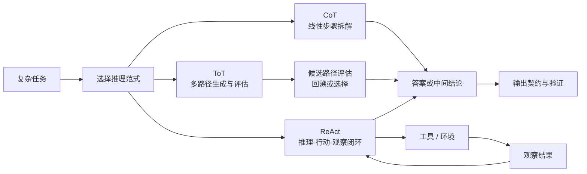

# CoT、ToT、ReAct 推理范式

## 知识点入口

- 本模块先看宏观流程，再看文章：[知识地图](021200_核心知识点/知识地图.md)。
- 核心判断入口：[CoT、ToT、ReAct推理范式边界](021200_核心知识点/CoT、ToT、ReAct推理范式边界.md)。
- 本目录只沉淀推理路径控制、工具反馈闭环和工程边界；具体 Agent 框架实现仍归入 Agent 框架，工具协议仍归入工具调用。

## 技术定位

| 项 | 内容 |
|---|---|
| 技术名 | CoT / ToT / ReAct |
| 一级类目 | Agent 与 AI 工程 |
| 二级类目 | COT&TOT&REACT |
| 技术本体 | 用显式推理步骤、候选路径或工具反馈闭环，约束模型解决多步骤任务的过程 |
| 全局架构位置 | 位于任务 Prompt、Agent Loop、工具调用和 Harness 之间，是模型推理路径的接口层 |
| 主要使用者 | AI 应用工程师、Agent 工程师、AI 编程工作流设计者 |
| 主要产出 | 推理步骤、候选路径、工具调用决策、观察结果、最终答案或后续计划 |

## 官方锚点

- CoT 论文：`Chain-of-Thought Prompting Elicits Reasoning in Large Language Models`，后续补证。
- ToT 论文：`Tree of Thoughts: Deliberate Problem Solving with Large Language Models`，后续补证。
- ReAct 论文：`ReAct: Synergizing Reasoning and Acting in Language Models`，后续补证。
- 本轮只使用本地文章锚点，不联网补官网、GitHub 或论文链接。

## 架构图

## 核心模块

| 模块 | 职责 | 重点问题 |
|---|---|---|
| 任务判定 | 判断任务是否需要显式推理路径 | 简单任务不要强行加 CoT 或 ToT |
| CoT 线性推理 | 把复杂问题拆成连续步骤 | 一条路径走错会持续传播错误 |
| ToT 多路径搜索 | 生成多个候选思路并评估、回溯 | 成本更高，评估器质量决定收益 |
| ReAct 闭环 | 把推理、工具调用和观察结果交替推进 | 显式文本解析脆弱，生产系统应优先结构化 tool calling |
| 输出验证 | 检查答案、工具结果和最终格式 | 推理过程不等于正确性证据 |

## 上下游

| 方向 | 对象 | 关系 |
|---|---|---|
| 上游 | 用户任务、系统提示词、上下文、示例、反例 | 决定要不要显式拆解、搜索或调用工具 |
| 下游 | 结构化输出、工具调用、Agent Loop、评估与观测 | 承接推理结果并验证是否可执行 |
| 依赖 | 模型推理能力、工具 Schema、上下文质量、评估器 | 决定三种范式是否稳定 |

## 横向对标

| 对标对象 | 对标点 | 优势 | 劣势 | 使用判断 |
|---|---|---|---|---|
| 普通 Prompt | 都通过语言指令控制模型 | CoT/ToT/ReAct 更适合多步骤任务 | 更耗 token，容易制造伪推理 | 简单问答用普通 Prompt，复杂任务再升级 |
| 结构化 Tool Calling | 都能驱动外部动作 | ReAct 可解释性强 | 显式 ReAct 文本解析不稳定 | 生产系统优先用结构化 tool calling，ReAct 作为设计思想 |
| Plan & Execute | 都处理多步骤任务 | 预规划成本低、可控 | 对环境变化响应慢 | 流程稳定用 Plan & Execute，不确定环境用 ReAct 或 Harness |
| Harness Engineering | 都影响 Agent 运行 | Harness 更可测试、可恢复 | 实现成本更高 | Prompt 范式不够稳定时，把状态和门禁迁到 Harness |

## 已沉淀核心知识点

| 主题 | 文件 | 问题指纹 | 解决什么问题 | 认知增量 |
|---|---|---|---|---|
| CoT、ToT、ReAct 推理范式边界 | [CoT、ToT、ReAct推理范式边界](021200_核心知识点/CoT、ToT、ReAct推理范式边界.md) | 推理范式 + 线性推理/多路径搜索/工具反馈闭环 + 任务拆解与验证 + 成本和稳定性边界 | 区分三种范式什么时候有用，什么时候应该降级或迁移到 Tool Calling / Harness | ReAct 的长期价值是反馈闭环，不是显式 `Thought/Action/Observation` 文本格式 |

## 后续追查

- 关键词：Chain-of-Thought、Tree-of-Thought、ReAct、Self-Consistency、Reflection、LATS、Plan and Execute、tool calling loop。
- 待读资料：三篇原始论文、主流框架对 ReAct 的实现方式、结构化 tool calling 与显式 ReAct 的对比。
- 待补实验：选一个本地数据分析或代码排障任务，对比普通 Prompt、CoT、ToT、ReAct、结构化 tool calling 的正确率、耗时、token 和失败类型。
