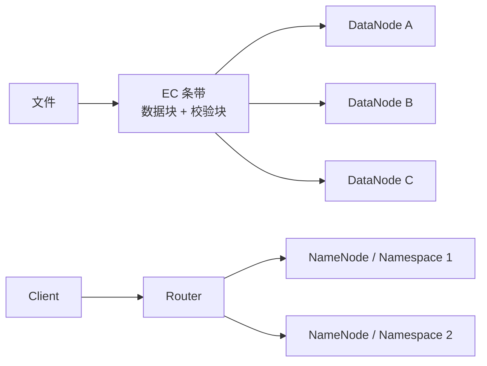

# HDFS 3.x 纠删码与元数据扩展边界

## 原文锚点

- 本地文件：
  - [HDFS面试相关知识-HDFS 3.x 的新特性有哪些？](<../文章/done-HDFS面试相关知识-HDFS 3.x 的新特性有哪些？.md>)
  - [深入剖析HDFS 3.0版本EC技术，节省一半存储但拥有三副本机制相同的容错能力](<../文章/done-深入剖析HDFS 3.0版本EC技术，节省一半存储但拥有三副本机制相同的容错能力.md>)
- 原文链接：见各本地 Markdown 头部 `url` 字段。
- 关键段落：EC、Federation、Router-Based Federation、多 NameNode HA。
- 关键图：EC 矩阵和条带布局图在 Markdown 中缺失。

## 图片处理

| 图片 | 类型 | 是否保留 | 理由 | 处理方式 |
|---|---|---|---|---|
| EC 条带与校验块示意 | 说明图 | 重建 | 说明 EC 用数据块和校验块替代完整副本 | Mermaid 重建 |
| RBF 架构图 | 架构图 | 重建 | 说明 Router 在多个 NameNode 之上提供统一入口 | Mermaid 重建 |

## 一句话结论

HDFS 3.x 的关键价值不是“版本更强”，而是把存储成本、NameNode 扩展、统一命名空间和高可用拆成不同能力；EC 适合冷/温数据降成本，但会引入 CPU、网络、远程读和操作语义限制。

## 用户相关性判断

| 项 | 内容 |
|---|---|
| 用户当前认知层级 | Hive / 离线数仓 L3-L4；HDFS 机制按 L2-L3 处理 |
| 认知成熟度 | draft |
| 阅读投入建议 | 精读 |
| 阅读投入理由 | 能补 HDFS 作为存储底座的成本、扩展和 HA 边界 |
| 对用户的新信息 | EC、Federation、RBF、HA 解决的是不同瓶颈，不能混成单一升级收益 |
| 问题指纹 | HDFS 3.x + EC/Federation/RBF/HA + 存储成本与元数据扩展 + 冷温数据边界 |
| 排重判断 | 合并两篇文章为一个主题 |
| 置信度 | 中 |

## 认知校准点

| 校准点 | 文章观点/信息 | 与用户认知或价值观的关系 | 处理建议 |
|---|---|---|---|
| EC 不是免费省空间 | EC 用校验块降低存储开销，但编码和恢复消耗 CPU/网络 | 对“节省一半”标题降权 | 写清数据温度和访问模式前提 |
| Federation 解决 NameNode 扩展 | 多 NameNode 管理多个命名空间 | 补架构边界 | 与 HA 区分 |
| RBF 解决统一访问 | Router 提供透明路由和挂载点 | 补使用链路 | 关注路由层、状态存储和迁移代价 |
| 多 NameNode HA 解决可用性 | 多节点高可用可容忍更多故障 | 补可靠性边界 | 不等同于容量扩展 |

## 冲突点

| 冲突类型 | 具体表现 | 影响 | 处理 |
|---|---|---|---|
| 标题降权 | “节省一半存储但同等容错”容易被读成无代价收益 | 误导存储策略选择 | 增加 CPU、网络、数据温度和操作限制 |
| 图片缺失 | EC 矩阵、条带布局图缺失 | 影响机制理解 | 重建简化图 |
| 面试题包装 | HDFS 3.x 新特性文章偏清单 | 容易泛泛记忆 | 按瓶颈拆成成本、扩展、访问、高可用 |
| 证据不足 | 缺真实集群读写、恢复和 NameNode 指标 | 不能直接给生产参数 | 标记后续验证 |

## 待吸收点

| 分级 | 内容 | 为什么值得吸收 | 后续动作 |
|---|---|---|---|
| 理解 | EC 用数据块 + 校验块替代多完整副本 | 解释存储成本下降的机制 | 后续补 HDFS EC 官方策略和限制 |
| 理解 | EC 适合冷/温数据，不适合频繁小写、强 append 或低延迟读写 | 影响数据分层策略 | 与 Hive 分区生命周期关联 |
| 记住 | Federation、RBF、HA 分别对应扩展、统一入口、高可用 | 防止能力混淆 | 写入技术入口 |
| 实践 | 对一批冷分区测试三副本和 EC 的空间、读耗时、恢复耗时 | 可验证价值 | 后续补实验 |

## 已知可跳过

| 内容 | 跳过理由 |
|---|---|
| HDFS 是高吞吐高容错文件系统 | 基础背景 |
| EC 的数学推导细节 | 当前沉淀目标是工程边界，不是编码理论 |
| 白皮书推广内容 | 与 HDFS 技术判断无关 |

## 实践门槛

| 门槛 | 判断 | 证据 |
|---|---|---|
| 可运行 | 部分 | 文章有策略和机制描述，但缺完整命令 |
| 可验证 | 部分 | 可验证空间占用、读性能、恢复耗时，但文章未给本地基线 |
| 可排障 | 部分 | 有恢复开销和限制提示，缺日志信号 |
| 可迁移 | 是 | 可迁移到离线数仓冷分区存储成本治理 |
| 结论 | 降为精读 | 需要补官方命令和真实集群实验后才能判实践 |

## 归类判断

| 项 | 内容 |
|---|---|
| 技术本体 | HDFS 3.x |
| 文章主问题 | HDFS 存储成本、元数据扩展、统一访问和高可用能力 |
| 使用场景 | 离线数仓冷/温数据、HDFS 集群扩展、大规模命名空间 |
| 关键词干扰 | 面试、新特性、存储成本 |
| 最终归类 | 数据工程与数仓 / 离线数仓 / Hadoop&HDFS |
| 归类理由 | 主问题是 HDFS 存储底座能力，不是通用资源调度 |

## 技术定位

| 项 | 内容 |
|---|---|
| 技术类型 | 分布式文件系统能力升级 |
| 所属领域 | 数据工程与数仓 |
| 二级类目 | 离线数仓 |
| 全局架构位置 | Hive/Spark/MapReduce 下方的存储和元数据层 |
| 涉及模块 | EC、NameNode、DataNode、Federation、RBF、HA |
| 解决问题 | 存储成本、元数据扩展、统一访问和高可用 |
| 原文局限 | 缺官方版本证据、真实参数、失败恢复指标 |
| 我的结论 | 以后关注，作为 HDFS 存储治理方向 |

## 纵向理解

| 维度 | 判断 |
|---|---|
| 全局架构 | 数据写入 HDFS，NameNode 管元数据，DataNode 存 Block，Hive/Spark 消费 |
| 本文位置 | 存储成本和元数据扩展，不是 SQL 优化 |
| 核心机制 | EC 编码、校验块恢复、NameNode 命名空间拆分、Router 透明路由、HA 切换 |
| 使用链路 | 识别冷/温数据 -> 配置 EC 策略 -> 监控读写和恢复 -> 评估成本收益 |
| 前置条件 | 数据温度、读写比例、CPU/网络余量、恢复窗口、操作语义要求 |
| 边界 | 热数据、频繁追加、低延迟读写、小文件和强 rename 依赖场景要谨慎 |

## 横向对标

| 对标技术 | 实现方式 | 优势 | 劣势 | 适合场景 |
|---|---|---|---|---|
| HDFS 三副本 | 每个 Block 多完整副本 | 读写简单、恢复直接、热数据友好 | 存储开销高 | 热数据、频繁访问、简单可靠 |
| HDFS EC | 数据块 + 校验块 | 降低存储成本 | CPU/网络和恢复开销更高，有操作限制 | 冷/温数据、归档分区 |
| 对象存储 EC/副本 | 存储服务内部封装 | 用户侧简单、弹性强 | 文件系统语义不同 | 云上归档和湖仓底座 |

## 后续追查

- 关键词：HDFS Erasure Coding、RS-6-3、EC Policy、Router-Based Federation、NameNode Federation、HDFS HA。
- 相关技术：Hive 分区生命周期、对象存储、湖仓表格式、HDFS Balancer。
- 需要补读的文章：官方 HDFS EC 文档、RBF 文档、EC 限制和运维案例。
