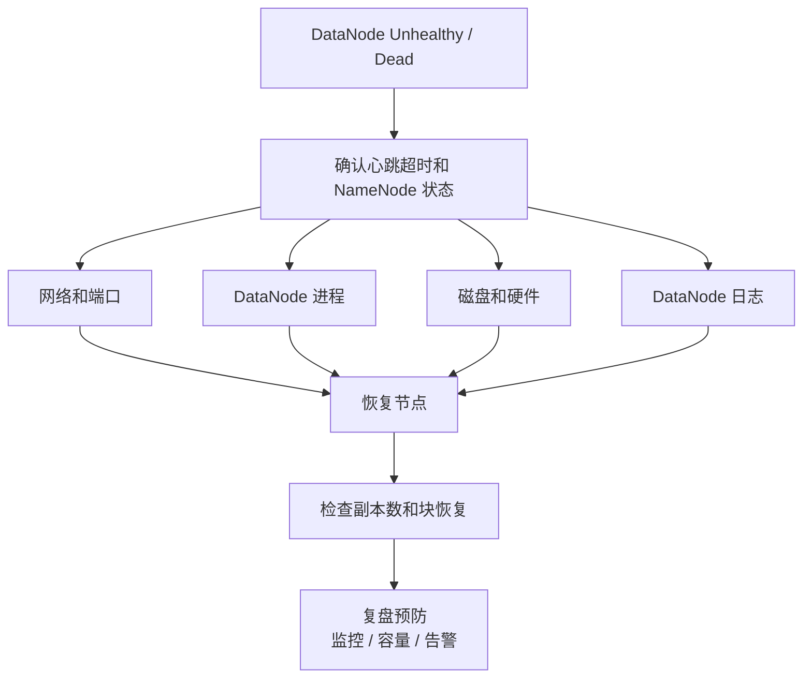

# HDFS DataNode 失联排障

## 原文锚点

- 本地文件：[HDFS面试相关知识-DataNode 失联（Unhealthy Node），如何处理？](<../文章/HDFS面试相关知识-DataNode 失联（Unhealthy Node），如何处理？.md>)
- 原文链接：见本地 Markdown 头部 `url` 字段。
- 关键段落：心跳机制、网络连通性、进程状态、磁盘状态、日志分析、副本恢复。
- 关键图：无。

## 图片处理

| 图片 | 类型 | 是否保留 | 理由 | 处理方式 |
|---|---|---|---|---|
| 排障流程图 | 流程图 | 重建 | 文章有明确定位顺序，适合沉淀为流程 | Mermaid 重建 |

## 一句话结论

DataNode 失联不是单纯“重启节点”的问题，排障主线应固定为心跳判定、网络、进程、磁盘、日志、副本恢复和预防复盘。

## 用户相关性判断

| 项 | 内容 |
|---|---|
| 用户当前认知层级 | HDFS 排障按 L2-L3 处理 |
| 认知成熟度 | draft |
| 阅读投入建议 | 实践 |
| 阅读投入理由 | 文章提供排查维度、命令方向和恢复链路，可转成演练清单 |
| 对用户的新信息 | 把面试题转为生产故障定位顺序和验证动作 |
| 问题指纹 | HDFS + DataNode 心跳/副本恢复 + 失联排障 + 数据可靠性边界 |
| 排重判断 | 新建 |
| 置信度 | 中 |

## 认知校准点

| 校准点 | 文章观点/信息 | 与用户认知或价值观的关系 | 处理建议 |
|---|---|---|---|
| 心跳是状态判定入口 | NameNode 根据心跳和块报告判断 DataNode 状态 | 补排障起点 | 固化为首个节点 |
| 单节点失联通常不等于数据丢失 | HDFS 多副本会触发副本恢复 | 防止过度响应 | 仍要检查副本不足和连续故障风险 |
| 重启前要分因定位 | 网络、进程、磁盘、日志分别指向不同处理 | 符合工程排障偏好 | 做成固定检查表 |
| 恢复后必须验证副本 | 节点恢复不等于副本已经达标 | 补验证闭环 | 关注 under-replicated blocks |

## 冲突点

| 冲突类型 | 具体表现 | 影响 | 处理 |
|---|---|---|---|
| 面试题包装 | 标题是面试知识，但内容有实操排障价值 | 容易被误判为低价值 | 转成流程化排障 |
| 版本风险 | 端口、命令和守护进程管理方式可能随发行版变化 | 直接照抄可能失败 | 后续补项目版本和官方命令 |
| 证据不足 | 缺真实日志样例、监控图和恢复耗时 | 不能作为完整 SOP | 标记待验证 |

## 待吸收点

| 分级 | 内容 | 为什么值得吸收 | 后续动作 |
|---|---|---|---|
| 理解 | NameNode 通过心跳和块状态判断 DataNode 健康 | 排障入口 | 补 NameNode UI / JMX / 告警指标 |
| 理解 | 网络、进程、磁盘和日志分别代表不同故障域 | 避免盲目重启 | 建检查表 |
| 记住 | 恢复节点后必须检查副本不足、坏块和块恢复进度 | 形成验证闭环 | 后续补命令 |
| 实践 | 构造 DataNode 停进程、断端口、满盘三类演练 | 可运行、可验证、可排障、可迁移 | 后续做实验记录 |

## 已知可跳过

| 内容 | 跳过理由 |
|---|---|
| “DataNode 是 HDFS 存储节点” | 基础定义 |
| 只背心跳超时时间 | 不如掌握可验证排障流程 |

## 实践门槛

| 门槛 | 判断 | 证据 |
|---|---|---|
| 可运行 | 是 | 可通过停止 DataNode 进程、断网络端口、模拟满盘构造故障 |
| 可验证 | 是 | 可检查 NameNode 状态、Live/Dead Node、副本不足、块恢复 |
| 可排障 | 是 | 网络、进程、磁盘、日志、JVM、块恢复都有定位路径 |
| 可迁移 | 是 | 可迁移到数据平台 HDFS 运维和离线数仓可靠性治理 |
| 结论 | 实践 | 后续需要补版本化命令和真实日志样例 |

## 归类判断

| 项 | 内容 |
|---|---|
| 技术本体 | HDFS DataNode |
| 文章主问题 | DataNode 失联时如何定位和恢复 |
| 使用场景 | HDFS 集群运维、离线数仓存储可靠性 |
| 关键词干扰 | 面试、Unhealthy Node、Dead Node |
| 最终归类 | 数据工程与数仓 / 离线数仓 / Hadoop&HDFS |
| 归类理由 | 主问题是 HDFS 存储节点故障，不是通用资源调度 |

## 技术定位

| 项 | 内容 |
|---|---|
| 技术类型 | 分布式文件系统排障 |
| 所属领域 | 数据工程与数仓 |
| 二级类目 | 离线数仓 |
| 全局架构位置 | HDFS 存储层 DataNode 与 NameNode 之间 |
| 涉及模块 | 心跳、块报告、DataNode 进程、磁盘、网络、副本恢复 |
| 解决问题 | DataNode 失联后如何快速定位并恢复可靠性 |
| 原文局限 | 缺发行版差异、真实日志和恢复指标 |
| 我的结论 | 现在用，作为 HDFS 运维演练候选 |

## 纵向理解

| 维度 | 判断 |
|---|---|
| 全局架构 | NameNode 维护元数据和节点状态，DataNode 存储块并周期上报 |
| 本文位置 | 存储节点故障排障，不是 SQL 或表模型问题 |
| 核心机制 | 心跳、块报告、副本恢复、磁盘健康、进程状态 |
| 使用链路 | 告警 -> 判定节点状态 -> 分域排查 -> 恢复 -> 校验副本 -> 复盘 |
| 前置条件 | 有监控、日志路径、HDFS 管理权限、变更窗口和回滚方案 |
| 边界 | 多节点连续故障、NameNode 故障、机架级故障需要更高层应急流程 |

## 横向对标

| 对标技术 | 实现方式 | 优势 | 劣势 | 适合场景 |
|---|---|---|---|---|
| HDFS DataNode 恢复 | 节点恢复 + 副本重建 | 文件系统级容错清晰 | 依赖副本数和恢复窗口 | 自建 HDFS |
| 对象存储节点故障 | 服务内部封装 | 使用者少感知底层节点 | 内部细节不可见 | 云上存储服务 |
| HBase RegionServer 故障 | WAL、Region、HDFS 存储协同恢复 | 更贴近在线读写 | 排障链路更复杂 | 宽列数据库 |

## 后续追查

- 关键词：DataNode Heartbeat、Block Report、Under Replicated Blocks、Dead DataNode、HDFS fsck。
- 相关技术：NameNode HA、HDFS Balancer、HBase on HDFS、Prometheus Hadoop Exporter。
- 需要补读的文章：HDFS 官方命令、DataNode 日志样例、NameNode UI/JMX 指标、坏盘替换 SOP。
