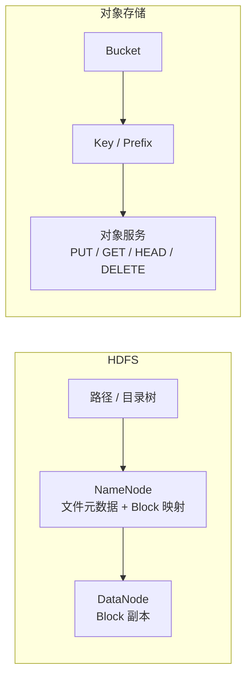

# HDFS 存储模型与对象存储边界

## 原文锚点

- 本地文件：[HDFS 和对象存储有什么本质区别](<../文章/done-HDFS 和对象存储有什么本质区别.md>)
- 原文链接：见本地 Markdown 头部 `url` 字段。
- 关键段落：命名空间、元数据暴露、读写路径、rename/append/list、运维关注点。
- 关键图：正文提到系统差异但 Markdown 未保留技术图。

## 图片处理

| 图片 | 类型 | 是否保留 | 理由 | 处理方式 |
|---|---|---|---|---|
| HDFS 与对象存储结构对比图 | 架构图 | 重建 | 帮助区分 NameNode/Block 与 bucket/key 对象语义 | Mermaid 重建 |

## 一句话结论

HDFS 和对象存储的差异不是“谁更能存大数据”，而是文件系统语义与对象语义的差异；选型要看命名空间、元数据暴露、读写路径、rename/append/list 成本和运维边界。

## 用户相关性判断

| 项 | 内容 |
|---|---|
| 用户当前认知层级 | Hive / 离线数仓建模 L3-L4；HDFS 存储边界按 L2-L3 处理 |
| 认知成熟度 | draft |
| 阅读投入建议 | 精读 |
| 阅读投入理由 | 文章能补离线数仓存储底座和对象存储/湖仓底座的横向边界 |
| 对用户的新信息 | 把“能存文件”拆成文件系统命名空间、对象键空间、元数据访问和操作语义 |
| 问题指纹 | HDFS + 命名空间/Block/NameNode + 对象存储对比 + 存储选型边界 + 文件系统语义校准 |
| 排重判断 | 新建 |
| 置信度 | 高 |

## 认知校准点

| 校准点 | 文章观点/信息 | 与用户认知或价值观的关系 | 处理建议 |
|---|---|---|---|
| 不按“都能存文件”比较 | HDFS 是目录树和 Block 映射，对象存储是 bucket/key 对象空间 | 补横向对标边界 | 写成存储选型准则 |
| 元数据暴露方式不同 | HDFS 客户端先问 NameNode 拿 Block 位置，对象存储隐藏底层分片 | 补全局架构位置 | 区分使用者心智和内部实现 |
| 操作语义不同 | HDFS rename/append/list 更接近文件系统元数据操作，对象存储常是 key 级组合操作 | 补工程边界 | 关注任务提交、临时目录、表提交语义 |
| 运维关注点不同 | HDFS 关注 NameNode、Block、小文件、RPC、GC；对象存储关注桶策略、生命周期、请求、计费 | 补运维边界 | 后续文章按故障信号归类 |

## 冲突点

| 冲突类型 | 具体表现 | 影响 | 处理 |
|---|---|---|---|
| 原目录冲突 | 原文曾在资源与运维目录，但主问题是 HDFS 存储本体对标 | 容易把 HDFS 只当运维主题 | 重路由到 `0302_离线数仓/030201_Hadoop&HDFS` |
| 图片缺失 | 正文讲结构差异但无图 | 影响机制理解 | Mermaid 重建 |
| 证据不足 | 没有具体云厂商对象存储一致性、性能或成本基线 | 不能直接做采购结论 | 只沉淀抽象边界 |

## 待吸收点

| 分级 | 内容 | 为什么值得吸收 | 后续动作 |
|---|---|---|---|
| 理解 | HDFS 的路径是命名空间树节点，对象存储的路径感通常来自 key 前缀 | 直接影响目录遍历、权限、rename 和表提交语义 | 后续补 Iceberg/Hive on object storage 证据 |
| 理解 | HDFS 客户端参与 Block 位置选择，对象存储客户端主要按对象 API 访问 | 解释数据本地性和读写路径差异 | 关联 Spark/Hive 读写路径 |
| 记住 | HDFS 更像自运维分布式文件系统，对象存储更像服务化存储接口 | 选型短规则 | 写入 Hadoop&HDFS 技术入口 |
| 实践 | 对比同一批提交任务在 HDFS 与对象存储上的 rename/list 行为和失败恢复 | 可验证湖仓迁移风险 | 后续补实验 |

## 已知可跳过

| 内容 | 跳过理由 |
|---|---|
| HDFS 能存大文件、对象存储能存对象 | 基础背景 |
| “对象存储更现代”或“HDFS 更传统”的泛泛判断 | 不构成选型准则 |

## 实践门槛

不适用。本文是机制和选型边界文章，不提供完整可运行实验。

## 归类判断

| 项 | 内容 |
|---|---|
| 技术本体 | HDFS / 对象存储 |
| 文章主问题 | 两类大规模存储系统的抽象、读写路径和适用边界 |
| 使用场景 | 离线数仓、湖仓底座、日志归档、批处理文件存储 |
| 关键词干扰 | 运维、对象存储、云存储 |
| 最终归类 | 数据工程与数仓 / 离线数仓 / Hadoop&HDFS |
| 归类理由 | HDFS 是离线数仓存储承载层，文章主问题是存储本体对标 |

## 技术定位

| 项 | 内容 |
|---|---|
| 技术类型 | 分布式文件系统 / 对象存储对标 |
| 所属领域 | 数据工程与数仓 |
| 二级类目 | 离线数仓 |
| 全局架构位置 | Hive/Spark/MapReduce 之下的数据文件承载层 |
| 涉及模块 | NameNode、DataNode、Block、bucket、key、对象 API |
| 解决问题 | 选型时区分文件系统语义和对象语义 |
| 原文局限 | 缺具体云对象存储版本、一致性模型、性能和成本数据 |
| 我的结论 | 现在用作 HDFS/对象存储横向边界准则 |

## 纵向理解

| 维度 | 判断 |
|---|---|
| 全局架构 | 上游写入文件，HDFS/对象存储承载数据，下游 Hive/Spark/湖表读取 |
| 本文位置 | 存储抽象和选型边界，不是 Hive 建模或 Spark 优化 |
| 核心机制 | 命名空间、元数据、Block 映射、对象 key、读写 API |
| 使用链路 | 写入路径 -> 元数据登记 -> 数据读写 -> 下游计算 -> 运维治理 |
| 前置条件 | 文件规模、文件数、读写模式、表格式、团队运维能力、云上或自建基础设施 |
| 边界 | 不能用“能存文件”替代真实的提交语义、目录成本和一致性判断 |

## 横向对标

| 对标技术 | 实现方式 | 优势 | 劣势 | 适合场景 |
|---|---|---|---|---|
| HDFS | 文件系统命名空间 + Block + NameNode/DataNode | 大文件吞吐、文件系统语义、与传统 Hadoop 生态贴合 | 自运维重、小文件和 NameNode 压力明显 | 自建离线数仓、批处理、强文件系统语义 |
| 对象存储 | bucket/key + 对象 API + 服务化元数据 | 弹性、共享、跨集群、生命周期管理 | rename/append/list 语义和成本不同 | 云上湖仓、归档、跨业务共享 |
| 本地文件系统 | 单机文件和目录 | 简单、低延迟 | 无分布式容错和扩展 | 小规模开发、临时分析 |

## 后续追查

- 关键词：HDFS NameNode、Object Store Consistency、Hive on S3、FileOutputCommitter、rename cost。
- 相关技术：Hive、Spark、Iceberg、Hudi、Paimon、S3A。
- 需要补读的文章：Hadoop S3A committers、Iceberg on object storage、HDFS 小文件治理。
