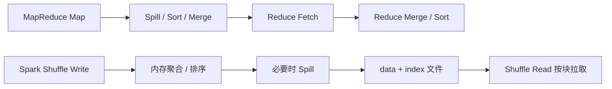

# MapReduce Shuffle 与 Spark Shuffle 边界

## 原文锚点

- 本地文件：[MapReduce 的 shuffle 与 spark的 shuffle 有什么区别？](<../文章/done-MapReduce 的 shuffle 与 spark的 shuffle 有什么区别？.md>)
- 原文链接：见本地 Markdown 头部 `url` 字段。
- 关键段落：MapReduce Shuffle 流程、Spark Shuffle 流程、磁盘 I/O、内存和流水线差异。
- 关键图：无。

## 图片处理

| 图片 | 类型 | 是否保留 | 理由 | 处理方式 |
|---|---|---|---|---|
| Shuffle 对比流程 | 流程图 | 重建 | 文章以流程解释差异，适合沉淀为对照图 | Mermaid 重建 |

## 一句话结论

这篇文章对 Hadoop&HDFS 目录的价值不是“证明 Spark 更快”，而是把 Hadoop 传统 MapReduce 计算模型与 Spark 运行时治理边界拆开：MapReduce Shuffle 更稳定但磁盘物化重，Spark Shuffle 更灵活但运行时问题应归 Spark 节点继续沉淀。

## 用户相关性判断

| 项 | 内容 |
|---|---|
| 用户当前认知层级 | Spark / Spark SQL L3；Hadoop MapReduce 按 L2-L3 处理 |
| 认知成熟度 | draft |
| 阅读投入建议 | 略读 |
| 阅读投入理由 | 文章能补 MapReduce 与 Spark 的历史计算模型对标，但 Spark 内部细节对用户已偏基础，需要降权 |
| 对用户的新信息 | MapReduce Shuffle 的强制排序、磁盘物化和 Spark Shuffle 的 index/data 文件边界可用于归类判断 |
| 问题指纹 | Hadoop + MapReduce Shuffle + Spark Shuffle 对标 + 批计算模型边界 + 引擎归类校准 |
| 排重判断 | 新建 |
| 置信度 | 中 |

## 认知校准点

| 校准点 | 文章观点/信息 | 与用户认知或价值观的关系 | 处理建议 |
|---|---|---|---|
| 不把 Spark Shuffle 细节沉淀到 Hadoop 节点 | 文章大量解释 Spark Shuffle | 防止按对比对象误归类 | 本目录只保留 MapReduce 对照，Spark 细节回 Spark |
| MapReduce 的稳定性来自物化代价 | Map 端 Spill、Merge，Reduce 端 Fetch、Merge 都依赖磁盘流程 | 补计算模型边界 | 写成历史批计算模型对照 |
| Spark 的灵活性来自运行时优化 | Spark 使用内存、溢写、索引文件和可插拔 ShuffleManager | 对用户多半已知 | 不扩写为 Spark 运行时知识点 |
| 标题偏面试 | 内容偏概念对比，缺真实指标 | 证据不足 | 不作为性能选型结论 |

## 待吸收点

| 分级 | 内容 | 为什么值得吸收 | 后续动作 |
|---|---|---|---|
| 理解 | MapReduce Shuffle 是强制排序和磁盘物化链路 | 解释 Hadoop 传统批处理为什么重 | 放入 Hadoop 生态边界 |
| 理解 | Spark Shuffle 用 data/index 文件定位分区块，减少盲目拷贝 | 解释 Spark 和 MapReduce 的运行方式差异 | 更深入细节归 Spark 节点 |
| 记住 | MapReduce 对标文章只吸收 Hadoop 计算模型边界，不沉淀 Spark 调优细节 | 防止目录污染 | 写入 AGENTS 归类规则 |

## 已知可跳过

| 内容 | 跳过理由 |
|---|---|
| Spark 比 MapReduce 更适合迭代计算和交互式查询 | 用户大概率已知 |
| “重型/轻量”的类比 | 只能帮助理解，不构成工程准则 |
| 公众号推荐和社群广告 | 无沉淀价值 |

## 实践门槛

不适用。文章没有提供可复现实验、输入输出、指标基线或排障路径，只能作为对标理解。

## 归类判断

| 项 | 内容 |
|---|---|
| 技术本体 | Hadoop MapReduce / Spark |
| 文章主问题 | 两类批计算引擎 Shuffle 模型差异 |
| 使用场景 | 离线批处理、Spark 替代 MapReduce、面试对比 |
| 关键词干扰 | Spark、Shuffle、性能 |
| 最终归类 | 数据工程与数仓 / 离线数仓 / Hadoop&HDFS |
| 归类理由 | 本目录只吸收 MapReduce 作为 Hadoop 生态计算模型的边界；Spark 运行时优化归 Spark 节点 |

## 技术定位

| 项 | 内容 |
|---|---|
| 技术类型 | 批计算模型对标 |
| 所属领域 | 数据工程与数仓 |
| 二级类目 | 离线数仓 |
| 全局架构位置 | HDFS 存储之上的传统 MapReduce 计算层，与 Spark 计算层对标 |
| 涉及模块 | Map、Reduce、Spill、Merge、Fetch、ShuffleManager、Shuffle Read/Write |
| 解决问题 | 解释 MapReduce 为什么重，以及为什么 Spark 运行时问题不应沉淀在 Hadoop 节点 |
| 原文局限 | 缺版本、数据规模、指标和失败模式 |
| 我的结论 | 仅了解/略读，用作目录边界校准 |

## 横向对标

| 对标技术 | 实现方式 | 优势 | 劣势 | 适合场景 |
|---|---|---|---|---|
| MapReduce Shuffle | 强制排序、磁盘物化、Reduce 拉取 | 稳定、流程清楚、失败恢复心智简单 | 磁盘 I/O 重，迭代和交互慢 | 传统批处理、历史系统维护 |
| Spark Shuffle | 内存优先、必要时 Spill、data/index 文件定位 | 灵活、性能优化空间大 | 参数、内存、倾斜、外部 Shuffle 治理复杂 | Spark SQL、迭代计算、交互式离线分析 |

## 后续追查

- 关键词：MapReduce Shuffle、Spill、Merge、SortShuffleManager、External Shuffle Service、Spark AQE。
- 相关技术：Spark、Hive on Tez、Celeborn。
- 需要补读的文章：Spark Shuffle 生产排障、AQE 与 Shuffle 分区治理。
