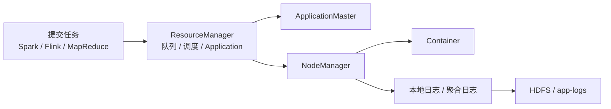

# YARN 资源调度与运行边界

## 原文锚点

- 本地文件：
  - [Yarn Application 日志总结](<../文章/Yarn Application 日志总结.md>)
  - [Yarn调度器深度对比：从Hadoop到K8S的调度演进之路](../文章/Yarn调度器深度对比：从Hadoop到K8S的调度演进之路.md)
  - [《YARN vs Kubernetes：大数据资源调度谁称王？深度对比告诉你答案！》](<../文章/《YARN vs Kubernetes：大数据资源调度谁称王？深度对比告诉你答案！》.md>)
  - [Flink On Yarn HA 重启次数](<../文章/Flink On Yarn HA 重启次数.md>)
  - [Flink + YARN + Gitlab 自动提交代码全流程详解](<../文章/Flink + YARN + Gitlab 自动提交代码全流程详解.md>)
- 原文链接：见各本地 Markdown 头部 `url` 字段。
- 关键段落：YARN 调度器、Application 日志、日志聚合、Application Attempt、Flink on YARN、YARN 与 Kubernetes 对比。
- 关键图：部分文章提到架构图或对比图，但 Markdown 未保留。

## 图片处理

| 图片 | 类型 | 是否保留 | 理由 | 处理方式 |
|---|---|---|---|---|
| YARN 调度链路图 | 架构图 | 重建 | 说明 ResourceManager、NodeManager、ApplicationMaster、Container 的关系 | Mermaid 重建 |

## 一句话结论

YARN 应作为 Hadoop 生态资源调度层沉淀：它管理队列、Application、ApplicationMaster、Container 和日志聚合；Flink/Spark 的算子、状态、Checkpoint、Shuffle 机制仍回到对应计算引擎目录。

## 用户相关性判断

| 项 | 内容 |
|---|---|
| 用户当前认知层级 | 数据工程资源调度按 L2-L3 处理 |
| 认知成熟度 | draft |
| 阅读投入建议 | 精读 |
| 阅读投入理由 | 能补 Hadoop 生态资源层边界，且日志和重试文章有实践价值 |
| 对用户的新信息 | 资源调度不再单独做目录，YARN 跟随 Hadoop；Kubernetes 通用平台能力按工程部署或具体数据技术归类 |
| 问题指纹 | Hadoop + YARN + 队列/Container/Application/日志/HA + Spark/Flink 运行承载 + Kubernetes 对标 |
| 排重判断 | 新建 |
| 置信度 | 中 |

## 认知校准点

| 校准点 | 文章观点/信息 | 与用户认知或价值观的关系 | 处理建议 |
|---|---|---|---|
| YARN 属于 Hadoop 生态 | YARN 管理大数据任务资源，不是独立问题域 | 纠偏目录边界 | 放入 `Hadoop&HDFS` |
| 不按关键词抢 Flink/Spark | Flink on YARN 的 YARN 日志、Attempt、队列问题归 YARN；Flink 状态和算子问题归 Flink | 防止误归类 | 路由表显式记录 |
| YARN vs Kubernetes 要拆维度 | YARN 更偏大数据任务队列，Kubernetes 更偏云原生运行平台 | 补横向对标 | 不写“谁称王”式结论 |
| 日志链路有实践价值 | 本地日志、聚合日志、历史日志和失败保留是排障入口 | 符合工程落地偏好 | 后续补命令和版本验证 |

## 冲突点

| 冲突类型 | 具体表现 | 影响 | 处理 |
|---|---|---|---|
| 原目录冲突 | 原文来自已下线的资源与运维目录 | 后续文章可能继续导入旧目录 | 规则改为 YARN 进 Hadoop |
| 标题降权 | “谁称王”“深度对比”类标题夸张 | 不能直接作为选型结论 | 只保留对标维度 |
| 技术混杂 | Flink、GitLab、Kubernetes 与 YARN 混在同一篇文章 | 容易按场景误归类 | 以文章主问题和可复用机制拆分 |
| 证据不足 | 部分文章缺真实集群配置、资源指标和回滚方案 | 不能直接沉淀为生产 SOP | 标记后续验证 |

## 待吸收点

| 分级 | 内容 | 为什么值得吸收 | 后续动作 |
|---|---|---|---|
| 理解 | ResourceManager 负责调度，NodeManager 承载 Container，ApplicationMaster 管理单个应用生命周期 | YARN 基本架构边界 | 后续补官方架构图 |
| 理解 | FIFO、Capacity、Fair Scheduler 解决不同队列公平性和资源保障问题 | 影响多租户数仓任务隔离 | 后续补真实队列配置 |
| 记住 | `yarn logs -applicationId`、NodeManager 本地日志、HDFS 聚合日志是排障三条线 | 能直接用于任务失败定位 | 后续补命令清单 |
| 记住 | YARN vs Kubernetes 不是谁替代谁，而是大数据任务队列和通用云原生平台的差异 | 选型边界 | 写入目录划分 |
| 实践 | 做一个 Flink on YARN Application Attempt 和日志聚合演练 | 可运行、可验证、可排障 | 后续补实验 |

## 已知可跳过

| 内容 | 跳过理由 |
|---|---|
| YARN 是资源调度器 | 基础定义 |
| “Kubernetes 更现代”或“YARN 更稳定”的泛泛说法 | 没有队列、隔离、调试、弹性和运维证据 |
| GitLab 自动提交流水线的普通步骤 | 主问题不是 GitLab |

## 实践门槛

| 门槛 | 判断 | 证据 |
|---|---|---|
| 可运行 | 部分 | 日志文章有命令，Flink on YARN 有参数线索 |
| 可验证 | 部分 | 可验证 Application 状态、Attempt 次数、日志聚合路径 |
| 可排障 | 是 | 日志、本地路径、聚合日志、失败保留有定位链路 |
| 可迁移 | 是 | 可迁移到 Hadoop 集群任务排障和 Flink/Spark on YARN 运维 |
| 结论 | 精读，局部实践 | 需要补真实集群版本和最小演练记录 |

## 归类判断

| 项 | 内容 |
|---|---|
| 技术本体 | YARN |
| 文章主问题 | Hadoop 生态任务如何调度、运行、记录日志、重试和对标 Kubernetes |
| 使用场景 | Hive、Spark、Flink、MapReduce 等大数据任务运行承载 |
| 关键词干扰 | Flink、GitLab、Kubernetes |
| 最终归类 | 数据工程与数仓 / 离线数仓 / Hadoop&HDFS |
| 归类理由 | 用户明确要求 YARN 相关放在 Hadoop；从技术本体看，YARN 也是 Hadoop 生态资源层 |

## 技术定位

| 项 | 内容 |
|---|---|
| 技术类型 | Hadoop 生态资源调度层 |
| 所属领域 | 数据工程与数仓 |
| 二级类目 | 离线数仓 |
| 全局架构位置 | HDFS 与计算引擎之间的资源调度和应用生命周期管理层 |
| 涉及模块 | ResourceManager、NodeManager、ApplicationMaster、Container、Scheduler、日志聚合 |
| 解决问题 | 多任务资源分配、队列隔离、应用运行、日志查看和故障定位 |
| 原文局限 | 多篇文章偏教程或标题党，缺统一版本和生产指标 |
| 我的结论 | 现在用作 Hadoop 生态资源层入口 |

## 纵向理解

| 维度 | 判断 |
|---|---|
| 全局架构 | Client 提交任务 -> ResourceManager 分配资源 -> ApplicationMaster 协调 -> NodeManager 启动 Container -> 日志聚合 |
| 本文位置 | 资源调度与应用运行，不是 HDFS 存储语义，也不是 Flink/Spark 算子机制 |
| 核心机制 | 队列调度、Application Attempt、Container 分配、日志聚合、HA 和重试 |
| 使用链路 | 配队列 -> 提交任务 -> 观察 Application -> 拉日志 -> 调整重试/资源 -> 复盘 |
| 前置条件 | Hadoop 版本、YARN 队列配置、日志聚合开启、HDFS 路径、权限和监控 |
| 边界 | 云原生弹性、容器生态、多类型服务编排通常由 Kubernetes 更擅长 |

## 横向对标

| 对标技术 | 实现方式 | 优势 | 劣势 | 适合场景 |
|---|---|---|---|---|
| YARN | ResourceManager + NodeManager + Container + 队列 | Hadoop 生态成熟，批任务和队列模型稳定 | 云原生弹性、隔离和生态弱于 Kubernetes | 传统 Hadoop、Hive/Spark/Flink on YARN |
| Kubernetes | API Server + Scheduler + Kubelet + Pod | 容器生态、隔离、弹性和部署能力强 | 数据任务依赖镜像和存储配置，调试复杂 | 云原生数据平台、Flink/Spark on K8s |
| Standalone / 本地模式 | 引擎自带资源管理 | 简单 | 多租户和隔离弱 | 开发、小集群、实验 |

## 后续追查

- 关键词：YARN ResourceManager、NodeManager、ApplicationMaster、Capacity Scheduler、Fair Scheduler、YARN logs、Application Attempt、Log Aggregation。
- 相关技术：HDFS、Spark on YARN、Flink on YARN、Kubernetes、Kyuubi。
- 需要补读的文章：YARN 官方架构、Capacity Scheduler 配置、Flink on YARN Application Mode、Spark on YARN 日志和重试。
