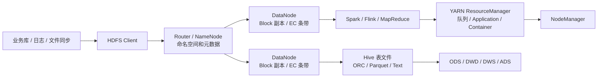

# Hadoop & HDFS

## 知识点入口

- 本模块先看宏观流程，再看文章：[知识地图](030201_核心知识点/知识地图.md)。
- 新文章必须先判断主问题是 HDFS 存储本体、Hadoop MapReduce 计算模型、YARN 资源调度，还是其他技术借用 HDFS。
- `文章/` 只保留原文锚点，长期知识必须沉淀到 `030201_核心知识点/`。

## 技术定位

| 项 | 内容 |
|---|---|
| 技术名 | Hadoop & HDFS |
| 一级类目 | 数据工程与数仓 |
| 二级类目 | 离线数仓 |
| 技术本体 | Hadoop 是大数据批处理生态底座，包含 HDFS 存储、YARN 资源调度和 MapReduce 传统计算模型；HDFS 是面向大文件、高吞吐、容错存储的分布式文件系统 |
| 全局架构位置 | 位于采集同步、Hive/Spark/Flink/MapReduce 计算和上层数仓表之间，承担离线数据存储承载、资源调度和传统批处理运行底座 |
| 主要使用者 | 数据平台工程师、数仓工程师、大数据运维、离线计算任务开发者 |
| 主要产出 | HDFS 文件、目录、Block、副本/纠删码数据、YARN Application、队列、Container、离线任务输入输出、数仓表底层文件 |

## 官方锚点

初始化阶段只使用本地资料，不联网补证；以下官方锚点后续精修时补证。

- 官网：后续补证
- GitHub：后续补证
- 官方文档：后续补证
- 架构文档：后续补证

## 架构图

## 核心模块

| 模块 | 职责 | 重点问题 |
|---|---|---|
| NameNode | 管理命名空间、文件到 Block 的映射、权限和元数据 | 文件数、Block 数、内存、FSImage/EditLog、HA、Federation |
| DataNode | 存储 Block，向 NameNode 上报心跳、块状态和磁盘健康 | 磁盘、网络、心跳、坏盘、满盘、副本不足 |
| Block 与副本 | 把文件拆为块并按副本策略分布到 DataNode | 吞吐、容错、本地性、存储成本 |
| 纠删码 | 用校验块替代完整副本，降低冷/温数据存储成本 | CPU、网络、远程读、操作限制、恢复开销 |
| Router-Based Federation | 在多 NameNode 之上提供统一命名空间视图 | 路由、挂载点、隔离、迁移复杂度 |
| MapReduce | Hadoop 传统批计算模型 | 适合作为 Spark Shuffle、批处理模型的历史对照，不等同于 HDFS |
| YARN | Hadoop 生态资源调度层 | 队列、Application、Container、日志聚合、HA、与 Kubernetes 调度模型对标 |

## 上下游

| 方向 | 对象 | 关系 |
|---|---|---|
| 上游 | DataX、Sqoop、日志采集、业务导出、Flink/Spark 输出 | 把离线或准实时数据落为 HDFS 文件 |
| 下游 | Hive、Spark、MapReduce、Kyuubi、数据治理工具 | 读取 HDFS 文件做 SQL、批处理、建模、质量和血缘治理 |
| 依赖 | 机房网络、磁盘、操作系统、Kerberos/Ranger、监控告警 | 影响吞吐、可靠性、权限和排障 |
| 相邻 | 对象存储、湖仓表格式、Kubernetes、Flink、Spark | 分别承担存储服务、表事务、云原生平台运行和具体计算引擎 |

## 横向对标

| 对标技术 | 对标点 | 优势 | 劣势 | 使用判断 |
|---|---|---|---|---|
| 对象存储 | 大规模数据存储 | 弹性、共享、服务边界清晰、适合云上湖仓 | rename/append/目录语义不同，元数据和一致性心智不同 | 需要文件系统语义和批处理吞吐时偏 HDFS；需要弹性共享和服务化访问时偏对象存储 |
| Hive 表 | 数仓表承载 | HDFS 提供文件系统，Hive 提供表、分区和元数据 | HDFS 不管理表语义 | 不把 HDFS 当数仓建模层，Hive 才是表语义入口 |
| Spark | 离线计算 | Spark 负责执行 DAG、SQL、Shuffle | Spark 不提供底层分布式文件系统语义 | Spark 文章只有讲 HDFS I/O、存储或 MapReduce 对标时才归本目录 |
| YARN | 资源调度 | YARN 管理队列、Container、Application 和任务资源 | YARN 不解决文件存储语义，且云原生弹性弱于 Kubernetes | 主问题是 Hadoop 生态资源调度时归本目录；Flink/Spark 算子和运行时机制仍归对应技术 |
| 湖仓表格式 | 事务和增量表管理 | Iceberg/Hudi/Paimon 补快照、事务、增量和 Schema 演进 | 仍需依赖 HDFS/对象存储等底层存储 | 文章主问题是表格式机制时归湖仓表格式，不归 HDFS |

## 已沉淀核心知识点

| 主题 | 文件 | 问题指纹 | 解决什么问题 | 认知增量 |
|---|---|---|---|---|
| HDFS 存储模型与对象存储边界 | [HDFS存储模型与对象存储边界](030201_核心知识点/HDFS存储模型与对象存储边界.md) | HDFS + 命名空间/Block/NameNode + 对象存储对比 + 存储选型边界 + 文件系统语义校准 | 区分 HDFS 和对象存储，不把“都能存文件”当成同类语义 | 把存储选型从接口清单校准为命名空间、元数据、读写路径和运维边界 |
| HDFS 3.x 纠删码与元数据扩展边界 | [HDFS 3.x纠删码与元数据扩展边界](<030201_核心知识点/HDFS 3.x纠删码与元数据扩展边界.md>) | HDFS 3.x + EC/Federation/RBF/HA + 存储成本与元数据扩展 + 冷温数据边界 | 判断 HDFS 3.x 新特性适合解决哪些瓶颈 | 把“节省一半存储”校准为有 CPU、网络、操作限制和数据温度前提 |
| HDFS DataNode 失联排障 | [HDFS DataNode失联排障](<030201_核心知识点/HDFS DataNode失联排障.md>) | HDFS + DataNode 心跳/副本恢复 + 失联排障 + 数据可靠性边界 | DataNode 失联时如何按网络、进程、磁盘、日志、副本修复定位 | 把面试题转成生产排障流程和验证动作 |
| YARN 资源调度与运行边界 | [YARN资源调度与运行边界](030201_核心知识点/YARN资源调度与运行边界.md) | Hadoop + YARN + 队列/Container/Application/日志/HA + Spark/Flink 运行承载 + Kubernetes 对标 | YARN 文章如何归到 Hadoop 生态，而不是单独资源目录 | 把 YARN 校准为 Hadoop 生态资源层，和 Flink/Spark 运行时机制、Kubernetes 通用平台能力分开 |

## 文章路由

- YARN 相关文章统一放在本目录，不再维护独立资源与运维目录。
- `Hadoop必须用JDK 8，Flink 2.2_1.20却要JDK 11？一文解决环境冲突` 保留在实时计算目录，因为主问题是 Flink 环境冲突。

## 后续追查

- 关键词：NameNode、DataNode、Block、Replica、Erasure Coding、Federation、RBF、FSImage、EditLog、Small Files、Balancer、ResourceManager、NodeManager、Capacity Scheduler、YARN Application。
- 待读资料：Apache Hadoop HDFS Architecture、HDFS Erasure Coding、Router-Based Federation、HDFS HA、YARN Architecture、YARN Capacity Scheduler。
- 待补实验：HDFS 小文件与 NameNode 内存估算、EC 冷数据读写对比、DataNode 失联副本恢复演练、对象存储 rename/list 成本对照、YARN 日志聚合和 Application 重试演练。
