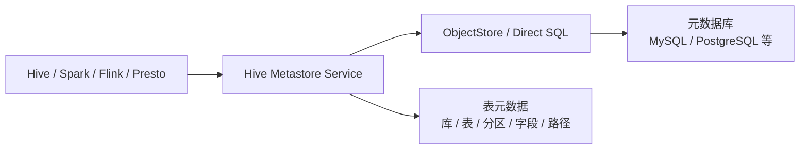

# Hive Metastore 的实现和优化

## 原文锚点

- 原文标题：Hive MetaStore的实现和优化
- 原文链接：http://mp.weixin.qq.com/s?__biz=Mzg2OTcxNDM2OA==&mid=2247526532&idx=1&sn=67534b91947b6d2e8f3b03ab6986ac08&chksm=cfb616fdd4740048322797bd44167a8532f039a69f7dbf800ae0dd06896332755fd2a50547e2&mpshare=1&scene=24&srcid=0520HKVSrImh6Ihi62Q5059i&sharer_shareinfo=d4ff5d8c8d404136cffe5e600d9554b4&sharer_shareinfo_first=d4ff5d8c8d404136cffe5e600d9554b4#rd

## 一句话结论

Hive Metastore 是 Hive 体系的元数据中心，也是 Spark、Flink、Presto/Trino、Impala 等引擎共享 Hive 表语义的关键接口；理解 Hive，必须先理解 Metastore。

## 核心知识点

| 点     | 内容                                           |
| ----- | -------------------------------------------- |
| 技术本体  | Metastore 不是查询引擎，而是库、表、分区、字段、存储位置等元数据的服务层    |
| 关键接口  | 客户端通常通过 Thrift 协议访问 Metastore 服务             |
| 服务端实现 | HMSHandler 承接元数据操作，再通过底层存储层访问元数据库            |
| 元数据存储 | 元数据最终落在关系型数据库中，常见实现会经过 ORM 或直接 SQL           |
| 生态价值  | 兼容 Hive Metastore 协议的引擎可以共享表定义、分区、路径和 Schema |

## 纵向定位

## 为什么重要

- 没有 Metastore，Hive 表只是分布式存储上的文件目录，缺少统一的表语义。
- Metastore 是跨引擎共享数仓表的核心，因此它的稳定性会影响多个计算引擎。
- 分区规模、元数据库性能、连接池、缓存和请求放大都会成为生产瓶颈。

## 风险和边界

- 元数据服务不能无限承载海量小分区和高频元数据查询。
- 元数据库不是普通业务库，变更、备份、权限和容量都要按基础设施管理。
- 文章讲的是 Metastore 层，不等同于 Hive SQL 执行引擎整体。

## 后续追查

- Hive Metastore 表结构。
- ObjectStore 与 Direct SQL 的差异。
- Spark / Flink / Trino 访问 Hive Metastore 的方式。
- 大分区表、元数据缓存、分区裁剪对查询性能的影响。
