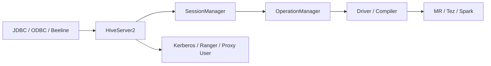

# HiveServer2 会话与内存治理

## 来源

- [HiveServer2 内存泄漏问题定位与优化方案](<../文章/done-HiveServer2 内存泄漏问题定位与优化方案.md>)

## 核心问题

HiveServer2 问题不能直接按“Hive SQL 慢”处理。它是查询入口服务，主要风险在连接、会话、Operation 生命周期、认证、线程和 JVM 内存；只有确认请求进入执行引擎后，才继续分析 SQL 计划和资源队列。

## 判断准则

| 判断项 | 应先看什么 | 处理边界 |
|---|---|---|
| 连接堆积 | JDBC/ODBC 连接数、会话数、线程池 | 先区分客户端连接泄漏还是服务端 Operation 未释放 |
| 内存增长 | Heap、GC、Operation Handle、结果集缓存 | 不能只靠加大堆内存，必须定位对象来源 |
| 查询失败 | HS2 日志、Operation 状态、引擎 ApplicationId | 入口失败归 HS2；执行失败再转 Hive/Spark/Tez |
| 认证问题 | Kerberos、Ranger、用户代理、会话上下文 | 与 Metastore 权限、HDFS 权限分层排查 |

## 认知偏差

| 常见错误认知 | 正确理解 |
|---|---|
| HiveServer2 只是一个 JDBC 壳 | 它承担会话、认证、并发和 Operation 生命周期，是服务治理对象 |
| 内存泄漏就调大 JVM | 调大内存只能延迟故障，不能替代对象来源和会话释放排查 |
| 查询失败都看 SQL | SQL 未进入执行引擎前，应先看 HS2 入口链路 |

## 架构/流程图

## 待验证缺口

- 需要补一份 HS2 排障 checklist：线程、堆对象、Operation 状态、会话超时、日志路径。
- 需要补不同发行版中 HS2 参数默认值和连接清理行为。
