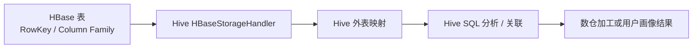

# Hive 与 HBase 数据互通边界

## 来源

- [Hive和Hbase数据互通（用户画像）](<../文章/done-Hive和Hbase数据互通（用户画像）.md>)

## 核心问题

Hive-HBase 互通的价值是让 HBase 数据能被 Hive SQL 离线分析或和数仓表关联，不是把 Hive 变成在线随机读写引擎，也不是把 HBase 变成标准 Hive 分区表。

## 判断准则

| 判断项 | 准则 | 边界 |
|---|---|---|
| 技术本体 | HBase 负责低延迟随机读写，Hive 负责 SQL 分析入口 | 不改变 HBase 的宽列和 RowKey 设计约束 |
| 适用场景 | 用户画像、标签、维表补充、低频分析 | 不适合高并发在线查询由 Hive 承担 |
| 表映射 | Hive 外表映射 HBase 表、列族和列 | 字段设计受 HBase RowKey/列族影响 |
| 性能风险 | 全表扫描、RowKey 设计、过滤下推能力 | 不能把 Hive 关联当成无成本 HBase 查询 |

## 认知偏差

| 常见错误认知 | 正确理解 |
|---|---|
| Hive 接上 HBase 后就能随便 SQL 分析 | 仍要受 HBase RowKey、扫描范围和过滤下推限制 |
| HBase 表映射成 Hive 表后就有 Hive 分区语义 | HBase 的物理组织仍是 RowKey 和列族 |
| 用户画像适合互通就代表所有标签查询适合 | 要区分离线分析、批量导出和在线标签服务 |

## 架构/流程图

## 待验证缺口

- 需要补 HBase RowKey 过滤、列族映射和 Hive 全表扫描的性能边界。
- 需要补 Hive-HBase 互通在权限、Schema 演进和批量导出上的实践约束。
