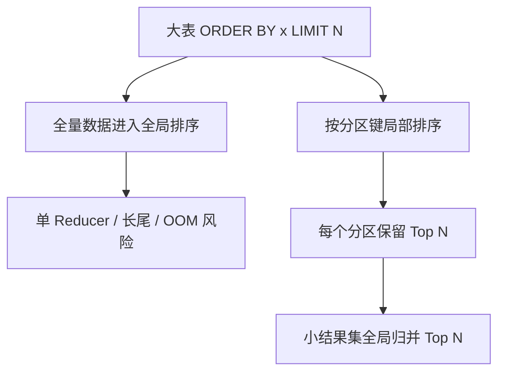

# Hive 性能优化

## 原文锚点

- 本地文件：
  - [Hive 性能调优与优化技巧](<../文章/done-Hive 性能调优与优化技巧.md>)
  - [Hive参数与性能企业级调优（建议收藏）](../文章/done-Hive参数与性能企业级调优（建议收藏）.md)
  - [Hive常用性能优化方法实践全面总结](../文章/done-Hive常用性能优化方法实践全面总结.md)
  - [Hive性能调优（二）](../文章/done-Hive性能调优（二）.md)
  - [Hive 大表全局排序如何优雅加速？PawSQL 让 ORDER BY + LIMIT 性能提升256倍](<../文章/done-Hive 大表全局排序如何优雅加速？PawSQL 让 ORDER BY + LIMIT 性能提升256倍.md>)
- 原文链接：见各本地 Markdown 头部 `url` 字段。
- 关键段落：执行计划、数据倾斜、MapJoin/Bucket MapJoin/SMB Join、分区裁剪、谓词下推、小文件治理、CBO、向量化、`ORDER BY + LIMIT` 全局排序。
- 关键图：多数文章未保留技术图；`Hive常用性能优化方法实践全面总结` 提到 PredicatePushDown 图但 Markdown 无图片。
- 相关原文：性能参数清单类文章重复度高，本轮不逐篇扩写，统一合并到本主题作为相关原文。

## 图片处理

| 图片 | 类型 | 是否保留 | 理由 | 处理方式 |
|---|---|---|---|---|
| PredicatePushDown 图 | 流程图 | 原图缺失 | 能说明过滤条件在 Join 前后的位置 | 标记原图缺失，用文字保留机制 |
| `ORDER BY + LIMIT` 改写示意 | 机制图 | 重建 | 说明单 Reducer 全局排序如何被分区排序 + 二次归并替代 | Mermaid 重建 |
| 参数清单截图 | 配图 | 删除 | 不提供机制增量 | 不进入知识点 |

## 一句话结论

Hive 性能优化不是参数大全，而是先定位瓶颈属于 SQL 语义、执行计划、数据分布、表布局、文件形态还是资源队列；没有瓶颈证据时，不应把参数清单当优化方案。

## 用户相关性判断

| 项 | 内容 |
|---|---|
| 用户当前认知层级 | Hive / 离线数仓：L3-L4 draft |
| 认知成熟度 | draft |
| 阅读投入建议 | 精读 |
| 阅读投入理由 | 多篇文章能补慢 SQL 定位顺序和典型失败场景，但性能数字缺少环境、数据规模和版本基线 |
| 对用户的新信息 | `ORDER BY + LIMIT` 的全局瓶颈、`count(distinct)` 与 `group by` 的反例、谓词下推在外连接保留行侧的边界 |
| 问题指纹 | Hive + 执行优化 + 分区裁剪/Join/倾斜/小文件/全局排序/CBO + 慢 SQL 定位 + 参数降权 |
| 排重判断 | 合并到已有主题；重复参数清单只追加相关原文 |
| 置信度 | 中 |

## 认知校准点

| 校准点 | 文章观点/信息 | 与用户认知或价值观的关系 | 处理建议 |
|---|---|---|---|
| 参数不是优化入口 | 多篇文章列出大量参数，但真正有效取决于瓶颈位置 | 防止把调参当系统优化 | 保留参数锚点，优先写定位顺序 |
| `count(distinct)` 不一定要替换成 `group by` | 枚举值少、Hive 3 有 distinct 优化时，替换可能更慢 | 纠偏“固定套路优化” | 先看基数、倾斜、版本和任务开销 |
| 外连接谓词下推有保留行边界 | 左表为保留行时，部分过滤不能在 Join 前下推 | 防止优化破坏语义 | SQL 审核时先确认 Join 类型和过滤位置 |
| `ORDER BY + LIMIT` 是全局排序瓶颈 | 大表全局 TopN 可能集中到单 Reducer | 补失败场景 | 只有语义允许时才改写成局部 TopN + 全局归并 |
| 性能收益数字要降权 | “提升 10 倍/256 倍”缺少完整环境、版本、数据分布 | 符合反标题党偏好 | 不把数字写成通用结论 |

## 冲突点

| 冲突类型 | 具体表现 | 影响 | 处理 |
|---|---|---|---|
| 标题降权 | “10 倍”“256 倍”“企业级调优”缺少统一基线 | 容易误把案例收益当普遍收益 | 只沉淀机制，不沉淀数字 |
| 排重冲突 | 多篇都讲分区、Join、倾斜、小文件、压缩、CBO | 逐篇写会重复膨胀 | 合并为一个性能主题 |
| 证据不足 | 大多缺 `EXPLAIN` 前后计划、数据规模、资源配置和版本 | 不能直接给实践结论 | 后续用本地 SQL 或真实作业验证 |
| 图片缺失 | 谓词下推等图未保留 | 降低机制可读性 | 本轮不回源，标记原图缺失 |

## 待吸收点

| 分级 | 内容 | 为什么值得吸收 | 后续动作 |
|---|---|---|---|
| 理解 | 慢 SQL 先看分区裁剪、Join 顺序、Shuffle、倾斜、文件数，再看参数 | 这是排障顺序 | 写入 Hive 阅读准则 |
| 理解 | 小文件会放大 Map 任务启动、NameNode 压力和扫描开销 | 是离线数仓常见稳定性问题 | 与 Spark/Kyuubi 小文件专题对齐 |
| 记住 | 谓词下推不能脱离 Join 保留行语义 | 防止优化改错结果 | SQL 审核时标出保留行表 |
| 记住 | 全局 TopN 优化的前提是语义等价和分区键分布可控 | 避免错误改写 | 需要 `EXPLAIN` 和结果集校验 |
| 实践 | 对一个慢 SQL 保存原 SQL、`EXPLAIN`、分区过滤、Reducer/Shuffle、输入输出文件数和优化后对比 | 能形成可复用排障证据 | 后续建立 Hive 慢 SQL 验证模板 |

## 已知可跳过

| 内容 | 跳过理由 |
|---|---|
| Hive 是离线数仓工具、底层可转 MR/Tez/Spark | 已知基础 |
| ORC/Parquet 比 Text 更适合分析 | 已知方向，除非给出具体编码/压缩/读放大机制 |
| 参数名长清单 | 没有瓶颈证据时无法指导选型 |
| 公众号营销和推荐阅读 | 不进入长期知识点 |

## 实践门槛

| 门槛 | 判断 | 证据 |
|---|---|---|
| 可运行 | 部分 | 有 SQL 片段和参数，但缺完整表结构、数据和环境 |
| 可验证 | 否 | 缺优化前后 `EXPLAIN`、输入规模、资源配置和耗时明细 |
| 可排障 | 部分 | 给出倾斜、小文件、谓词下推、全局排序等信号 |
| 可迁移 | 是 | 可迁移到 Hive 慢 SQL 和离线任务治理 |
| 结论 | 降为精读 | 不直接判实践，后续需要真实 SQL 验证 |

## 归类判断

| 项 | 内容 |
|---|---|
| 技术本体 | Apache Hive |
| 文章主问题 | Hive 慢 SQL 和批处理任务如何定位与优化 |
| 使用场景 | 离线数仓 SQL、DWD/DWS/ADS 加工、批任务排障 |
| 关键词干扰 | PawSQL、Spark、Tez、MapReduce 是优化工具或执行依赖，不改变主类 |
| 最终归类 | 数据工程与数仓 / 离线数仓 / Hive |
| 归类理由 | 主问题是 Hive 数仓执行优化，不是 OLAP 查询服务或通用数据库调优 |

## 技术定位

| 项 | 内容 |
|---|---|
| 技术类型 | 执行优化 / 排障准则 |
| 所属领域 | 数据工程与数仓 |
| 二级类目 | 离线数仓 |
| 全局架构位置 | Hive SQL 编译优化、执行引擎、存储布局和资源队列之间 |
| 涉及模块 | Driver/Optimizer、Join、Shuffle、Reducer、分区、文件格式、CBO、资源参数 |
| 解决问题 | 慢 SQL、长尾、倾斜、小文件、全局排序和资源浪费 |
| 原文局限 | 多数是经验清单，缺少版本、基线、计划和指标 |
| 我的结论 | 以后关注，作为 Hive 慢 SQL 排障入口 |

## 纵向理解

| 维度 | 判断 |
|---|---|
| 全局架构 | SQL -> 解析/优化 -> 执行计划 -> MR/Tez/Spark -> HDFS/ORC/Parquet -> 结果表 |
| 本文位置 | 执行优化和运行排障层，不是 Hive Metastore 或建模全貌 |
| 核心机制 | 减少扫描、减少 Shuffle、降低单点长尾、控制文件数、让统计信息辅助计划 |
| 使用链路 | 识别慢 SQL -> 保存计划和指标 -> 定位瓶颈 -> 做语义等价改写或参数调整 -> 复核结果 |
| 前置条件 | 表统计信息可用、分区字段清晰、执行引擎和队列配置可查 |
| 边界 | 没有数据分布和执行计划时，不应直接套参数；不能为性能牺牲语义正确性 |

## 横向对标

| 对标技术 | 实现方式 | 优势 | 劣势 | 适合场景 |
|---|---|---|---|---|
| Hive 参数优化 | 调整 Join、Reducer、并行、压缩、CBO 等参数 | 成本低，适合局部瓶颈 | 容易误调，版本差异大 | 明确瓶颈后的局部治理 |
| SQL 改写 | 谓词下推、局部 TopN、两阶段聚合、MapJoin | 可直接减少扫描和 Shuffle | 需要证明语义等价 | 慢 SQL 审核和重构 |
| Spark SQL | 用 Spark 执行 Hive 语义或迁移 SQL | 执行引擎更强，AQE 能处理部分动态问题 | 兼容性和小文件问题需治理 | 复杂批处理和存量 Hive SQL 迁移 |
| Trino/Presto | 交互式查询引擎 | 即席查询体验好 | 不适合替代所有离线 ETL | 分析查询出口 |
| Doris/StarRocks | OLAP 存储和查询服务 | 并发和低延迟强 | 不承担完整离线数仓加工 | 报表和服务化分析 |

## 后续追查

- 关键词：Hive `EXPLAIN CBO`、`hive.optimize.skewjoin`、`hive.groupby.skewindata`、`hive.exec.reducers.bytes.per.reducer`、`hive.vectorized.execution.enabled`。
- 相关技术：Spark AQE、Kyuubi Spark Extensions、小文件治理、ORC/Parquet、Hive Metastore 分区规模。
- 需要补读的文章：真实慢 SQL 的 `EXPLAIN` 对照、Hive CBO 统计信息、Spark SQL 迁移兼容性。
