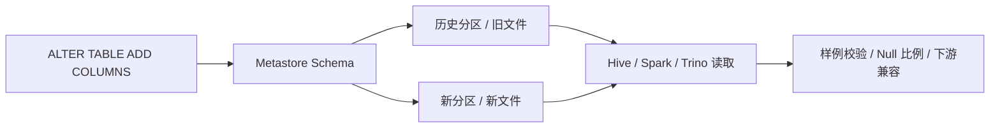

# Hive 表结构演进与字段新增边界

## 来源

- [Hive 表添加列（新增字段）](<../文章/done-Hive 表添加列（新增字段）.md>)

## 核心问题

Hive 新增字段不只是 `alter table add columns` 是否执行成功。真正要判断的是：元数据变了以后，旧分区、旧文件、不同存储格式、不同读取引擎和下游 SQL 是否还能按预期读取。

## 判断准则

| 场景 | 判断重点 | 风险 |
|---|---|---|
| ORC/Parquet 表新增列 | Schema 演进、列名/列位置、旧文件读取 | 旧分区可能读出 Null，也可能受读取引擎差异影响 |
| Text 表新增列 | 分隔符字段个数、Serde 解析 | 历史数据物理字段不足，容易形成 Null 或错位 |
| 分区表新增列 | 元数据是否覆盖所有分区、历史分区是否需要修复 | 新旧分区 Schema 不一致导致下游查询异常 |
| 下游宽表/报表 | 字段默认值、口径、回填策略 | 新字段进入公共表可能引发下游兼容和对账问题 |

## 认知偏差

| 常见错误认知 | 正确理解 |
|---|---|
| 新增字段只是 DDL 操作 | DDL 只改元数据，还要验证历史数据和读取引擎 |
| 新字段读出 Null 就安全 | Null 可能是合理默认，也可能是历史分区未回填或 Serde 错位 |
| Hive 能读就说明下游没问题 | 下游 Spark/Trino/BI 可能有不同 Schema 缓存和类型处理 |

## 架构/流程图

## 待验证缺口

- 需要补 ORC、Parquet、Text 三类表新增字段的实测矩阵。
- 需要补 Spark 读 Hive 表时对新增字段、缓存和历史分区的差异。
