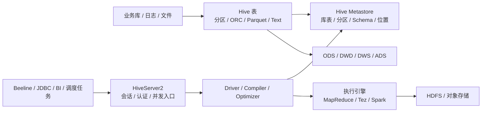

# Hive

## 快速入口

| 文件 | 用途 |
|---|---|
| [知识地图](030202_知识地图.md) | Hive 全景流程、已沉淀知识点和待补缺口 |
| [版本记录](030202_版本记录.md) | Apache Hive 版本、企业发行版差异和版本敏感结论 |
| [030202_核心知识点/](030202_核心知识点/) | 已蒸馏的长期知识点 |
| [文章/](文章/) | 原始文章存档，已蒸馏文章统一使用 `done-` 前缀 |

新文章必须先判断主问题是 Metastore、HiveServer2、Hive SQL 执行、性能治理、表结构演进，还是 Hive 作为数仓建模落地载体。

## 技术定位

| 项 | 内容 |
|---|---|
| 技术名 | Apache Hive |
| 一级类目 | 数据工程与数仓 |
| 二级类目 | 离线数仓 |
| 技术本体 | 基于 Hadoop 生态的数据仓库系统，用 HiveQL、Metastore 和批计算执行引擎管理大规模离线表 |
| 全局架构位置 | 位于数据集成之后、BI/OLAP/数据产品之前，承担离线表管理、元数据管理、批 SQL 和建模落地 |
| 主要使用者 | 数据开发、数仓工程师、数据平台工程师、分析师 |
| 主要产出 | Hive 表、分区、字段、元数据、Hive SQL 作业、ODS/DWD/DWS/ADS 分层模型 |

## 官方锚点

- 官网：[Apache Hive](https://hive.apache.org/)
- GitHub：[apache/hive](https://github.com/apache/hive)
- 版本标签：[apache/hive tags](https://github.com/apache/hive/tags)
- 官方文档：[Hive Wiki](https://cwiki.apache.org/confluence/display/Hive)

## 架构图

## 核心模块

| 模块 | 职责 | 重点问题 |
|---|---|---|
| Hive Metastore | 管理库、表、分区、字段、存储位置等元数据 | 元数据瓶颈、分区数量、元数据库压力、跨引擎共享 |
| HiveServer2 | 提供 JDBC/ODBC 查询入口和多客户端连接 | 连接管理、认证、并发、内存泄漏、会话稳定性 |
| Driver / Compiler / Optimizer | SQL 解析、语义分析、执行计划生成、优化 | SQL 语义、CBO、Join 计划、分区裁剪 |
| 执行引擎 | 将 SQL 计划交给 MapReduce、Tez、Spark 等执行 | 引擎差异、资源队列、Shuffle、任务失败恢复 |
| 存储格式与分区 | 通过 HDFS/对象存储承载表数据 | ORC/Parquet、压缩、小文件、分区设计 |
| 表结构演进 | 管理新增字段、格式差异、分区历史数据和兼容读 | ORC/Text/Parquet 差异、Schema 演进、回填风险 |
| 生态互通 | 与 Spark、Flink、HBase、Kyuubi、湖仓表格式共享 Catalog 或读写数据 | 语义边界、权限、性能和一致性 |

## 横向对标

| 对标技术 | 对标点 | Hive 优势 | Hive 劣势 | 使用判断 |
|---|---|---|---|---|
| Spark SQL | 离线 SQL 计算 | 元数据生态成熟，适合传统数仓表管理 | 执行性能和弹性通常不如 Spark | 存量 Hive 数仓继续维护；复杂计算和性能优化可迁 Spark |
| Trino / Presto | 交互式联邦查询 | Hive 表生态兼容强 | 交互式查询延迟和并发体验弱 | Trino/Presto 做即席查询，Hive 做加工底座 |
| Doris / StarRocks / ClickHouse | OLAP 服务化查询 | 分层建模、离线加工成熟 | 高并发、低延迟、索引能力弱 | Hive 做加工和沉淀，OLAP 引擎做服务出口 |
| Iceberg / Hudi / Paimon | 湖仓表格式 | 使用门槛低，存量生态广 | 事务、快照、增量、流批一体能力弱 | 新湖仓优先评估现代表格式；存量 Hive 做兼容和迁移 |
| HBase | 随机读写和宽列存储 | Hive SQL 易接入离线分析 | Hive 不适合高并发随机写 | Hive-HBase 互通只适合把 HBase 映射为离线分析入口，不替代 HBase 在线访问 |

## 文章处理 SOP

1. 先读正文第一屏和结论段，判断主问题，不按标题关键词归类。
2. 构造问题指纹：`Hive + 模块 + 核心机制 + 解决问题 + 适用边界 + 认知增量`。
3. 先找认知校准点：参数清单是否缺证据、性能数字是否缺基线、面试题是否能转成生产准则。
4. 有新增机制、失败模式、版本差异或验证动作时，写入 `030202_核心知识点/`。
5. 版本发布、兼容性、配置/API 行为变化写入 [版本记录](030202_版本记录.md)，不新建普通知识点。
6. 有知识贡献的文章改为 `done-` 前缀，知识点来源链接指向 `../文章/done-原文件名.md`；无贡献文章直接删除。
7. 不生成日期化中间产物；批量判断最终沉淀到本文件、知识地图或具体知识点。

## 排重判断

| 判断项 | 排重规则 |
|---|---|
| 都是性能优化 | 按分区裁剪、Join/倾斜、小文件、排序、存储格式、执行计划拆分；参数清单不单独成点 |
| 都是 Metastore | 有 ObjectStore/DirectSQL/Thrift/元数据库瓶颈新增时追加；泛泛说明只追加来源 |
| 都是建模 | 拉链、累积快照、时间维表按模型语义拆分；纯 Hive 代码示例不重复建点 |
| 都是面试题 | 大多降权；只有能转成判断准则或排障链路时才沉淀 |
| 多了工具宣传 | 只吸收可验证的 SQL 改写模式，工具营销不进入知识点 |

## 已沉淀核心知识点

| 主题 | 文件 | 问题指纹 | 解决什么问题 | 认知增量 |
|---|---|---|---|---|
| Hive Metastore | [Hive Metastore的实现和优化](<030202_核心知识点/Hive Metastore的实现和优化.md>) | Hive + Metastore + ObjectStore/DirectSQL/Thrift + 元数据瓶颈 + 跨引擎共享 | 元数据服务如何工作、瓶颈在哪里 | 把 Hive 理解从 SQL 执行补到元数据底座 |
| Hive 性能优化 | [Hive性能优化](030202_核心知识点/Hive性能优化.md) | Hive + 执行优化 + 分区裁剪/Join/倾斜/小文件/全局排序/CBO + 慢 SQL 定位 | 慢 SQL、数据倾斜、小文件、排序等问题如何定位 | 把优化点归到具体机制和证据，而不是参数清单 |
| Hive 数仓建模 | [Hive数仓建模落地](030202_核心知识点/Hive数仓建模落地.md) | Hive + 建模模块 + 分层/事实/维表/拉链 + 数仓落地 + 口径治理边界 | 拉链表、快照事实表、分区和模型落地如何理解 | 把模型设计和 Hive 表实现连接起来 |
| Hive 拉链表与累积型快照事实表 | [Hive拉链表与累积型快照事实表](030202_核心知识点/Hive拉链表与累积型快照事实表.md) | Hive + 数仓建模 + 拉链/累积快照 + 增量合并/有效期/里程碑时间 + 历史追踪边界 | 区分实体属性有效期和业务过程里程碑事实 | 防止把所有历史状态模型都误用成拉链表 |
| Hive 时间维度表 | [Hive时间维度表与时间函数](030202_核心知识点/Hive时间维度表与时间函数.md) | Hive + SQL 实践 + 日期维表/时间函数 + 周/月/季度口径 + 版本差异 | 日期维表、时间函数和周/月/季度/年口径如何落地 | 把函数速查校准为公共维表口径治理问题 |
| HiveServer2 会话与内存治理 | [HiveServer2会话与内存治理](030202_核心知识点/HiveServer2会话与内存治理.md) | Hive + HiveServer2 + 会话/连接/内存泄漏 + 查询入口稳定性 + 生产排障 | HiveServer2 问题如何和 SQL 引擎、Metastore 问题区分 | 把 HS2 作为查询入口服务治理，而不是 Hive SQL 参数问题 |
| Hive 表结构演进与字段新增边界 | [Hive表结构演进与字段新增边界](030202_核心知识点/Hive表结构演进与字段新增边界.md) | Hive + 表结构演进 + 新增字段/文件格式/分区历史数据 + 兼容读边界 | 新增字段为什么不能只看 `alter table add columns` 是否成功 | 把字段新增校准为存储格式、历史分区和下游兼容问题 |
| Hive 与 HBase 数据互通边界 | [Hive与HBase数据互通边界](030202_核心知识点/Hive与HBase数据互通边界.md) | Hive + HBaseStorageHandler + 离线 SQL 映射 + 随机读写边界 + 用户画像场景 | Hive 访问 HBase 时该保留哪些语义边界 | 不把 Hive-HBase 互通误解为 Hive 替代 HBase |
| Hive 执行计划与 SQL 审核边界 | [Hive执行计划与SQL审核边界](030202_核心知识点/Hive执行计划与SQL审核边界.md) | Hive + Explain/SQL 审核 + 全局排序/分区裁剪/倾斜改写 + 自动优化边界 | PawSQL 类工具和人工优化该如何定位 | 工具建议必须回到执行计划、数据分布和正确性验证 |

## 后续追查

- Hive 4.x 与企业发行版 Hive 3.x 的功能差异、迁移边界和兼容性。
- HiveServer2 的连接池、会话泄漏、Operation 日志、Kerberos/Ranger 权限排障。
- Metastore 分区规模、DirectSQL、元数据库慢查询和跨引擎 Catalog 压力。
- Hive 表结构演进在 ORC、Parquet、Text、历史分区上的行为差异。
- 拉链表、累积快照在迟到数据、补跑、幂等覆盖写下的校验策略。
