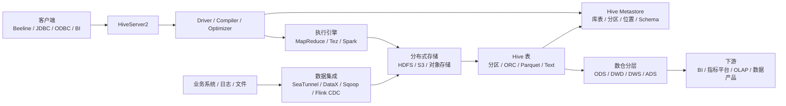

# Hive
## 知识点入口

- 本模块先看宏观流程，再看文章：[知识地图](030202_核心知识点/知识地图.md)。
- 新文章必须先归入流程节点，再判断是补充、冲突、不同层次还是降权。
- `文章/` 只保留原文锚点，长期知识必须沉淀到 `030202_核心知识点/`。

## 技术定位

| 项 | 内容 |
|---|---|
| 技术名 | Apache Hive |
| 一级类目 | 数据工程与数仓 |
| 二级类目 | 离线数仓 |
| 技术本体 | 分布式数据仓库系统，用 SQL 管理和分析分布式存储上的大规模数据 |
| 全局架构位置 | 位于数据集成之后、BI/OLAP/数据产品之前，承担离线数仓表管理、元数据管理、批 SQL 和建模落地 |
| 主要使用者 | 数据开发、数仓工程师、数据平台工程师、分析师 |
| 主要产出 | Hive 表、分区、元数据、离线 SQL 作业、ODS/DWD/DWS/ADS 分层模型 |

## 官方锚点

- 官网：[Apache Hive](https://hive.apache.org/)
- GitHub：[apache/hive](https://github.com/apache/hive)
- 官方文档：[Hive Documentation](https://hive.apache.org/)
- 关键入口：[Hive Metastore](https://hive.apache.org/)、[HiveServer2](https://hive.apache.org/)

## 一句话结论

Hive 是离线数仓的基础设施锚点：它的价值不只是执行 SQL，而是把分布式存储、元数据、表模型、分区、权限、批处理计算和数仓分层连接成一个可治理的数据仓库体系。

## 架构图

## 核心模块

| 模块 | 职责 | 重点问题 |
|---|---|---|
| Hive Metastore | 管理库、表、分区、字段、存储位置等元数据 | 元数据瓶颈、分区数量、元数据库压力、跨引擎共享 |
| HiveServer2 | 提供 JDBC/ODBC 查询入口和多客户端连接 | 连接管理、认证、并发、内存泄漏、会话稳定性 |
| Driver / Compiler / Optimizer | SQL 解析、语义分析、执行计划生成、优化 | SQL 语义、CBO、Join 计划、分区裁剪 |
| 执行引擎 | 将 SQL 计划交给 MapReduce、Tez、Spark 等执行 | 引擎差异、资源队列、Shuffle、任务失败恢复 |
| 存储格式与分区 | 通过 HDFS/对象存储承载表数据 | ORC/Parquet、压缩、小文件、分区设计 |
| 数仓建模 | 将业务过程落成 ODS/DWD/DWS/ADS 模型 | 事实表、维度表、拉链表、快照事实表、粒度变化 |
| 治理与权限 | 与 Ranger、Atlas、审计、血缘结合 | 权限、脱敏、审计、血缘、数据质量 |

## 上下游

| 方向 | 对象 | 关系 |
|---|---|---|
| 上游 | MySQL、日志、文件、Kafka、HBase 等 | 通过批同步或 CDC 进入 Hive 表 |
| 存储依赖 | HDFS、S3、对象存储、ORC、Parquet | Hive 自身不直接解决底层存储可靠性 |
| 计算依赖 | MapReduce、Tez、Spark、YARN | Hive SQL 的执行性能高度依赖执行引擎和资源调度 |
| 元数据消费者 | Spark、Flink、Presto/Trino、Impala、Kyuubi | Hive Metastore 常作为共享 Catalog |
| 下游 | BI、指标平台、OLAP 引擎、数据产品 | Hive 常做加工底座，低延迟查询通常交给 OLAP 引擎 |

## 横向对标

| 对标技术 | 对标点 | Hive 优势 | Hive 劣势 | 使用判断 |
|---|---|---|---|---|
| Spark SQL | 离线 SQL 计算 | 元数据生态成熟，适合传统数仓表管理 | 执行性能和弹性通常不如 Spark | 存量 Hive 数仓继续维护；复杂计算和性能优化可迁 Spark |
| Trino / Presto | 交互式联邦查询 | Hive 表生态兼容强 | 交互式查询延迟和并发体验弱 | Trino/Presto 做即席查询，Hive 做数据底座 |
| Doris / StarRocks / ClickHouse | OLAP 服务化查询 | 分层建模、离线加工成熟 | 高并发、低延迟、索引能力弱 | Hive 做加工和沉淀，OLAP 引擎做服务出口 |
| Iceberg / Hudi / Paimon | 湖仓表格式 | 使用门槛低，存量生态广 | 事务、快照、增量、流批一体能力弱 | 新湖仓优先评估现代表格式；存量 Hive 做兼容和迁移 |
| SeaTunnel / DataX / Flink CDC | 数据集成 | 常作为同步目标和中间层 | 本身不是同步框架 | 选型时区分“同步引擎”和“Hive 目标表” |

## 已沉淀核心知识点

| 主题 | 文件 | 问题指纹 | 解决什么问题 | 认知增量 |
|---|---|---|---|---|
| Hive Metastore | [Hive Metastore的实现和优化](<030202_核心知识点/Hive Metastore的实现和优化.md>) | Hive + 元数据模块 + Metastore/ObjectStore + 元数据瓶颈 + 跨引擎共享 | 元数据服务如何工作、瓶颈在哪里 | 把 Hive 理解从 SQL 执行补到元数据底座 |
| Hive 性能优化 | [Hive性能优化](030202_核心知识点/Hive性能优化.md) | Hive + 执行优化 + 分区裁剪/Join/倾斜/小文件/全局排序/CBO + 慢 SQL 定位 + 参数降权 | 慢 SQL、数据倾斜、小文件、排序等问题如何定位 | 把优化点归到具体机制和证据，而不是参数清单 |
| Hive 数仓建模 | [Hive数仓建模落地](030202_核心知识点/Hive数仓建模落地.md) | Hive + 建模模块 + 分层/事实/维表/拉链 + 数仓落地 + 口径治理边界 | 拉链表、快照事实表、分区和模型落地如何理解 | 把模型设计和 Hive 表实现连接起来 |
| Hive 拉链表与累积型快照事实表 | [Hive拉链表与累积型快照事实表](030202_核心知识点/Hive拉链表与累积型快照事实表.md) | Hive + 数仓建模 + 拉链/累积快照 + 增量合并/有效期/里程碑时间 + 历史追踪边界 | 区分实体属性有效期和业务过程里程碑事实 | 防止把所有历史状态模型都误用成拉链表 |
| Hive 时间维度表 | [Hive时间维度表与时间函数](030202_核心知识点/Hive时间维度表与时间函数.md) | Hive + SQL 实践 + 日期维表/时间函数 + 周/月/季度口径 + 版本差异 | 日期维表、时间函数和周/月/季度/年口径如何落地 | 把函数速查校准为公共维表口径治理问题 |

## 阅读时的判断准则

看到 Hive 文章，先判断它落在哪个模块：

| 模块 | 典型关键词 | 读完要得到的结论 |
|---|---|---|
| 元数据 | Metastore、Catalog、ObjectStore、Thrift、JDO | 元数据如何存、如何查、瓶颈在哪里 |
| 查询入口 | HiveServer2、JDBC、Kyuubi、连接池 | 查询请求怎么进来，稳定性如何保障 |
| SQL 语义 | Join、窗口函数、lateral view、explode、函数 | SQL 写法是否影响正确性和性能 |
| 性能优化 | 参数、倾斜、小文件、排序、分区、MapJoin | 适合哪类慢 SQL，优化前置条件是什么 |
| 数仓建模 | ODS、DWD、DWS、ADS、拉链表、快照事实表 | 模型如何落到 Hive 表和分区 |
| 生态集成 | Spark、Flink、Paimon、Iceberg、Doris、ClickHouse | Hive 是源、目标、Catalog，还是迁移对象 |

## 后续追查

- Hive Metastore 的元数据库表结构、缓存、分区规模瓶颈。
- HiveServer2 的会话、连接、权限、内存问题。
- Hive SQL 到 Spark SQL / Trino / Doris 的迁移边界。
- Hive 与 Iceberg、Paimon 等湖仓表格式的关系。
- 拉链表、累积快照在迟到数据、补跑、幂等覆盖写下的校验策略。
