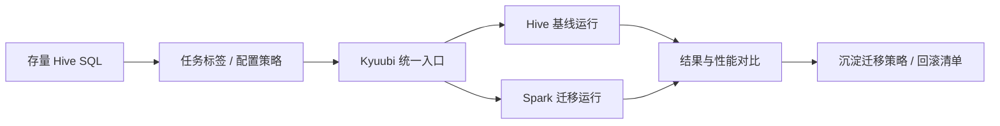

# Kyuubi SQL 迁移与小文件治理

## 来源

- [Kyuubi 实践 _ 有了它！爱奇艺加速 Hive SQL 迁移 Spark](<../文章/done-Kyuubi 实践 _ 有了它！爱奇艺加速 Hive SQL 迁移 Spark.md>)
- [Kyuubi 实践 _ 如何优化 Spark 小文件，Kyuubi 一步搞定！](<../文章/done-Kyuubi 实践 _ 如何优化 Spark 小文件，Kyuubi 一步搞定！.md>)

## 核心问题

Hive SQL 迁移 Spark 或治理 Spark 小文件时，Kyuubi 的核心价值不是替代 Spark 优化器，而是提供迁移控制面：统一入口、配置标签、双跑对比、审计记录、任务分类和可回滚的治理流程。

## 判断准则

| 场景 | Kyuubi 能做什么 | 必须回到哪里验证 |
|---|---|---|
| Hive SQL 迁移 Spark | 统一提交入口、按标签注入 Spark 配置、记录 SQL 和用户 | Spark SQL 语义、结果对账、执行计划 |
| 小文件治理 | 统一配置 Repartition/AQE/写入参数，沉淀任务级策略 | Spark 写入 Stage、动态分区数量、文件数指标 |
| 双跑对比 | 记录 Hive/Spark 两套执行结果和性能 | 结果一致性、边界样例、失败 SQL 清单 |
| SQL 审计 | 记录用户、SQL、配置、引擎、耗时 | 归因规则和人工复核 |

## 认知偏差

| 常见错误认知 | 正确理解 |
|---|---|
| Kyuubi 能“一步搞定”小文件 | 它能提供治理入口，最终文件数由 Spark 写入计划、分区和 AQE 决定 |
| Hive SQL 迁 Spark 只改入口 | SQL 方言、函数、Null、类型、排序和 Join 计划都要双跑验证 |
| 有统一网关就不用迁移清单 | 仍需要按 SQL 类型、业务重要性、下游依赖分批迁移 |

## 架构/流程图

## 待验证缺口

- 需要补 Hive SQL 迁 Spark 的函数差异、Null 语义、排序稳定性和精度对账模板。
- 需要补小文件治理前后的文件数、任务耗时、下游读取性能和资源成本对比。
