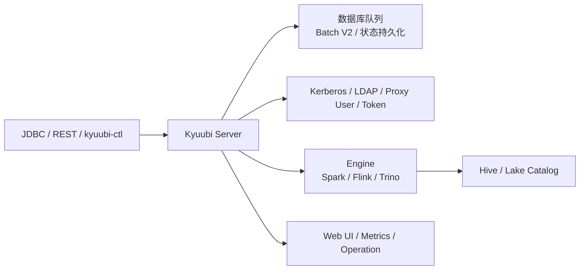

# Kyuubi 企业级 SQL 网关 1.8 边界

## 原文锚点

- 本地文件：
  - [Apache Kyuubi 1.8 特性解读](<../文章/Apache Kyuubi 1.8 特性解读.md>)
  - [坦白局！网易数帆解读 Apache Kyuubi 1.8 特性](<../文章/坦白局！网易数帆解读 Apache Kyuubi 1.8 特性.md>)
  - [基于 Kyuubi 实现分布式 Flink SQL 网关](<../文章/基于 Kyuubi 实现分布式 Flink SQL 网关.md>)
  - [大数据统一SQL网关：最新版Kyuubi整合Flink、Spark方案的实践案例总结](../文章/大数据统一SQL网关：最新版Kyuubi整合Flink、Spark方案的实践案例总结.md)
  - [Kyuubi 实践 | 如何优化 Spark 小文件，Kyuubi 一步搞定！](<../文章/Kyuubi 实践 _ 如何优化 Spark 小文件，Kyuubi 一步搞定！.md>)
  - [Kyuubi 实践 | 有了它！爱奇艺加速 Hive SQL 迁移 Spark](<../文章/Kyuubi 实践 _ 有了它！爱奇艺加速 Hive SQL 迁移 Spark.md>)
- 原文链接：见各本地 Markdown 头部 `url` 字段。
- 关键段落：Batch V2 数据库队列、Submitter/Backend 线程池拆分、Flink YARN Application Mode、Kerberos/LDAP、Hadoop 代理用户、Delegation Token、Authz、Engine share level、Web UI、Session/Operation/Engine。
- 关键图：1.8 特性、Flink SQL Gateway 和实践文章均引用架构图或截图，但 Markdown 未保留图片。
- 相关原文：两篇 1.8 解读内容高度重复，合并为一个版本边界主题；小文件和 Hive 迁移文章只追加为相关原文。

## 图片处理

| 图片 | 类型 | 是否保留 | 理由 | 处理方式 |
|---|---|---|---|---|
| Kyuubi 1.8 架构/队列图 | 架构图 | 原图缺失 | 说明 Batch V2 和 HA 状态持久化 | Mermaid 重建 |
| Flink Application Mode 图 | 流程图 | 原图缺失 | 说明 Kyuubi Flink Engine 放在 JobManager 内部的差异 | Mermaid 重建 |
| Web UI 截图 | 配图 | 删除 | 只说明界面功能，不影响机制 | 不进入知识点 |

## 一句话结论

Kyuubi 1.8 的增量不是“又支持几个版本”，而是把 SQL 网关从交互式连接入口继续推向企业控制面：批任务削峰、状态持久化、多引擎路由、安全认证、权限审计和可观测性。

## 用户相关性判断

| 项 | 内容 |
|---|---|
| 用户当前认知层级 | Kyuubi / SQL Gateway：L2-L3 draft |
| 认知成熟度 | draft |
| 阅读投入建议 | 精读 |
| 阅读投入理由 | 能补权限、多租户、多引擎和批任务调度边界，但版本状态和插件能力需后续补证 |
| 对用户的新信息 | Batch V2 用数据库队列削峰，Flink Engine 通过 Application Mode 降低 Server 负载，安全侧强调 Kerberos/LDAP/Proxy User/Delegation Token/Authz |
| 问题指纹 | Kyuubi + 企业级 SQL Gateway + Batch V2/Flink Engine/Authz/多租户/多引擎 + 控制面边界 |
| 排重判断 | 新建；1.8 重复解读和实践文章合并为相关原文 |
| 置信度 | 中 |

## 认知校准点

| 校准点 | 文章观点/信息 | 与用户认知或价值观的关系 | 处理建议 |
|---|---|---|---|
| Kyuubi 网关职责继续上移 | 从 Spark Thrift Server 替代品扩展到 Serverless SQL 服务和批任务入口 | 补技术位置 | 更新 Kyuubi index |
| 批任务不是简单复用交互 Session | REST 短连接、LB、多 Server 导致状态必须持久化 | 补失败场景 | Batch V2 单独记为控制面机制 |
| 多租户不仅是共享级别 | 还包括认证、代理用户、Delegation Token、Authz、审计 | 纠偏“隔离=Engine share level” | 权限和审计单独追查 |
| Flink SQL Gateway 与 Kyuubi 有边界 | Kyuubi 借助 Flink SQL Gateway 能力，但补分布式、多租户和多版本 | 横向对标增量 | 不把 Kyuubi 当 Flink 执行引擎 |
| 小文件/迁移能力属于 Spark Extensions | 不是 Kyuubi Server 核心网关能力 | 防止模块混淆 | 作为相关原文，不另开 Kyuubi 小文件主题 |

## 冲突点

| 冲突类型 | 具体表现 | 影响 | 处理 |
|---|---|---|---|
| 排重冲突 | 两篇 1.8 特性解读内容近似 | 重复写会膨胀 | 合并为一个版本边界主题 |
| 原目录冲突 | 一篇在数据分析与 BI，一篇在数据工程目录 | 目录可能误导 | 按技术本体归 Kyuubi |
| 证据不足 | 版本兼容和 Authz 能力缺官方逐项验证 | 不能作为当前版本承诺 | 后续补证 |
| 实践资讯混杂 | 1.9 实践包含安装命令、下载链接、Web UI 尝鲜 | 容易误判为正式 SOP | 只抽多引擎入口边界 |
| 图片缺失 | 架构图和截图未保留 | 影响理解 | Mermaid 重建主链路 |

## 待吸收点

| 分级 | 内容 | 为什么值得吸收 | 后续动作 |
|---|---|---|---|
| 理解 | Batch V2 用数据库队列、Submitter 线程池、Backend 线程池拆分来削峰 | 解释批任务高并发提交的稳定性机制 | 加入 Kyuubi 模块图 |
| 理解 | Flink YARN Application Mode 把 SQL 解析/计划等负载从 Server 转移到 AM/JobManager | 说明 Kyuubi Server 轻量化边界 | 与 Flink SQL Gateway 对标 |
| 记住 | 共享 Engine 下大查询会影响其他用户，需 HBO 或用户主动切 CONNECTION 隔离 | 多租户失败场景 | 写入选型准则 |
| 记住 | Kerberos/LDAP/Proxy User/Delegation Token/Authz 是企业级网关的安全面 | 权限治理关键 | 后续补 auth-extension 和 Ranger/Iceberg |
| 实践 | 建一个网关验收清单：连接、认证、共享级别、队列堆积、Engine 状态、Operation 审计、失败查询归因 | 可迁移到 SQL 网关平台治理 | 后续补验证模板 |

## 已知可跳过

| 内容 | 跳过理由 |
|---|---|
| Kyuubi 是多租户 SQL 网关的基础定义 | 已在已有两篇 Kyuubi 核心知识点覆盖 |
| 社区毕业、PMC、活动介绍 | 低沉淀价值 |
| 安装下载命令 | 本轮不做实践，不联网补证 |
| Web UI 截图细节 | 界面功能了解即可 |

## 实践门槛

| 门槛 | 判断 | 证据 |
|---|---|---|
| 可运行 | 部分 | 1.9 实践文章有安装和连接命令，但依赖外部下载和真实集群 |
| 可验证 | 部分 | 可验证 Session/Operation/Engine、SQL Editor、Spark/Flink 连接，但本轮不运行 |
| 可排障 | 部分 | 提供队列、API Server 压力、大查询隔离、认证复杂度等信号 |
| 可迁移 | 是 | 可迁移到多引擎 SQL 网关和数据平台控制面设计 |
| 结论 | 降为精读 | 本轮只做知识沉淀，不做集群实践 |

## 归类判断

| 项 | 内容 |
|---|---|
| 技术本体 | Apache Kyuubi |
| 文章主问题 | Kyuubi 作为企业级 SQL 网关的版本边界和多引擎控制面能力 |
| 使用场景 | 交互式 SQL、批任务提交、Spark/Flink SQL、多租户数据平台 |
| 关键词干扰 | Flink、Spark、小文件、Hive 迁移是引擎或插件场景 |
| 最终归类 | 数据工程与数仓 / 离线数仓 / Kyuubi |
| 归类理由 | 主体是 SQL 服务入口、权限、多租户和网关治理 |

## 技术定位

| 项 | 内容 |
|---|---|
| 技术类型 | SQL Gateway / 平台控制面 |
| 所属领域 | 数据工程与数仓 |
| 二级类目 | 离线数仓 |
| 全局架构位置 | BI/JDBC/REST 客户端与 Spark/Flink/Trino/Hive 等引擎之间 |
| 涉及模块 | Server、Session、Operation、Engine、Batch V2、认证授权、Web UI、Metrics、Extensions |
| 解决问题 | 多租户 SQL 接入、多引擎路由、批任务削峰、安全认证、审计和可观测 |
| 原文局限 | 版本与插件能力需要官方和真实环境补证 |
| 我的结论 | 以后关注，作为 Kyuubi 企业落地边界补充 |

## 纵向理解

| 维度 | 判断 |
|---|---|
| 全局架构 | Client -> Kyuubi Server -> Session/Operation/Batch 队列 -> Engine -> Catalog/Storage |
| 本文位置 | SQL 网关控制面和企业治理层，不是 Spark/Flink 执行引擎内部优化 |
| 核心机制 | Server/Engine 解耦、共享级别、状态持久化、数据库队列、认证授权、Operation 可观测 |
| 使用链路 | 用户认证 -> 建 Session -> 选择共享级别/Engine -> 执行 Operation 或 Batch -> 审计监控 |
| 前置条件 | Zookeeper/HA、元数据库、Kerberos/LDAP、计算引擎版本、权限插件、监控采集 |
| 边界 | 不替代 Ranger/Atlas/调度系统/计算引擎优化器；只是把它们接到统一入口 |

## 横向对标

| 对标技术 | 实现方式 | 优势 | 劣势 | 适合场景 |
|---|---|---|---|---|
| HiveServer2 | Hive SQL 服务入口 | 传统生态稳定 | 多引擎和弹性弱 | 传统 Hive 查询 |
| Spark Thrift Server | Spark SQL 长驻服务 | 简单直连 Spark | 多租户和资源隔离弱 | 小规模 Spark SQL |
| Flink SQL Gateway | Flink 官方 SQL 服务 | 贴近 Flink | 分布式、多租户、版本隔离能力弱 | Flink 单引擎 SQL |
| Kyuubi | Server/Engine 解耦，多引擎多租户 | 统一入口、隔离、控制面扩展强 | 部署、权限、状态和插件复杂 | 企业级 Spark/Flink/Hive SQL 网关 |
| Trino Gateway | Trino 查询入口治理 | 交互查询和联邦查询强 | 不承接 Spark/Flink 作业 | OLAP/联邦查询入口 |

## 后续追查

- 关键词：Kyuubi Batch V2、Engine share level、Kerberos LDAP、Proxy User、Delegation Token、Authz、Flink YARN Application Mode、Operation。
- 相关技术：HiveServer2、Spark Thrift Server、Flink SQL Gateway、Ranger、Iceberg Authz、Kyuubi Spark Extensions。
- 需要补读的文章：Kyuubi 1.8/1.9 官方文档、auth-extension、Batch Session、Flink Engine、Web UI 与 Metrics。
