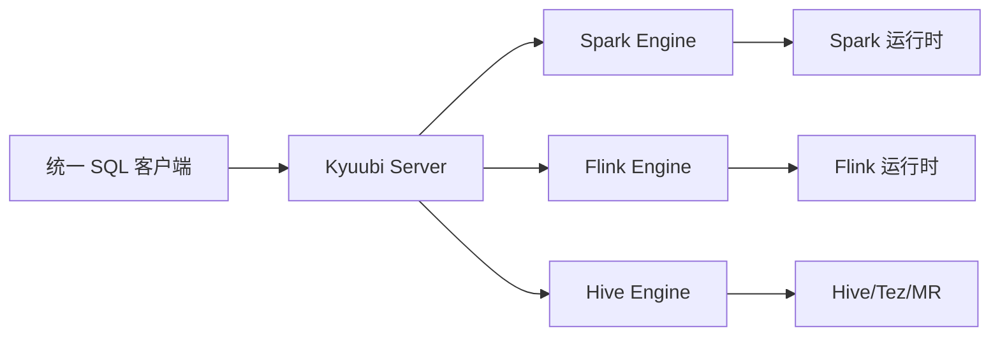

# Kyuubi 多引擎 SQL 网关接入边界

## 来源

- [基于 Kyuubi 实现分布式 Flink SQL 网关](<../文章/done-基于 Kyuubi 实现分布式 Flink SQL 网关.md>)
- [大数据统一SQL网关：最新版Kyuubi整合Flink、Spark方案的实践案例总结](<../文章/done-大数据统一SQL网关：最新版Kyuubi整合Flink、Spark方案的实践案例总结.md>)

## 核心问题

Kyuubi 多引擎接入的价值是把 Spark/Flink/Hive 等引擎包装成统一 SQL 服务入口，并在 Server 层做会话、认证、配置、审计和生命周期治理。它不改变各引擎自己的运行时语义。

## 判断准则

| 判断项 | Kyuubi 负责 | 仍归引擎本体 |
|---|---|---|
| SQL 入口 | JDBC/ODBC/REST 接入、Session、认证 | SQL 语义细节、优化器规则 |
| 引擎启动 | Engine 创建、共享级别、生命周期 | Spark Executor、Flink JobManager/TaskManager |
| 资源治理 | 配置注入、用户/任务标签、队列策略 | Spark/Flink 运行时资源调度和状态管理 |
| 审计血缘 | SQL 事件、用户、配置、执行记录 | 字段级血缘解析、运行时状态一致性 |

## 认知偏差

| 常见错误认知 | 正确理解 |
|---|---|
| Kyuubi 支持 Flink 就能治理 Flink 生产作业 | Kyuubi 只治理入口和 Engine 生命周期，Flink 状态、Checkpoint、重启仍归 Flink |
| Kyuubi 支持 Spark 就能解决 Spark 性能问题 | Kyuubi 可注入配置和收集审计，物理计划和 Shuffle 仍要看 Spark |
| 多引擎入口等于语义统一 | 不同引擎 SQL 方言、Catalog、权限和执行行为仍需显式兼容 |

## 架构/流程图

## 待验证缺口

- 需要补不同 Engine 共享级别下的资源占用、启动时延和隔离效果。
- 需要补 Flink YARN Application Mode 在 Kyuubi 中的失败恢复和日志追踪链路。
