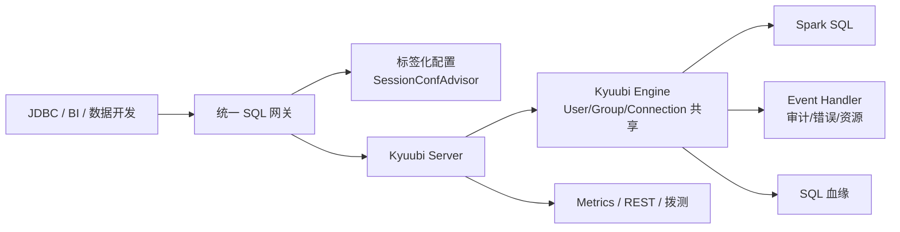

# Kyuubi 多租户 SQL 网关平台化实践

## 原文锚点

- 本地文件：[Apache Kyuubi 在爱奇艺的实践](<../文章/done-Apache Kyuubi 在爱奇艺的实践.md>)
- 原文链接：http://mp.weixin.qq.com/s?__biz=MzkxMjM2MDIyNQ==&mid=2247558880&idx=1&sn=605d715e011158e48c20861d9b4e99bd
- 关键段落：Spark Thrift Server 演进、Kyuubi Server/Engine 解耦、共享策略、SessionConfAdvisor、Event Handler、血缘、监控、小文件优化、Z-order。
- 关键图：原文多处图缺失，本地 Markdown 无图片链接。

## 图片处理

| 图片 | 类型 | 是否保留 | 理由 | 处理方式 |
|---|---|---|---|---|
| SQL 网关架构图 | 架构图 | 原图缺失 | 说明 Pilot/Kyuubi/Engine 关系 | Mermaid 重建 |
| 小文件和 Z-order 图 | 机制图 | 原图缺失 | 细节多但可文字表达 | 不强行重建 |

## 一句话结论

这篇文章值得精读：它把 Kyuubi 从“Spark Thrift Server 替代品”校准为多租户 SQL 网关平台，重点是引擎隔离、标签化配置、事件审计和服务治理。

## 用户相关性判断

| 项 | 内容 |
|---|---|
| 用户当前认知层级 | Kyuubi / SQL Gateway L2 draft |
| 认知成熟度 | draft |
| 阅读投入建议 | 精读 |
| 阅读投入理由 | 能补 Kyuubi 纵向模块；但案例是爱奇艺平台化实践，部分能力需按版本验证 |
| 对用户的新信息 | Kyuubi 1.x 的关键变化是 Server 与 Engine 解耦，并用共享策略平衡隔离和资源复用 |
| 问题指纹 | Kyuubi + SQL Gateway + Server/Engine 解耦/共享策略/SessionConfAdvisor/Event Handler + 多租户 Spark SQL 平台化 |
| 排重判断 | 新建 |
| 置信度 | 高 |

## 认知校准点

| 校准点 | 文章观点/信息 | 与用户认知或价值观的关系 | 处理建议 |
|---|---|---|---|
| Kyuubi 价值不只是兼容 HiveServer2 | Server/Engine 解耦带来多租户和资源隔离 | 补技术本体 | 写入 Kyuubi index |
| 引擎共享是权衡 | User/Group/Server/Connection 级别共享影响响应速度、资源复用和隔离 | 补选型边界 | 作为记住点 |
| 标签化配置是平台能力 | SessionConfAdvisor 按任务类型注入配置 | 补平台化治理 | 与调度/资源治理关联 |
| Event Handler 是观测入口 | SQL 事件、失败量、资源使用、错误规则库、HBO 优化 | 补运维闭环 | 后续可实践 |

## 冲突点

| 冲突类型 | 具体表现 | 影响 | 处理 |
|---|---|---|---|
| 图片缺失 | 架构、小文件、Z-order 等图未保留 | 影响理解 | Mermaid 重建主架构 |
| 版本时效 | 案例基于 Kyuubi 0.7/1.4 和 Spark 3.x | 当前版本需复核 | 标为 draft |
| 案例不可直接迁移 | Pilot 是爱奇艺内部统一 SQL 网关 | 不能照搬平台架构 | 抽取通用机制 |

## 待吸收点

| 分级 | 内容 | 为什么值得吸收 | 后续动作 |
|---|---|---|---|
| 理解 | Spark Thrift Server -> Kyuubi 0.x -> Kyuubi 1.x 的演进主线 | 解释为什么需要 Kyuubi | 更新 index |
| 理解 | Server 负责启动和转发，Engine 负责执行，二者解耦 | Kyuubi 架构核心 | 写入纵向模块 |
| 记住 | 独立引擎隔离强但启动成本高，共享引擎响应快但隔离弱 | 影响平台策略 | 作为选型准则 |
| 记住 | SQL 网关要有审计、血缘、监控和拨测 | 防止只做查询入口 | 与治理结合 |
| 实践 | 构造 JDBC 拨测和 Event Handler 输出，验证 Operation 失败统计 | 可落地 | 待实验 |

## 已知可跳过

| 内容 | 跳过理由 |
|---|---|
| Spark SQL 替代 Hive 的大方向 | 已知基础 |
| 会议和嘉宾背景 | 无长期知识价值 |
| Z-order 基础定义 | 可放到 Spark/表优化专题，不在本文展开 |

## 实践门槛

| 门槛 | 判断 | 证据 |
|---|---|---|
| 可运行 | 否 | 无完整部署配置 |
| 可验证 | 部分 | 有接口、事件和拨测方向 |
| 可排障 | 部分 | 有 Event/Metric/Rest API 信号 |
| 可迁移 | 是 | 可迁移到 SQL 网关平台治理 |
| 结论 | 降为精读 | 缺本地 Kyuubi 环境 |

## 归类判断

| 项 | 内容 |
|---|---|
| 技术本体 | Kyuubi 是多租户 SQL 网关 |
| 文章主问题 | 爱奇艺如何用 Kyuubi 平台化 Spark SQL 服务 |
| 使用场景 | Ad-hoc、ETL、Spark SQL、离线湖仓分析 |
| 关键词干扰 | Spark、Hive、血缘、Z-order |
| 最终归类 | 数据工程与数仓 / 离线数仓 / Kyuubi |
| 归类理由 | 主问题是 SQL 服务入口和多租户治理，不是 Spark 执行优化单点 |

## 技术定位

| 项 | 内容 |
|---|---|
| 技术类型 | SQL 网关 / 平台化实践 |
| 所属领域 | 数据工程与数仓 |
| 二级类目 | 离线数仓 |
| 全局架构位置 | JDBC/BI/数据开发平台 与 Spark/Hive/Trino/ClickHouse 引擎之间 |
| 涉及模块 | Server、Engine、SessionConfAdvisor、Event Handler、Lineage、Metrics |
| 解决问题 | 多租户 SQL 服务、资源隔离、审计和平台化治理 |
| 原文局限 | 平台特定、缺完整配置 |
| 我的结论 | 重点吸收架构和治理边界 |

## 纵向理解

| 维度 | 判断 |
|---|---|
| 全局架构 | Client -> Pilot/SQL 网关 -> Kyuubi Server -> Kyuubi Engine -> Spark/Hive/湖仓 |
| 本文位置 | 讲 Kyuubi 在统一 SQL 服务中的平台化使用 |
| 核心机制 | Server/Engine 解耦、引擎共享策略、标签化配置、事件审计、血缘和监控 |
| 使用链路 | JDBC 请求 -> 标签识别 -> 配置注入 -> 引擎选择 -> SQL 执行 -> Event/Metrics/Lineage |
| 前置条件 | 计算引擎、Catalog、权限、审计存储、监控平台 |
| 边界 | 不替代 Spark 优化器、资源调度器和数据权限系统 |

## Mermaid 重建

## 横向对标

| 对标技术 | 实现方式 | 优势 | 劣势 | 适合场景 |
|---|---|---|---|---|
| Spark Thrift Server | 常驻 SparkContext 提供 Thrift | 简单、启动快 | 多租户和隔离弱 | 小规模 Spark SQL |
| Kyuubi | Server/Engine 解耦和共享策略 | 多租户、隔离、平台治理 | 运维复杂 | 企业 Spark SQL 网关 |
| HiveServer2 | Hive SQL 服务入口 | Hive 生态成熟 | Spark/Flink 多引擎弱 | 传统 Hive 数仓 |
| Trino Gateway | 查询网关治理 | 联邦查询入口强 | 不解决 Spark ETL 执行 | 交互式查询 |

## 后续追查

- 关键词：Kyuubi Server、Kyuubi Engine、SessionConfAdvisor、EventHandler、Engine share level、SparkHistory Logging EventHandler。
- 相关技术：Spark Thrift Server、HiveServer2、Trino Gateway、Spark SQL、Atlas 血缘。
- 需要补读的文章：Kyuubi 官方架构、Engine 生命周期、认证授权、EventHandler、自定义 SessionConfAdvisor。

