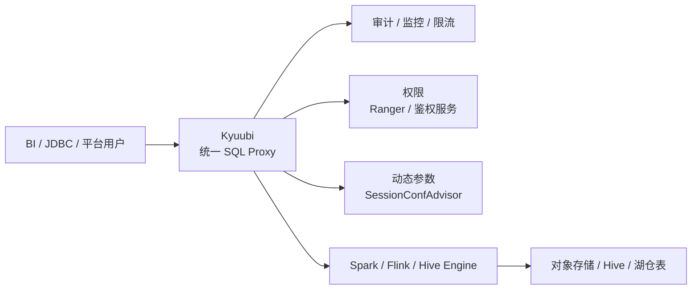

# Kyuubi 统一 SQL Proxy 实践

## 原文锚点

- 本地文件：[多点DMALL × Apache Kyuubi：构建统一SQL Proxy探索实践](<../文章/done-多点DMALL × Apache Kyuubi：构建统一SQL Proxy探索实践.md>)
- 原文链接：`http://mp.weixin.qq.com/s?__biz=MzI0NTIxNzE1Ng==&mid=2651226418&idx=1&sn=a74238d46fe1abd4a4d29769c62fc89d`
- 关键段落：存算一体下 Kyuubi 作为 Spark SQL 代理，存算分离后替代 UniSQL 成为统一 SQL Proxy；补充审计、监控、限流、动态参数、Ranger 权限、小文件合并等能力。
- 关键图：正文提到架构图，但 Markdown 缺失。

## 图片处理

| 图片 | 类型 | 是否保留 | 理由 | 处理方式 |
|---|---|---|---|---|
| 即席查询总体架构图 | 架构图 | 原图缺失 | 说明 UniSQL、Kyuubi、SparkSQL、YARN/CDH 的关系 | 标记原图缺失，重建简图 |
| 升级架构设计图 | 架构图 | 原图缺失 | 说明 Kyuubi 在存算分离架构中的统一入口位置 | 标记原图缺失，重建简图 |

## 一句话结论

这篇文章值得精读：Kyuubi 的价值不是“又一个 SQL 服务”，而是把多租户 SQL 入口、引擎生命周期、权限、审计、限流和资源隔离放到统一网关层治理。

## 用户相关性判断

| 项 | 内容 |
|---|---|
| 用户当前认知层级 | Kyuubi / SQL Gateway：L2 |
| 认知成熟度 | draft |
| 阅读投入建议 | 精读 |
| 阅读投入理由 | 有真实架构演进和工程边界，但性能数字和参数需要按版本复核 |
| 对用户的新信息 | Kyuubi 可以从“Spark SQL 代理”上升为“统一 SQL Proxy”，但要补齐审计、权限、限流、动态参数和资源组能力 |
| 问题指纹 | Kyuubi + SQL Proxy + 多租户/权限/审计/资源隔离 + 统一查询入口 + 不等同计算引擎 |
| 排重判断 | 新建 |
| 置信度 | 高 |

## 认知校准点

| 校准点 | 文章观点/信息 | 与用户认知或价值观的关系 | 处理建议 |
|---|---|---|---|
| Kyuubi 不是计算引擎 | 原文用 Kyuubi 代理 Spark SQL、Flink、Hive 等 | 校准技术本体 | 归到离线数仓 SQL Gateway，不归 Spark/Flink |
| SQL Proxy 会和自研网关重叠 | UniSQL 与 Kyuubi 角色重叠 | 符合系统位置判断 | 设计时要先定清网关职责边界 |
| 多租户入口必须补治理能力 | 审计、监控、限流、权限、动态参数都在网关层处理 | 补足 Kyuubi L2 -> L3 的边界 | 作为 Kyuubi 文章排重主线 |
| 存算分离改变 Kyuubi 位置 | 从补充 Spark SQL 代理变为统一 SQL Proxy | 是架构位置变化 | 后续 Kyuubi 文章要分阶段看 |
| 小文件合并等数字需降权 | 文中提到文件数和耗时改善 | 缺环境、数据规模、版本细节 | 不写成通用结论，只保留机制 |

## 冲突点

| 冲突类型 | 具体表现 | 影响 | 处理 |
|---|---|---|---|
| 图片缺失 | 架构图在正文提到但 Markdown 无图 | 影响理解 Kyuubi 位置 | Mermaid 重建 |
| 证据不足 | 性能和文件数改善缺少完整实验上下文 | 不能直接迁移参数 | 标记待验证 |
| 实践门槛不足 | 有配置思路但没有完整部署脚本 | 不直接判实践 | 降为精读 |

## 待吸收点

| 分级 | 内容 | 为什么值得吸收 | 后续动作 |
|---|---|---|---|
| 理解 | Kyuubi 位于客户端和计算引擎之间，核心是多租户 SQL 服务入口 | 防止把它误解为 Spark 替代品 | 更新 Kyuubi index |
| 理解 | 统一 SQL Proxy 需要审计、监控、限流、权限、动态参数和资源组 | 这是平台级网关的最低治理面 | 后续整理 Kyuubi 文章都按这几个模块排重 |
| 记住 | 旧网关和 Kyuubi 并存会带来连接链路长、角色重叠、排障复杂 | 对架构设计有迁移价值 | 设计时避免双代理长期共存 |
| 记住 | 权限插件和社区版本跟随是持续成本 | 工程落地风险 | 实践前看 Ranger/Sentry/版本兼容 |
| 了解 | Kyuubi EventHandler 可做审计，SessionConfAdvisor 可做动态参数 | 形成后续追查锚点 | 查官方 API 与版本 |

## 已知可跳过

| 内容 | 跳过理由 |
|---|---|
| Hadoop 存算一体成本高、存算分离趋势 | 背景已知 |
| 公司业务介绍 | 对技术判断价值低 |
| 社群推广 | 不进入知识点 |

## 实践门槛

| 门槛 | 判断 | 证据 |
|---|---|---|
| 可运行 | 否 | 缺完整部署配置 |
| 可验证 | 部分 | 有功能点和部分参数，但无验收指标 |
| 可排障 | 部分 | 指出了长链路、权限、日志膨胀等问题 |
| 可迁移 | 是 | 可迁移到 SQL Gateway 设计 |
| 结论 | 降为精读 | 作为架构准则，不直接当 SOP |

## 归类判断

| 项 | 内容 |
|---|---|
| 技术本体 | Apache Kyuubi |
| 文章主问题 | 统一 SQL Proxy 的架构演进和治理能力 |
| 使用场景 | 即席查询、多租户 SQL、Spark/Flink/Hive 代理 |
| 关键词干扰 | Spark、Flink、K8s、Ranger 都只是上下游或依赖 |
| 最终归类 | 数据工程与数仓 / 离线数仓 / Kyuubi |
| 归类理由 | 主问题是数仓 SQL 服务入口和多租户治理 |

## 技术定位

| 项 | 内容 |
|---|---|
| 技术类型 | SQL Gateway / SQL Proxy |
| 所属领域 | 数据工程与数仓 |
| 二级类目 | 离线数仓 |
| 全局架构位置 | 客户端/BI 与 Spark/Flink/Hive 引擎之间 |
| 涉及模块 | 会话、引擎、审计、监控、限流、权限、动态参数、资源组 |
| 解决问题 | 统一 SQL 入口、多租户隔离、降低引擎使用门槛 |
| 原文局限 | 图缺失、版本细节和性能基线不足 |
| 我的结论 | 以后关注，作为 Kyuubi 架构定位核心文章 |

## 纵向理解

| 维度 | 判断 |
|---|---|
| 全局架构 | BI/JDBC -> Kyuubi Server -> Engine -> Catalog/Storage |
| 本文位置 | SQL Proxy 层和平台治理层 |
| 核心机制 | 会话启动引擎，代理 SQL，叠加审计、权限、限流、动态参数 |
| 使用链路 | 用户连接 -> 鉴权 -> Session 参数 -> 引擎实例 -> SQL 执行 -> 审计监控 |
| 前置条件 | 引擎版本、权限体系、资源组、监控和日志管理 |
| 边界 | 不替代计算引擎、Catalog、调度系统和 OLAP 查询出口 |

## 横向对标

| 对标技术 | 实现方式 | 优势 | 劣势 | 适合场景 |
|---|---|---|---|---|
| HiveServer2 | Hive SQL 服务入口 | 稳定、生态老 | 多引擎和多租户弱 | 传统 Hive 查询 |
| Spark Thrift Server | Spark SQL 服务化 | 直接接 Spark | 多租户治理和引擎生命周期弱 | 简单 Spark SQL 服务 |
| Kyuubi | 多租户 SQL Gateway | 多引擎、会话、治理扩展强 | 部署和权限集成复杂 | 企业级统一 SQL 入口 |
| Trino Gateway | Trino 查询入口治理 | 联邦查询入口强 | 不代理 Spark/Flink 执行 | 交互式联邦查询 |

## 后续追查

- 关键词：Kyuubi EventHandler、SessionConfAdvisor、auth-extension、engine HA、resource pool。
- 相关技术：HiveServer2、Spark Thrift Server、Ranger、Spark on Kubernetes。
- 需要补读的文章：Apache Kyuubi 在爱奇艺的实践、Kyuubi 1.8 特性。
