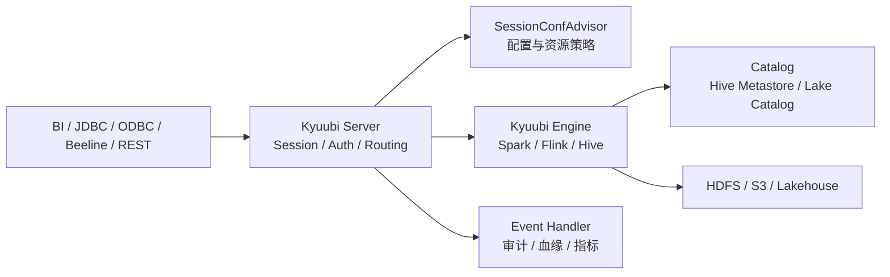

# Kyuubi

## 快速入口

| 文件 | 用途 |
|---|---|
| [知识地图](030203_知识地图.md) | Kyuubi 控制面全景、已沉淀知识点和待补缺口 |
| [版本记录](030203_版本记录.md) | Kyuubi 版本、引擎兼容性和版本敏感结论 |
| [030203_核心知识点/](030203_核心知识点/) | 已蒸馏的长期知识点 |
| [文章/](文章/) | 原始文章存档，已蒸馏文章统一使用 `done-` 前缀 |

新文章必须先判断主问题是 Kyuubi Server、Engine 生命周期、多租户隔离、Spark/Flink 引擎接入、SQL 迁移治理、审计血缘，还是纯社区动态。

## 技术定位

| 项 | 内容 |
|---|---|
| 技术名 | Apache Kyuubi |
| 一级类目 | 数据工程与数仓 |
| 二级类目 | 离线数仓 |
| 技术本体 | 面向数据仓库和湖仓的多租户 SQL 网关，向外提供 JDBC/ODBC/Thrift/REST 等访问入口 |
| 全局架构位置 | 位于客户端/BI/调度任务和 Spark/Flink/Hive 等计算引擎之间，承担统一入口、会话管理、多租户和权限隔离 |
| 主要使用者 | 数据平台工程师、数据开发、分析师、平台运维 |
| 主要产出 | SQL 服务入口、Session、Engine 实例、审计日志、资源隔离策略、多引擎代理能力 |

## 官方锚点

- 官网：[Apache Kyuubi](https://kyuubi.apache.org/)
- GitHub：[apache/kyuubi](https://github.com/apache/kyuubi)
- 下载与版本：[Kyuubi Releases](https://kyuubi.apache.org/releases.html)
- 官方文档：[Kyuubi Documentation](https://kyuubi.readthedocs.io/)

## 架构图

## 核心模块

| 模块 | 职责 | 重点问题 |
|---|---|---|
| Kyuubi Server | 接入 JDBC/Thrift/REST 请求、管理 Session、启动和转发到 Engine | 高可用、认证、路由、会话生命周期 |
| Kyuubi Engine | 执行 Spark/Flink/Hive 等 SQL 或批任务 | 引擎共享策略、资源隔离、启动成本、兼容性 |
| SessionConfAdvisor | 按用户、标签或任务类型注入配置 | ETL/即席查询差异、资源治理、成本控制 |
| Auth/Authz | 认证、授权、代理用户和权限插件 | Kerberos、LDAP、Ranger、Spark AuthZ |
| Event Handler / Metrics | 处理 SQL 事件、审计、血缘和监控 | 拨测、错误归因、容量、稳定性和 HBO |
| Batch / REST API | 批任务提交、削峰和任务生命周期管理 | 离线任务提交、状态追踪、失败恢复 |

## 横向对标

| 对标技术 | 对标点 | Kyuubi 优势 | Kyuubi 劣势 | 使用判断 |
|---|---|---|---|---|
| HiveServer2 | SQL 服务入口 | 多引擎、多租户、Engine 解耦能力更强 | 额外控制面和运维复杂度 | 只服务 Hive SQL 可用 HS2；统一 Spark/Flink/Hive 入口时评估 Kyuubi |
| Spark Thrift Server | Spark SQL 服务化 | Server/Engine 解耦、共享策略、审计和配置治理更完整 | 需要治理引擎启动和资源池 | Spark SQL 平台化、多租户共享时优先 Kyuubi |
| Flink SQL Gateway | Flink SQL 接入 | 可纳入统一 SQL 网关和多引擎入口 | Flink 状态、Checkpoint 等运行时治理仍归 Flink | 只做 Flink 专项网关看 Flink Gateway；统一入口看 Kyuubi |
| Trino Gateway | 查询入口治理 | 更贴近 Spark/Flink/Hive 生态 | 不是 MPP 交互式查询引擎 | 联邦低延迟查询看 Trino；批 SQL 和多引擎代理看 Kyuubi |

## 文章处理 SOP

1. 先判断文章是在讲 Kyuubi 本体，还是借 Kyuubi 讲 Spark/Flink/Hive。
2. 构造问题指纹：`Kyuubi + 模块 + 核心机制 + 解决问题 + 适用边界 + 认知增量`。
3. 版本发布、兼容性、引擎支持范围写入 [版本记录](030203_版本记录.md)。
4. 企业实践要优先抽取可复用准则：为什么引入、替代了谁、隔离怎么做、审计怎么做、失败怎么处理。
5. 社区动态、PMC 成员、活动回顾、礼品征集、Playground 资讯只重命名，不新建知识点。
6. 有知识贡献的文章改为 `done-` 前缀，知识点来源链接指向 `../文章/done-原文件名.md`；无贡献文章直接删除。
7. 不生成日期化中间产物；过程判断最终沉淀到本文件、知识地图或具体知识点。

## 排重判断

| 判断项 | 排重规则 |
|---|---|
| 都是版本发布 | 只进版本记录；只有改变架构判断时才追加到知识点 |
| 都是企业实践 | 按统一入口、多租户、迁移治理、审计血缘、资源隔离拆分 |
| 都是多引擎 | Spark/Flink/Hive 接入边界合并到多引擎知识点，不按引擎重复新建 |
| 都是社区动态 | 只保留来源锚点并重命名，通常不沉淀 |
| 都是小文件/迁移 | 如果主问题是 Kyuubi 承载迁移治理，放 Kyuubi；若主问题是 Spark 物理计划，转 Spark |

## 已沉淀核心知识点

| 主题 | 文件 | 问题指纹 | 解决什么问题 | 认知增量 |
|---|---|---|---|---|
| 统一 SQL Proxy 实践 | [Kyuubi统一SQLProxy实践](030203_核心知识点/Kyuubi统一SQLProxy实践.md) | Kyuubi + SQL Proxy + 多租户/权限/审计/资源隔离 + 统一查询入口 | Kyuubi 如何从 Spark SQL 代理演进为统一 SQL 入口 | 把 Kyuubi 校准为多租户 SQL Gateway，而不是 Spark/Flink/Hive 本身 |
| 多租户 SQL 网关平台化实践 | [Kyuubi多租户SQL网关平台化实践](030203_核心知识点/Kyuubi多租户SQL网关平台化实践.md) | Kyuubi + Server/Engine 解耦/共享策略/SessionConfAdvisor/Event Handler + 多租户治理 | 如何承接资源隔离、审计、血缘和监控 | Kyuubi 1.x 的关键变化是 Server 与 Engine 解耦 |
| 企业级 SQL 网关 1.8 边界 | [Kyuubi企业级SQL网关1.8边界](030203_核心知识点/Kyuubi企业级SQL网关1.8边界.md) | Kyuubi + 1.8 + Batch V2/Flink Engine/Authz/多租户/多引擎 + 控制面边界 | Kyuubi 1.8 如何补批任务削峰、多引擎、安全认证和可观测边界 | 把版本特性校准为网关控制面能力 |
| 多引擎 SQL 网关接入边界 | [Kyuubi多引擎SQL网关接入边界](030203_核心知识点/Kyuubi多引擎SQL网关接入边界.md) | Kyuubi + Spark/Flink/Hive Engine + 多引擎代理 + 统一入口边界 | Kyuubi 接入 Flink/Spark 时哪些归网关，哪些归引擎本体 | 防止把 Flink 状态、Spark 计划问题误沉淀到 Kyuubi |
| SQL 迁移与小文件治理 | [Kyuubi SQL迁移与小文件治理](030203_核心知识点/Kyuubi SQL迁移与小文件治理.md) | Kyuubi + Hive SQL 迁移 Spark + 小文件治理/AQE/配置标签 + 平台化迁移 | Kyuubi 如何承接 Hive 到 Spark 迁移和小文件治理流程 | 把迁移治理从单次 SQL 改写提升到配置、审计和双跑对比闭环 |

## 后续追查

- Kyuubi 1.11.x 与 1.8.x 在 Spark/Flink 兼容、Batch API、AuthZ、Lineage 上的差异。
- Engine 共享级别、资源池、SessionConfAdvisor 和成本统计的生产配置。
- Kyuubi EventHandler、SQL 血缘、错误规则库和 HBO 优化的可落地方式。
- Kyuubi 与 HiveServer2、Spark Thrift Server、Trino Gateway、Flink SQL Gateway 的迁移边界。
