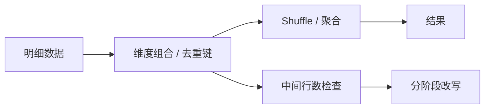

# SQL 聚合去重与膨胀治理

## 来源

- [Count-Distinct实践_ 万亿级数据量任务优化方式](<../文章/done-Count-Distinct实践_ 万亿级数据量任务优化方式.md>)
- [SQL成神之路｜求求你别用with cube了](<../文章/done-SQL成神之路｜求求你别用with cube了.md>)
- [Spark_Hive避坑指南：GROUPING SETS与COUNT(DISTINCT)的膨胀机制解析及优化](<../../030205_Spark/文章/done-Spark_Hive避坑指南：GROUPING SETS与COUNT(DISTINCT)的膨胀机制解析及优化.md>)

## 核心问题

`COUNT DISTINCT`、`GROUPING SETS`、`CUBE` 和多维聚合容易把输入数据放大为大量中间行，并让 Shuffle、排序和去重成为瓶颈。优化前必须确认去重口径、聚合维度组合和中间数据规模。

## 判断准则

| 场景 | 风险 | 处理 |
|---|---|---|
| 单字段 Count Distinct | 热点 Key、全局去重压力 | 局部去重、分桶、预聚合 |
| 多字段 Count Distinct | 组合键膨胀、内存压力 | 先降维或分阶段聚合 |
| Grouping Sets / Cube | 多维组合复制输入行 | 只保留必要组合，避免无脑全组合 |
| 聚合与明细混合 | 粒度漂移 | 拆 CTE，分别验证粒度 |

## 认知偏差

| 常见错误认知 | 正确理解 |
|---|---|
| `COUNT DISTINCT` 慢是引擎问题 | 常常是去重口径和数据分布问题 |
| `CUBE` 一行写完更高级 | 全组合聚合可能制造大量无用中间数据 |
| 预聚合一定等价 | 必须验证维度、过滤条件和去重范围 |

## 架构/流程图

## 待验证缺口

- 需要补不同引擎下多 distinct、grouping sets 和 cube 的物理计划对比。

## 重新蒸馏补充（2026-06-18）

| 来源 | 认知增量 | 处理 |
|---|---|---|
| [[03_数据工程与数仓/0302_离线数仓/030204_SQL书写/文章/done-Group By 深度优化，真实绝了！]] | 补充分组、累计去重、多维聚合和统计口径风险。 | 重新判断后补入目标知识产物 |
| [[03_数据工程与数仓/0302_离线数仓/030204_SQL书写/文章/done-SQL实战：如何写SQL求出平均数、中位数和众数？]] | 补充分组、累计去重、多维聚合和统计口径风险。 | 重新判断后补入目标知识产物 |
| [[03_数据工程与数仓/0302_离线数仓/030204_SQL书写/文章/done-SQL实战：查询不同部门中，工资top3和top20%的员工]] | 补充分组、累计去重、多维聚合和统计口径风险。 | 重新判断后补入目标知识产物 |
| [[03_数据工程与数仓/0302_离线数仓/030204_SQL书写/文章/done-SQL练习超详解——时间函数+表连接+分组+排序]] | 补充分组、累计去重、多维聚合和统计口径风险。 | 重新判断后补入目标知识产物 |
| [[03_数据工程与数仓/0302_离线数仓/030204_SQL书写/文章/done-SQL进阶技巧：如何利用Grouping_id逆向还原任意聚合结果下的维度列簇名称？ _ 多维分析应用]] | 补充分组、累计去重、多维聚合和统计口径风险。 | 重新判断后补入目标知识产物 |
| [[03_数据工程与数仓/0302_离线数仓/030204_SQL书写/文章/done-高级SQL优化 _ 告别临时表分组！PawSQL智能重写让跨表GROUP BY性能提升超百倍]] | 补充分组、累计去重、多维聚合和统计口径风险。 | 重新判断后补入目标知识产物 |
