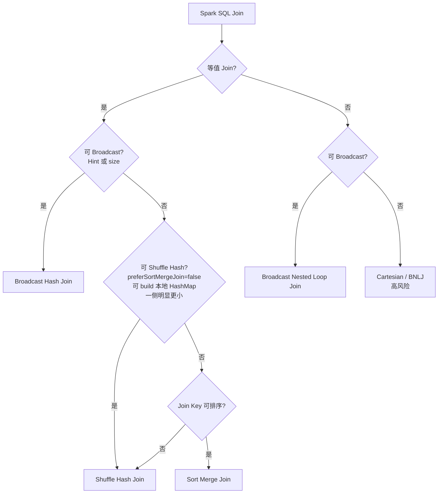

# Spark SQL Join 策略选择

## 原文锚点

- 本地文件：[Spark SQL如何选择join策略](<../文章/done-Spark SQL如何选择join策略.md>)
- 原文链接：`https://mp.weixin.qq.com/s?__biz=MzI0Mjc0MDU2NQ==&mid=2247484354&idx=1&sn=389aab2b4f4339df08d6997b7d33f479`
- 关键段落：Catalyst `JoinSelection`、build side 判断、Broadcast Hash Join、Shuffle Hash Join、Sort Merge Join、Broadcast Nested Loop Join、Cartesian Product。
- 关键图：无技术图。

## 图片处理

| 图片 | 类型 | 是否保留 | 理由 | 处理方式 |
|---|---|---|---|---|
| 无 | 无 | 不适用 | 文章主要是源码片段和规则说明 | 用流程图重建选择顺序 |

## 一句话结论

这篇文章值得精读：Spark SQL Join 策略不是“写了 hint 就一定生效”，最终由 Join 类型、统计信息、build side 条件、key 可排序性和配置共同决定。

## 用户相关性判断

| 项 | 内容 |
|---|---|
| 用户当前认知层级 | Spark / Spark SQL：L3 |
| 认知成熟度 | draft |
| 阅读投入建议 | 精读 |
| 阅读投入理由 | 能补 Spark SQL 执行计划判断准则，但仍需结合具体 Spark 版本和 AQE |
| 对用户的新信息 | hint 不是强保证；非等值 Join 容易落到 BNLJ 或 Cartesian，需要重点避坑 |
| 问题指纹 | Spark SQL + Catalyst JoinSelection + BHJ/SHJ/SMJ/BNLJ + Join 策略选择 + 执行计划判断 |
| 排重判断 | 新建 |
| 置信度 | 高 |

## 认知校准点

| 校准点 | 文章观点/信息 | 与用户认知或价值观的关系 | 处理建议 |
|---|---|---|---|
| hint 不一定按指定表执行 | 即使两边都 hint，Spark 仍可能按统计信息选更小侧 | 纠偏“hint = 强制”的常见误解 | 实践时必须看物理计划 |
| build side 受 Join 类型限制 | left/right 是否能 build 取决于 Inner/Outer/Semi/Anti 等 Join 类型 | 补 Spark Join 纵向机制 | 记住 build side 不是只看大小 |
| Shuffle Hash Join 条件苛刻 | 需要关闭 preferSortMergeJoin、一侧可 build、本地 HashMap 可构造、明显更小 | 防止误以为 SHJ 默认常见 | 只有特定场景才期待 SHJ |
| 非等值 Join 风险高 | 可能走 BNLJ 或 Cartesian | 与用户重性能和可验证偏好一致 | SQL 审查时重点识别非等值 Join |
| 版本和 AQE 未覆盖 | 原文偏静态规则 | Spark 版本/AQE 可能改变实际计划 | 后续补 AQE Join 优化专题 |

## 冲突点

| 冲突类型 | 具体表现 | 影响 | 处理 |
|---|---|---|---|
| 证据不足 | 文章给源码片段，但未说明 Spark 版本 | 不同版本规则可能差异 | 标记版本待确认 |
| 原文局限 | 未覆盖 AQE、统计信息缺失、倾斜 Join | 不能作为完整 Spark Join 优化手册 | 只沉淀 JoinSelection 基础规则 |
| 实践门槛不足 | 没有 explain 示例和测试数据 | 不能判实践 | 降为精读 |

## 待吸收点

| 分级 | 内容 | 为什么值得吸收 | 后续动作 |
|---|---|---|---|
| 理解 | Broadcast Hash Join 优先由 hint 或 size 触发 | 影响 Spark SQL 优化判断 | 看 `spark.sql.autoBroadcastJoinThreshold` 和 explain |
| 记住 | build side 不只看小表，还要看 Join 类型是否允许 | 会反复影响 outer/semi/anti join 调优 | SQL 审查时同时看 Join 类型 |
| 理解 | Shuffle Hash Join 需要本地 HashMap、明显更小和配置允许 | 解释为什么很多场景仍走 SMJ | 后续补参数和数据规模实验 |
| 记住 | Sort Merge Join 是等值 Join 常见兜底策略，前提是 key 可排序 | Spark 批处理默认常见路径 | 观察排序、shuffle、spill 成本 |
| 记住 | 非等值 Join 可能退化为 BNLJ 或 Cartesian，非常容易慢或 OOM | 排障和 SQL 审核高价值规则 | 建立 SQL 风险检查清单 |

## 已知可跳过

| 内容 | 跳过理由 |
|---|---|
| Catalyst 是 Spark SQL 优化器 | 用户大概率已知 |
| Hash Join 基本概念 | 已是通用数据库基础 |
| 文末推荐文章 | 不进入知识点 |

## 实践门槛

| 门槛 | 判断 | 证据 |
|---|---|---|
| 可运行 | 否 | 没有完整建表、数据和 explain 命令 |
| 可验证 | 否 | 没有物理计划输出和性能指标 |
| 可排障 | 部分 | 提供了 Join 策略风险判断 |
| 可迁移 | 是 | 可迁移到离线数仓 SQL 优化 |
| 结论 | 降为精读 | 后续需要补 explain 实验 |

## 归类判断

| 项 | 内容 |
|---|---|
| 技术本体 | Spark SQL |
| 文章主问题 | Catalyst 如何选择 Join 物理策略 |
| 使用场景 | 离线 SQL、数仓加工、大规模 Join |
| 关键词干扰 | Join 也属于数据库查询优化，但这里主角是 Spark 执行引擎 |
| 最终归类 | 数据工程与数仓 / 离线数仓 |
| 归类理由 | Spark 在数仓中承担离线计算引擎角色 |

## 技术定位

| 项 | 内容 |
|---|---|
| 技术类型 | 计算引擎优化规则 |
| 所属领域 | 数据工程与数仓 |
| 二级类目 | 离线数仓 |
| 全局架构位置 | Spark SQL Optimizer/Planner 到物理执行计划阶段 |
| 涉及模块 | Catalyst、JoinSelection、统计信息、Hint、Shuffle、Broadcast |
| 解决问题 | 判断 SQL 最终可能走哪种 Join 策略及风险 |
| 原文局限 | 缺 AQE、版本、explain 输出和实验 |
| 我的结论 | 以后关注，作为 Spark SQL Join 审核准则 |

## 跨域判断

| 问题 | 判断 |
|---|---|
| 它本体属于哪里 | 数据工程与数仓 / 离线数仓 |
| 这篇文章为什么可能跨域 | Join 策略也属于数据库优化通用问题 |
| 当前文章主问题是否改变分类 | 不改变，文章讨论 Spark Catalyst |
| 应避免的误归类 | 不归到 OLAP 与数据库 / 查询优化 |

## 纵向理解

| 维度 | 判断 |
|---|---|
| 全局架构 | SQL -> Logical Plan -> Optimized Logical Plan -> Physical Plan -> 执行 |
| 本文位置 | Physical Plan 生成阶段的 JoinSelection |
| 核心机制 | 按条件依次匹配 BHJ、SHJ、SMJ、BNLJ、Cartesian |
| 使用链路 | 写 SQL -> 更新统计信息 -> explain -> 看 Join 类型、build side、shuffle、broadcast |
| 前置条件 | 表统计信息准确、参数明确、Spark 版本/AQE 行为清楚 |
| 边界 | 规则判断不能替代真实 explain 和运行指标 |

## 横向对标

| 对标技术 | 实现方式 | 优势 | 劣势 | 适合场景 |
|---|---|---|---|---|
| Broadcast Hash Join | 广播小表到各 Executor，本地 hash probe | 避免大表 shuffle | 小表过大容易内存爆 | 小维表、大事实表 |
| Shuffle Hash Join | 两边按 key shuffle，一侧构建本地 HashMap | 避免排序成本 | 条件苛刻，内存压力高 | 一侧明显小且配置允许 |
| Sort Merge Join | 两边 shuffle 后排序归并 | 稳定、适合大表等值 Join | 排序和 shuffle 成本高 | 大表等值 Join 默认常见 |
| Broadcast Nested Loop Join | 广播一侧做嵌套循环 | 可处理非等值条件 | 慢，易 OOM | 小表非等值 Join，谨慎使用 |
| Cartesian Product | 笛卡尔积 | 几乎没有优势 | 极高风险 | 应尽量避免 |

## 后续追查

- 关键词：Spark JoinSelection、BroadcastHashJoinExec、ShuffledHashJoinExec、SortMergeJoinExec、BroadcastNestedLoopJoinExec、AQE。
- 相关技术：Spark 统计信息、CBO、AQE skew join、Shuffle、Celeborn。
- 需要补读的文章：Spark AQE Join 优化、Spark SQL 数据倾斜处理、Spark Shuffle 与资源治理。
