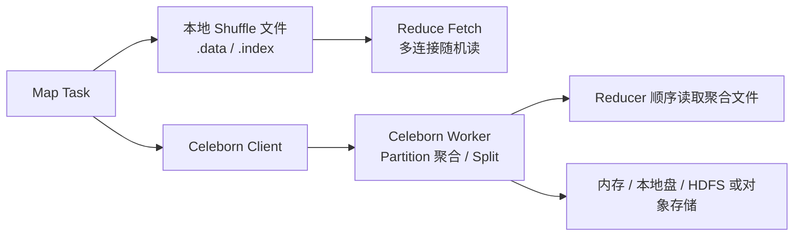

# Spark Shuffle 与 Celeborn 远程 Shuffle 边界

## 原文锚点

- 本地文件：
  - [Apache Celeborn 让 Spark 和 Flink 更快更稳更弹性](<../文章/done-Apache Celeborn 让 Spark 和 Flink 更快更稳更弹性.md>)
  - [MapReduce 的 shuffle 与 spark的 shuffle 有什么区别？](<../文章/done-MapReduce 的 shuffle 与 spark的 shuffle 有什么区别？.md>)
- 原文链接：见各本地 Markdown 头部 `url` 字段。
- 关键段落：传统 Shuffle 的随机磁盘 I/O、Fetch Failure、OOM、本地盘依赖；Celeborn 的 Push Shuffle、Partition 聚合、Split、异步刷盘/提交/Fetch、多层存储、Traffic Control、Revive、滚动升级。
- 关键图：原文多次提到 Shuffle 结构图、容错图、Traffic Control 图，但 Markdown 未保留图片。
- 相关原文：基础 Shuffle 面试题只作为对照，不单独沉淀。

## 图片处理

| 图片 | 类型 | 是否保留 | 理由 | 处理方式 |
|---|---|---|---|---|
| 传统 Shuffle 结构图 | 架构图 | 原图缺失 | 说明 Map 本地写、Reduce 拉取的随机 I/O 问题 | Mermaid 重建 |
| Celeborn Push Shuffle 图 | 架构图 | 原图缺失 | 说明中间数据服务和 Partition 聚合 | Mermaid 重建 |
| Traffic Control 图 | 流程图 | 原图缺失 | 说明反压和拥塞控制 | 文字保留，不重建细节 |

## 一句话结论

Celeborn 不是“让 Spark 变快的参数”，而是把 Shuffle/Spill 从计算节点本地盘抽成统一中间数据服务，用远程托管、Partition 聚合、容错和流控换取大 Shuffle 的稳定性、弹性和存算分离。

## 用户相关性判断

| 项 | 内容 |
|---|---|
| 用户当前认知层级 | Spark / Spark SQL：L3 draft |
| 认知成熟度 | draft |
| 阅读投入建议 | 精读 |
| 阅读投入理由 | 能补 Spark Join 之后的 Shuffle 资源治理边界，但部署和收益需要真实集群验证 |
| 对用户的新信息 | Spark Shuffle 的瓶颈不只在 SQL 计划，也在本地盘、随机 I/O、Fetch Failure、OOM 和计算节点有状态 |
| 问题指纹 | Spark + Shuffle + 远程中间数据服务/Celeborn + 大 Shuffle 稳定性/弹性 + 存算分离边界 |
| 排重判断 | 新建 |
| 置信度 | 中 |

## 认知校准点

| 校准点 | 文章观点/信息 | 与用户认知或价值观的关系 | 处理建议 |
|---|---|---|---|
| Shuffle 是系统瓶颈，不只是算子细节 | 原文把 Shuffle 归因到网络连接、随机 I/O、OOM、Fetch Failure、本地盘 | 补 Spark 纵向边界 | 与 Join 策略笔记分开沉淀 |
| Celeborn 解决的是中间数据托管 | 它接管 Shuffle/Spill，不替代 Spark 优化器 | 防止误归类 | 放在 Spark Shuffle 资源治理主题 |
| Push + Partition 聚合改变读写形态 | 同一 Partition 数据聚合到 Worker，Reducer 少读多文件 | 补机制 | 适合大 Shuffle，非所有任务必需 |
| 远程 Shuffle 也有架构代价 | 独立集群、网络路径、Worker 容量、流控和升级运维都要治理 | 符合工程落地偏好 | 不能只看性能数字 |
| 性能数据需降权 | PB、TB、20% 提升等来自特定集群 | 证据不足 | 只保留方向，不迁移数字 |

## 冲突点

| 冲突类型 | 具体表现 | 影响 | 处理 |
|---|---|---|---|
| 关键词误导 | Celeborn 同时服务 Spark 和 Flink | 容易误归实时计算 | 本文按 Spark Shuffle 边界沉淀 |
| 图片缺失 | 架构、容错、流控图均缺失 | 影响机制理解 | Mermaid 重建主链路 |
| 证据不足 | Evaluation 缺完整测试环境和对照细节 | 不能直接用于选型承诺 | 标记后续补证 |
| 实践门槛不足 | 原文只给部署方向，缺完整配置和验收脚本 | 不能判实践 | 降为精读 |

## 待吸收点

| 分级 | 内容 | 为什么值得吸收 | 后续动作 |
|---|---|---|---|
| 理解 | Spark 默认 Shuffle 依赖本地文件、索引和 Reduce Fetch | 是 Fetch Failure 和随机 I/O 的根源 | 与 History Server 指标关联 |
| 理解 | Celeborn 通过 Push Shuffle 和 Partition 聚合减少随机读和网络连接 | 解释远程 Shuffle 的价值来源 | 后续查配置和物理计划 |
| 记住 | Split、Revive、Traffic Control、Batch Revive 是稳定性关键词 | 会影响大作业故障定位 | 建立排障关键词 |
| 记住 | 是否独立部署 Celeborn 取决于是否需要存算分离和弹性 | 选型准则 | 区分混部、独立部署、存算分离 |
| 实践 | 用一个大 Join/Aggregation 作业对比本地 Shuffle 与远程 Shuffle 的 Fetch Failure、spill、磁盘、耗时 | 可验证价值 | 后续补实验设计 |

## 已知可跳过

| 内容 | 跳过理由 |
|---|---|
| MapReduce Shuffle 基础流程 | 只作为 Spark Shuffle 对照 |
| 社区发展史和活动推广 | 不影响技术判断 |
| 未给上下文的性能百分比 | 不能沉淀为通用结论 |

## 实践门槛

| 门槛 | 判断 | 证据 |
|---|---|---|
| 可运行 | 否 | 只有“部署集群、放 client jar、加参数”的方向，缺完整配置 |
| 可验证 | 部分 | 有稳定性、滚动升级、TPC-DS 对比方向，但缺本地基线 |
| 可排障 | 部分 | 提供 Fetch Failure、OOM、拥塞、Worker 不可用等信号 |
| 可迁移 | 是 | 可迁移到 Spark 大 Join、Flink Batch 和存算分离集群 |
| 结论 | 降为精读 | 需要集群级实验才能判实践 |

## 归类判断

| 项 | 内容 |
|---|---|
| 技术本体 | Spark Shuffle / Apache Celeborn |
| 文章主问题 | 如何治理大 Shuffle 的性能、稳定性和存算分离 |
| 使用场景 | Spark/Flink 大作业、批处理、湖仓计算、弹性计算集群 |
| 关键词干扰 | Flink、Lakehouse、Native、ESS 都是对照或上下游 |
| 最终归类 | 数据工程与数仓 / 离线数仓 / Spark |
| 归类理由 | 本轮关注 Spark 离线计算中的 Shuffle 资源治理 |

## 技术定位

| 项 | 内容 |
|---|---|
| 技术类型 | 计算引擎运行时 / 远程 Shuffle 服务 |
| 所属领域 | 数据工程与数仓 |
| 二级类目 | 离线数仓 |
| 全局架构位置 | Spark 执行引擎与存储/资源层之间的中间数据服务 |
| 涉及模块 | Shuffle Write/Read、Spill、Celeborn Master/Worker、流控、容错、存储层 |
| 解决问题 | 大 Shuffle 的随机 I/O、Fetch Failure、OOM、本地盘依赖和弹性不足 |
| 原文局限 | 缺完整配置、版本兼容、资源容量规划和失败注入 |
| 我的结论 | 以后关注，作为 Spark 大作业稳定性治理方向 |

## 纵向理解

| 维度 | 判断 |
|---|---|
| 全局架构 | Spark SQL/Job -> Stage -> Shuffle Write -> 中间数据 -> Shuffle Read -> 下游 Stage |
| 本文位置 | 运行时中间数据管理，不是 Catalyst JoinSelection 或建模问题 |
| 核心机制 | Push Shuffle、Partition 聚合、Split、异步刷盘、Revive、Traffic Control、多层存储 |
| 使用链路 | 部署 Celeborn -> 配置 Spark/Flink client -> 作业写入远程 Shuffle -> Worker 管理中间数据 -> Reducer 读取 |
| 前置条件 | 网络带宽、Worker 容量、磁盘健康、监控、版本兼容、失败恢复策略 |
| 边界 | 小作业或不需要弹性的混部场景未必值得引入独立远程 Shuffle |

## 横向对标

| 对标技术 | 实现方式 | 优势 | 劣势 | 适合场景 |
|---|---|---|---|---|
| Spark 本地 Shuffle | Executor/本地盘写 `.data/.index`，Reducer 拉取 | 简单、默认可用 | 随机 I/O、Fetch Failure、本地盘依赖 | 普通离线作业 |
| External Shuffle Service | NodeManager/外部服务保留 Shuffle 文件 | 支持动态资源回收 | 仍依赖节点本地盘 | YARN 传统集群 |
| Celeborn | 独立中间数据服务，Push + 聚合 + 容错 | 稳定性、弹性和存算分离更强 | 新增集群和运维复杂度 | 大 Shuffle、弹性计算、存算分离 |
| Magnet/Push Shuffle | 本地 Shuffle 基础上异步推远端 | 可改善部分读取 | 混合读路径复杂，不能彻底无状态 | 过渡优化 |

## 后续追查

- 关键词：Celeborn Push Shuffle、Partition Split、Revive、Traffic Control、Remote Shuffle、Spark Fetch Failure。
- 相关技术：Spark AQE、Gluten Native Shuffle、YARN/Kubernetes 动态资源、Flink Batch Shuffle。
- 需要补读的文章：Celeborn 配置和容量规划、Spark 远程 Shuffle 最小实验、Fetch Failure 故障复盘。
