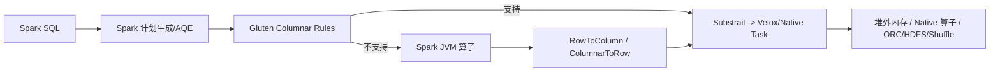

# Spark 向量化执行与 Native Engine 边界

## 原文锚点

- 本地文件：
  - [Spark向量化计算在美团生产环境的实践](../文章/done-Spark向量化计算在美团生产环境的实践.md)
  - [Spark 剖析 | Apache Spark Native Engine](<../文章/done-Spark 剖析 _ Apache Spark Native Engine.md>)
- 原文链接：见各本地 Markdown 头部 `url` 字段。
- 关键段落：SIMD、Block By Block、Gluten+Velox、ColumnarOverrideRules、Substrait、JNI、ColumnarToRow/RowToColumn、ORC Reader、Native HDFS、Shuffle 重构、HBO、一致性问题。
- 关键图：原文有多张架构图、流程图和性能图，但 Markdown 未保留图片。
- 相关原文：两篇文章问题互补，合并沉淀为一个 Native Engine 边界主题。

## 图片处理

| 图片 | 类型 | 是否保留 | 理由 | 处理方式 |
|---|---|---|---|---|
| Spark+Gluten+Velox 架构图 | 架构图 | 原图缺失 | 说明 Spark 与 Native backend 的分工 | Mermaid 重建 |
| JVM + Native 共存执行计划图 | 流程图 | 原图缺失 | 说明回退和行列转换成本 | Mermaid 重建 |
| 性能收益图 | 对比图 | 原图缺失 | 数字依赖环境，不适合直接沉淀 | 只保留指标维度 |

## 一句话结论

Spark 向量化不是“把 Spark 用 C++ 重写”，而是在保留 Spark 调度、SQL 解析、AQE 和生态连接的前提下，把可支持的物理算子下推到 Native 向量化执行；真正难点是回退、内存、文件格式、Shuffle 和结果一致性治理。

## 用户相关性判断

| 项 | 内容 |
|---|---|
| 用户当前认知层级 | Spark / Spark SQL：L3 draft |
| 认知成熟度 | draft |
| 阅读投入建议 | 精读 |
| 阅读投入理由 | 能校准 Native Engine 的真实工程边界，但需要官方和生产版本补证 |
| 对用户的新信息 | 算子覆盖率、Row/Column 转换、堆外内存、ORC/HDFS 和一致性比“性能提升倍数”更关键 |
| 问题指纹 | Spark SQL + Gluten/Velox + Native 向量化算子 + 回退/内存/ORC/HDFS/Shuffle/一致性 + 降本增效边界 |
| 排重判断 | 新建 |
| 置信度 | 中 |

## 认知校准点

| 校准点 | 文章观点/信息 | 与用户认知或价值观的关系 | 处理建议 |
|---|---|---|---|
| Native Engine 不替代 Spark 全栈 | Spark 仍负责 SQL、计划、AQE、调度和资源申请 | 纠偏“重写 Spark”标题党 | 技术定位为执行后端增强 |
| 向量化收益来自多层机制 | SIMD、列式批处理、减少虚函数调用、堆外内存、ORC/HDFS 优化共同作用 | 补机制 | 不把语言替换当核心原因 |
| 算子回退会吞掉收益 | Native 不支持 UDF/算子时需要 Row/Column 转换或 Stage 回退 | 补失败场景 | 评估覆盖率和回退比例 |
| 结果一致性是上线门槛 | count distinct、低版本 ORC、float 转 string 都可能出现差异 | 符合重可验证偏好 | 必须有黑盒对比和回退策略 |
| 性能数字要按 workload 看 | TPC-H/TPC-DS 和生产 ETL 的收益不同 | 降权宣传数字 | 只保留指标：memory-second、耗时、一致性 |

## 冲突点

| 冲突类型 | 具体表现 | 影响 | 处理 |
|---|---|---|---|
| 原目录冲突 | 美团文章原在 LLM 目录，但主问题是 Spark 执行引擎 | 误分类 | 重路由到离线数仓 / Spark |
| 证据不足 | 性能收益来自特定版本和集群 | 不能直接外推 | 标为后续补证 |
| 图片缺失 | 架构图和性能图未保留 | 影响理解 | Mermaid 重建主链路 |
| 实践门槛不足 | 缺可直接复现的 Gluten/Velox 环境 | 不能判实践 | 降为精读 |

## 待吸收点

| 分级 | 内容 | 为什么值得吸收 | 后续动作 |
|---|---|---|---|
| 理解 | Gluten 通过 Spark Plugin、Columnar Rule、Substrait、JNI 连接 Spark 与 Native backend | 这是架构位置 | 更新 Spark index |
| 理解 | Row/Column 转换和 Stage 回退是收益边界 | 防止盲目期待全局加速 | 后续查回退指标 |
| 记住 | Native 化上线必须先做端到端一致性校验 | 会影响生产可信度 | 借鉴 count + hash/checksum 对比 |
| 记住 | ORC、HDFS、Shuffle、HBO 都可能成为向量化落地瓶颈 | Native Engine 是系统工程 | 与 Celeborn/Shuffle 笔记关联 |
| 实践 | 对一个 Spark SQL 作业记录原生 Spark 与 Native 的耗时、memory-second、回退算子、一致性结果 | 能验证收益 | 后续补最小实验 |

## 已知可跳过

| 内容 | 跳过理由 |
|---|---|
| SIMD 指令历史 | 了解即可，不影响 Spark 选型 |
| Photon/Velox/Gluten 生态介绍 | 保留为对标锚点，不逐段沉淀 |
| 绝对性能提升倍数 | 缺少统一工作负载和环境 |
| 招聘、社区活动和推荐阅读 | 不进入知识点 |

## 实践门槛

| 门槛 | 判断 | 证据 |
|---|---|---|
| 可运行 | 否 | 原文给方向和命令片段，但缺完整部署环境 |
| 可验证 | 部分 | 美团提供黑盒校验思路，缺本地可跑样例 |
| 可排障 | 部分 | 提到 OOM、SIMD crash、ORC 数据丢失、distinct 错误、精度错误 |
| 可迁移 | 是 | 可迁移到 Spark SQL 引擎升级、降本和一致性验证 |
| 结论 | 降为精读 | 需要真实作业和版本环境才能实践 |

## 归类判断

| 项 | 内容 |
|---|---|
| 技术本体 | Spark SQL Native / 向量化执行 |
| 文章主问题 | 如何用 Native 向量化后端提升 Spark SQL 执行效率，并控制生产风险 |
| 使用场景 | 离线 ETL、批处理、湖仓 SQL、资源降本 |
| 关键词干扰 | LLM 目录、C++、Rust、OLAP 引擎是上下文，不改变主问题 |
| 最终归类 | 数据工程与数仓 / 离线数仓 / Spark |
| 归类理由 | 主体是 Spark 执行引擎优化和离线作业治理 |

## 技术定位

| 项 | 内容 |
|---|---|
| 技术类型 | 执行引擎增强 / Native 向量化 |
| 所属领域 | 数据工程与数仓 |
| 二级类目 | 离线数仓 |
| 全局架构位置 | Spark SQL 物理计划与 Executor 执行之间 |
| 涉及模块 | Spark Plugin、Columnar Rule、Substrait、JNI、Velox、ORC、HDFS、Shuffle、内存管理 |
| 解决问题 | Spark SQL 算子 CPU 效率、资源消耗和执行耗时 |
| 原文局限 | 版本、硬件、算子覆盖率和回退比例需要补证 |
| 我的结论 | 以后关注，适合高资源成本 Spark SQL 集群评估 |

## 纵向理解

| 维度 | 判断 |
|---|---|
| 全局架构 | SQL -> Spark 计划/AQE -> Gluten 改写 -> Native backend 执行 -> Spark 调度和结果返回 |
| 本文位置 | 物理执行层，不改变上层数仓建模、调度和 Catalog 本体 |
| 核心机制 | 列式批处理、SIMD/Native 算子、堆外内存、执行计划序列化、回退机制 |
| 使用链路 | 确认硬件/OS/版本 -> 编译部署 -> 灰度作业 -> 一致性校验 -> 监控回退和收益 |
| 前置条件 | CPU 指令集、Spark/Gluten/Velox 版本、ORC/Parquet 支持、UDF 覆盖、监控和回滚 |
| 边界 | 大量 Java UDF、TextFile、自研格式、复杂回退的作业可能收益差甚至变慢 |

## 横向对标

| 对标技术 | 实现方式 | 优势 | 劣势 | 适合场景 |
|---|---|---|---|---|
| Spark 原生 JVM | Catalyst/Tungsten/Codegen + JVM 执行 | 稳定、生态成熟 | GC、Codegen 限制、SIMD 使用弱 | 默认离线计算 |
| Gluten + Velox | Spark 插件 + C++ 向量化 backend | 可插拔、复用 Spark 调度 | 兼容、回退、一致性复杂 | 大规模 Spark SQL 降本 |
| Photon | Databricks 商业 Native 引擎 | 成熟商业落地 | 非开源，绑定平台 | Databricks Lakehouse |
| ClickHouse/Doris | Native OLAP 引擎 | 查询执行极强 | 不替代 Spark ETL 全链路 | OLAP 服务化查询 |
| DataFusion/Blaze | Rust Native 执行后端 | Rust 生态潜力 | 社区和生产成熟度需评估 | 实验或特定平台 |

## 后续追查

- 关键词：Spark Gluten、Velox、Substrait、ColumnarOverrideRules、ColumnarToRow、Native Shuffle、HBO、ETL Blackbox Test。
- 相关技术：Spark AQE、Celeborn、ORC Reader、HDFS Native Client、UDF 向量化。
- 需要补读的文章：Gluten 官方文档、Velox 支持矩阵、Spark 3.5 与 Gluten 兼容性、生产一致性验证方案。
