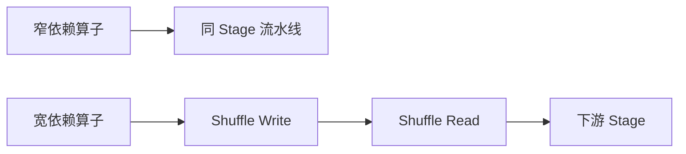

# Spark 宽窄依赖与 Shuffle 执行链路

## 来源

- [腾讯面试：什么是Spark 宽依赖、窄依赖，如何进行性能调优？](<../文章/done-腾讯面试：什么是Spark 宽依赖、窄依赖，如何进行性能调优？.md>)
- [腾讯面试：详细介绍Spark的Shuffle阶段数据从输入到输出经历了哪些步骤？](<../文章/done-腾讯面试：详细介绍Spark的Shuffle阶段数据从输入到输出经历了哪些步骤？.md>)
- [MapReduce 的 shuffle 与 spark的 shuffle 有什么区别？](<../文章/done-MapReduce 的 shuffle 与 spark的 shuffle 有什么区别？.md>)

## 核心问题

宽窄依赖不是面试概念，而是 Spark 划分 Stage、触发 Shuffle、决定数据是否跨节点移动的基础。性能和稳定性问题通常从宽依赖开始暴露。

## 判断准则

| 概念 | 判断 | 影响 |
|---|---|---|
| 窄依赖 | 子分区依赖少量父分区，可流水线执行 | 少 Shuffle，局部性好 |
| 宽依赖 | 子分区依赖多个父分区，触发 Shuffle | Stage 边界、网络/磁盘 I/O、长尾风险 |
| Shuffle Write | Map 端写中间数据、spill、排序/聚合 | 本地盘和内存压力 |
| Shuffle Read | Reduce 端拉取块、聚合、排序 | Fetch Failure、热点 Key、网络瓶颈 |

## 认知偏差

| 常见错误认知 | 正确理解 |
|---|---|
| 宽依赖一定不好 | 宽依赖是很多聚合/Join 必需代价，关键是控制数据量和分布 |
| 只要减少 Shuffle 就是优化 | 不能牺牲语义正确性和并行度 |
| Spark Shuffle 总比 MapReduce 好 | Spark 更灵活，但仍需要治理 spill、fetch、倾斜和中间数据 |

## 架构/流程图

## 待验证缺口

- 需要补 Spark UI 中识别宽依赖、Shuffle Read/Write 和长尾 Stage 的截图/字段说明。
