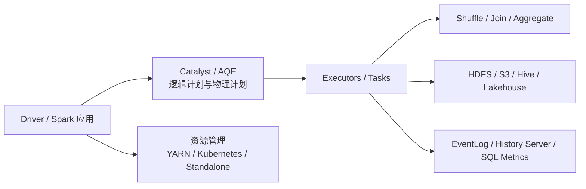

# Spark

## 快速入口

| 文件 | 用途 |
|---|---|
| [知识地图](030205_知识地图.md) | Spark 全景流程、已沉淀知识点和待补缺口 |
| [版本记录](030205_版本记录.md) | Apache Spark 版本、Scala/JDK/Hive 兼容和 Spark 4 迁移边界 |
| [030205_核心知识点/](030205_核心知识点/) | 已蒸馏的长期知识点 |
| [文章/](文章/) | 原始文章存档，已蒸馏文章统一使用 `done-` 前缀 |

新文章必须先判断主问题是 Spark SQL 计划、Join、Shuffle、AQE、资源治理、观测排障、版本升级，还是相邻技术借 Spark 做场景。

## 技术定位

| 项 | 内容 |
|---|---|
| 技术名 | Apache Spark |
| 一级类目 | 数据工程与数仓 |
| 二级类目 | 离线数仓 |
| 技术本体 | 大规模数据处理统一计算引擎，覆盖批处理、Spark SQL、DataFrame、流处理和机器学习库 |
| 全局架构位置 | 位于 HDFS/对象存储/Hive/湖仓表格式之上，承担离线数仓加工、复杂 SQL 和大规模计算 |
| 主要使用者 | 数据开发、平台工程师、算法工程师、分析工程师 |
| 主要产出 | Spark 作业、DataFrame/Dataset、Spark SQL 结果、分区文件、特征数据、批处理产物 |

## 官方锚点

- 官网：[Apache Spark](https://spark.apache.org/)
- GitHub：[apache/spark](https://github.com/apache/spark)
- 下载页：[Spark Downloads](https://spark.apache.org/downloads.html)
- Release Notes：[Spark Releases](https://spark.apache.org/releases/)

## 架构图

## 核心模块

| 模块 | 职责 | 重点问题 |
|---|---|---|
| Driver / DAG Scheduler | 生成 Job/Stage/Task，调度执行 | 任务拆分、宽窄依赖、Stage 边界 |
| Catalyst / Spark SQL | 解析、优化、生成物理计划 | Join 策略、统计信息、CBO、规则生效 |
| AQE | 运行时基于统计信息调整计划 | 分区合并、Join 策略调整、倾斜处理 |
| Shuffle | 跨分区数据重分布和中间数据传输 | Fetch Failure、磁盘 I/O、远程 Shuffle、数据倾斜 |
| 资源与内存 | 管理 Executor、内存、CPU、本地盘和网络 | OOM、并行度、动态资源、硬件配置 |
| 观测排障 | EventLog、History Server、SQL Metrics、日志 | 慢 SQL 定位、指标解释、Agent 可读化 |
| 版本生态 | Spark 3.x/4.x、Scala、JDK、Hive Catalog、Connect | 升级兼容、方言变化、依赖冲突 |

## 横向对标

| 对标技术 | 对标点 | Spark 优势 | Spark 劣势 | 使用判断 |
|---|---|---|---|---|
| Hive | 离线 SQL 与数仓加工 | Spark 更偏计算引擎，执行弹性和性能更强 | 表生态和传统治理依赖 Hive/HMS | Hive 做表和元数据，Spark 做复杂计算和执行层 |
| Flink | 流批计算 | 批处理和 Spark SQL 生态成熟 | 长状态流处理和低延迟事件语义弱于 Flink | 离线/批 SQL 优先 Spark；复杂实时状态优先 Flink |
| Trino | 交互式查询 | Spark 适合复杂 ETL、大批处理和机器学习 | 低延迟并发查询不如 MPP 查询引擎 | 服务化即席查询看 Trino/Doris；批加工看 Spark |
| Celeborn | Shuffle 服务 | Spark 本体执行计算，Celeborn 承接远程 Shuffle | 引入额外服务和运维面 | 大 Shuffle、弹性和稳定性瓶颈明显时评估 Celeborn |
| Native Engine / Gluten / Velox | 向量化执行 | 可降本增效、提升算子性能 | 算子覆盖、回退和一致性风险 | 必须用覆盖率、回退比例和结果一致性验证 |

## 文章处理 SOP

1. 先判断文章是 Spark 本体，还是 Kyuubi/Flink/AI/资源管理等相邻场景。
2. 构造问题指纹：`Spark + 模块 + 核心机制 + 解决问题 + 适用边界 + 认知增量`。
3. 优先提取认知校准点：夸大性能、缺少基线、把版本特性当生产结论、把工具替代当 Spark 本体。
4. 版本发布、Scala/JDK/Hive 兼容、Spark 4 变化写入 [版本记录](030205_版本记录.md)。
5. 有执行计划、指标、失败模式、版本差异或可验证准则时，写入 `030205_核心知识点/`。
6. 有知识贡献的文章改为 `done-` 前缀，知识点来源链接指向 `../文章/done-原文件名.md`；无贡献文章直接删除。
7. 不生成日期化中间产物；批量判断最终沉淀到本文件、知识地图或具体知识点。

## 排重判断

| 判断项 | 排重规则 |
|---|---|
| 都是 Join | 合并到 Join 策略，新增 AQE/统计信息/Hint 生效边界才追加 |
| 都是 Shuffle | 按本地 Shuffle、远程 Shuffle、宽依赖、Fetch Failure、数据倾斜拆分 |
| 都是调优清单 | 没有执行计划、指标或失败模式时降权 |
| 都是版本资讯 | 只进版本记录；改变迁移判断时再写知识点 |
| 都是 Native/Rust 替代 | 只吸收执行机制和验证边界，不采信营销性能结论 |

## 已沉淀核心知识点

| 主题 | 文件 | 问题指纹 | 解决什么问题 | 认知增量 |
|---|---|---|---|---|
| Spark SQL Join 策略选择 | [SparkSQLJoin策略选择](030205_核心知识点/SparkSQLJoin策略选择.md) | Spark SQL + Catalyst JoinSelection + BHJ/SHJ/SMJ/BNLJ + Join 策略选择 | Spark SQL 最终如何选择 Join 物理策略 | 把“写 hint 就生效”校准为统计信息、build side、Join 类型和配置共同决定 |
| Spark Shuffle 与 Celeborn 远程 Shuffle 边界 | [SparkShuffle与Celeborn远程Shuffle边界](030205_核心知识点/SparkShuffle与Celeborn远程Shuffle边界.md) | Spark + Shuffle + 远程中间数据服务/Celeborn + 大 Shuffle 稳定性 | 大 Shuffle 的随机 I/O、Fetch Failure、OOM 和本地盘依赖如何治理 | 把 Celeborn 校准为中间数据服务，而不是 Spark 参数 |
| Spark 向量化执行与 Native Engine 边界 | [Spark向量化执行与NativeEngine边界](030205_核心知识点/Spark向量化执行与NativeEngine边界.md) | Spark SQL + Gluten/Velox + Native 向量化算子 + 回退/内存/一致性 | Native Engine 的收益来自哪些机制，失败边界在哪里 | 把“Native 更快”校准为算子覆盖、回退、内存和一致性治理 |
| Spark 4 版本变化与迁移边界 | [Spark4版本变化与迁移边界](030205_核心知识点/Spark4版本变化与迁移边界.md) | Spark 4 + Scala 2.13/JDK17/ANSI/VARIANT/Connect + 迁移边界 | Spark 4 文章哪些值得关注，哪些需要官方补证 | 把版本资讯转成迁移检查清单 |
| Spark AQE 与执行计划诊断 | [SparkAQE与执行计划诊断](030205_核心知识点/SparkAQE与执行计划诊断.md) | Spark SQL + AQE + 分区合并/Join 调整/倾斜处理 + 运行时计划 | AQE 为什么会改变计划，如何诊断慢 SQL | 把 AQE 参数清单转成计划和指标验证 |
| Spark SQL 指标与 History Server 观测 | [SparkSQL指标与HistoryServer观测](030205_核心知识点/SparkSQL指标与HistoryServer观测.md) | Spark + SQL Metrics/EventLog/History Server + 慢任务诊断 + Agent 可读化 | Spark 观测数据如何服务调优和自动诊断 | 区分 UI 指标、AQE 统计和事件日志来源 |
| Spark 资源管理与硬件配置边界 | [Spark资源管理与硬件配置边界](030205_核心知识点/Spark资源管理与硬件配置边界.md) | Spark + Executor/CPU/内存/磁盘/网络/YuniKorn + 资源治理 | Spark 资源建议如何和作业形态匹配 | 防止把硬件清单写成通用答案 |
| Spark 宽窄依赖与 Shuffle 执行链路 | [Spark宽窄依赖与Shuffle执行链路](030205_核心知识点/Spark宽窄依赖与Shuffle执行链路.md) | Spark Core + 宽窄依赖/Stage/Shuffle Read Write + 性能边界 | 为什么宽依赖通常是性能和稳定性风险入口 | 把面试概念转成执行链路判断 |
| Spark Connect 生产接入边界 | [SparkConnect生产接入边界](030205_核心知识点/SparkConnect生产接入边界.md) | Spark Connect + 客户端/服务端解耦 + 生产接入 + 兼容性 | Spark Connect 适合解决什么，不适合解决什么 | 把 Connect 从新特性校准为接入形态和兼容治理 |
| Spark SQL 业务逻辑优化方法 | [SparkSQL业务逻辑优化方法](030205_核心知识点/SparkSQL业务逻辑优化方法.md) | Spark SQL + 业务逻辑改写/笛卡尔积/Stage 并发/版本行为 + 物理计划边界 | Spark SQL 写法为什么会触发非预期计划或结果风险 | 把“SQL技巧”校准为 Spark 物理计划和版本行为问题 |

## 后续追查

- Spark 4.x 与 Spark 3.x 的迁移 checklist：Scala/JDK、ANSI、VARIANT、Hive Catalog、Connect。
- AQE 对 Join、Skew、Coalesce 的实际计划变化和反例。
- History Server/EventLog 指标体系如何转成 Agent 可读的调优诊断。
- Spark Native、Gluten、Velox、Sail 等非 JVM 路线的结果一致性和回退治理。
