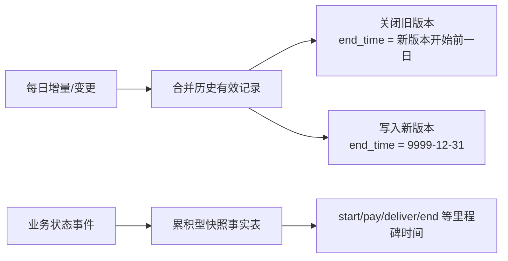

# Hive 拉链表与累积型快照事实表

## 原文锚点

- 本地文件：
  - [数仓中累积型快照事实表如何更新？| 基于Hive的更新方案](../文章/数仓中累积型快照事实表如何更新？_ 基于Hive的更新方案.md)
  - [数仓面试高频-如何在Hive中实现拉链表](../文章/数仓面试高频-如何在Hive中实现拉链表.md)
  - [详解数据仓库之拉链表（原理、设计以及在Hive中的实现）](../文章/详解数据仓库之拉链表（原理、设计以及在Hive中的实现）.md)
- 原文链接：见各本地 Markdown 头部 `url` 字段。
- 关键段落：拉链表的 `start_time/end_time` 生命周期、`9999-12-31` 当前状态、每日增量合并、累积型快照事实表的全生命周期状态字段、`FULL OUTER JOIN` 合并当前未完结分区。
- 关键图：拉链生命周期图和累积快照流转图在 Markdown 中缺失。
- 相关原文：拉链表文章问题指纹重复，本轮合并沉淀；累积快照文章作为相邻模型补边界。

## 图片处理

| 图片 | 类型 | 是否保留 | 理由 | 处理方式 |
|---|---|---|---|---|
| 拉链表生命周期图 | 说明图 | 原图缺失 | 说明一条实体记录如何形成多个有效区间 | Mermaid 重建 |
| 累积型快照状态流转图 | 流程图 | 原图缺失 | 说明订单等业务过程的多个里程碑时间如何补齐 | Mermaid 重建 |

## 一句话结论

拉链表和累积型快照事实表都处理“历史变化”，但本体不同：拉链表记录实体属性的有效区间，累积快照记录一个业务过程从开始到结束的多个里程碑状态，不能因为都用增量合并就混成一种模型。

## 用户相关性判断

| 项 | 内容 |
|---|---|
| 用户当前认知层级 | Hive / 离线数仓建模：L3-L4 draft |
| 认知成熟度 | draft |
| 阅读投入建议 | 精读 |
| 阅读投入理由 | 能补 Hive 建模落地边界，尤其是拉链表、周期快照、累积快照的差异和失败场景 |
| 对用户的新信息 | 累积快照的 `9999-12-31` 可表示未完成流程分区，但这和拉链表当前有效记录不是同一语义 |
| 问题指纹 | Hive + 数仓建模 + 拉链/累积快照 + 增量合并/有效期/里程碑时间 + 历史追踪边界 |
| 排重判断 | 新建主题；拉链表重复文章合并为相关原文 |
| 置信度 | 高 |

## 认知校准点

| 校准点 | 文章观点/信息 | 与用户认知或价值观的关系 | 处理建议 |
|---|---|---|---|
| 拉链表不是所有历史表的默认方案 | 适合变化比例不高、需要查询历史状态的实体属性 | 防止模型滥用 | 先判断变化频率、查询需求和存储成本 |
| 天粒度拉链会丢失日内多次变化 | 原文说明每日只取最后一个状态可满足大多数场景 | 补边界 | 需要日内审计时保留流水表或更细粒度 |
| 累积快照不是周期快照 | 累积快照跟踪业务生命周期，周期快照保留周期状态切片 | 纠偏分类 | 写入建模准则 |
| Hive 实现依赖覆盖写和合并 | 通过 `INSERT OVERWRITE`、增量表、历史有效记录合并实现更新 | 补工程机制 | 必须设计幂等、回溯和校验 |
| `9999-12-31` 是哨兵值，不是业务日期 | 拉链中表示当前有效，累积快照中可表示未完结流程 | 防止口径污染 | 对外查询层要封装语义 |

## 冲突点

| 冲突类型 | 具体表现 | 影响 | 处理 |
|---|---|---|---|
| 排重冲突 | 两篇拉链表文章都讲初始化、增量表、关闭旧记录、写入新记录 | 重复扩写会膨胀 | 合并为一个主题 |
| 图片缺失 | 原文多次提到示例图但 Markdown 无图片 | 生命周期理解成本上升 | Mermaid 重建 |
| 实践门槛不足 | SQL 示例可运行片段较多，但没有完整调度、补跑、异常恢复 | 不能直接当生产 SOP | 降为精读 |
| 证据不足 | 存储节省比例和查询性能建议缺少真实规模 | 不能通用化 | 只保留选型条件 |

## 待吸收点

| 分级 | 内容 | 为什么值得吸收 | 后续动作 |
|---|---|---|---|
| 理解 | 拉链表通过开始/结束日期表达实体属性有效区间 | 是维度历史追踪基础 | 加入 Hive 建模排重准则 |
| 理解 | 累积快照把一个业务过程的多个状态时间压到同一事实行 | 适合订单、履约、审批等流程分析 | 后续补事实表类型对比 |
| 记住 | 查询历史快照用 `start_date <= 查询日期 and end_date >= 查询日期` | 直接影响 SQL 正确性 | 写入模型使用准则 |
| 记住 | 每日增量只保留最终状态时，必须明确日内变化是否可丢弃 | 防止审计缺口 | 需求评审前置确认 |
| 实践 | 为拉链/累积快照建立增量合并后的行数、重复主键、时间顺序和当前记录唯一性校验 | 可迁移到数仓发布验证 | 后续沉淀校验 SQL 模板 |

## 已知可跳过

| 内容 | 跳过理由 |
|---|---|
| 拉链表基础定义反复解释 | 已在多篇重复出现 |
| 面试型标题和场景铺垫 | 对工程判断增量低 |
| 完整推荐阅读列表 | 不进入知识点 |

## 实践门槛

| 门槛 | 判断 | 证据 |
|---|---|---|
| 可运行 | 部分 | 有建表和合并 SQL 片段 |
| 可验证 | 部分 | 有时间顺序校验示例，但缺完整输入输出断言 |
| 可排障 | 部分 | 指出了归档、查询复杂度、频繁更新成本 |
| 可迁移 | 是 | 可迁移到 Hive 维表、订单履约事实、状态流转事实 |
| 结论 | 降为精读 | 需要补调度幂等、补跑和数据质量校验后才可实践 |

## 归类判断

| 项 | 内容 |
|---|---|
| 技术本体 | Hive 数仓建模 |
| 文章主问题 | 拉链表和累积型快照事实表如何在 Hive 中落地 |
| 使用场景 | 维度历史、订单状态流转、生命周期过程分析 |
| 关键词干扰 | “面试”“SQL 实现”容易误判为题库或 SQL 技巧 |
| 最终归类 | 数据工程与数仓 / 离线数仓 / Hive |
| 归类理由 | 主问题是离线数仓模型如何落到 Hive 表和分区 |

## 技术定位

| 项 | 内容 |
|---|---|
| 技术类型 | 建模模式 / Hive 实现 |
| 所属领域 | 数据工程与数仓 |
| 二级类目 | 离线数仓 |
| 全局架构位置 | ODS 增量/全量数据进入 DWD/DWS 历史追踪模型 |
| 涉及模块 | ODS、DWD/DWS、增量表、历史表、动态分区、覆盖写、数据质量 |
| 解决问题 | 低成本保留历史状态和业务过程里程碑 |
| 原文局限 | 缺生产级补跑、迟到数据、幂等和质量闭环 |
| 我的结论 | 现在用，但必须带校验和补跑策略 |

## 纵向理解

| 维度 | 判断 |
|---|---|
| 全局架构 | 源系统/流水 -> ODS -> 增量识别 -> 历史模型 -> DWS/ADS |
| 本文位置 | 建模落地层，不涉及 Hive Metastore 或 SQL 引擎优化全貌 |
| 核心机制 | 新增/变化数据与当前有效记录合并，关闭旧区间并写入新状态 |
| 使用链路 | 首日全量初始化 -> 每日增量抽取 -> 合并历史有效记录 -> 覆盖写目标表 -> 校验 |
| 前置条件 | 业务主键稳定、变更捕获可信、状态时间口径明确、可接受覆盖写成本 |
| 边界 | 高频更新、日内状态必须完整保留、强审计场景不能只靠天粒度拉链 |

## 横向对标

| 对标技术 | 实现方式 | 优势 | 劣势 | 适合场景 |
|---|---|---|---|---|
| 最新全量表 | 每天保留最新状态 | 简单、查询方便 | 无历史状态 | 只看当前状态 |
| 周期快照事实表 | 按日/月保留状态切片 | 查询某周期状态方便 | 存储膨胀 | 库存、账户余额等周期状态 |
| 拉链表 | 用有效期保存实体状态变化 | 存储相对节省，可查历史 | 查询条件复杂，更新链路复杂 | 低频变化维度和实体属性 |
| 累积型快照事实表 | 一行追踪业务过程多个里程碑 | 适合流程时长和漏斗分析 | 未完成状态和迟到更新复杂 | 订单、履约、审批、物流 |
| 流水表 | 保存每次变更事件 | 审计完整 | 分析当前/快照成本高 | 事件追溯和审计 |

## 后续追查

- 关键词：Hive 拉链表、累积型快照事实表、周期快照事实表、SCD2、`9999-12-31`、增量合并。
- 相关技术：Flink CDC、Hudi/Iceberg/Paimon Merge、数据质量校验、调度补跑。
- 需要补读的文章：迟到数据下的拉链修正、Hive 覆盖写幂等、拉链表与湖仓表格式 Merge 迁移。
