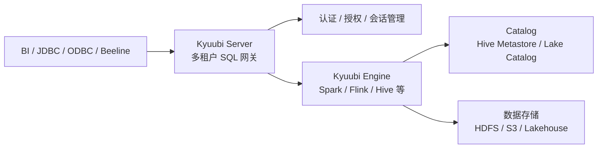

# Kyuubi
## 知识点入口

- 本模块先看宏观流程，再看文章：[流程化知识点总览](knowledge/03_数据工程与数仓/0302_离线数仓/Kyuubi/核心知识点/流程化知识点总览.md)。
- 新文章必须先归入流程节点，再判断是补充、冲突、不同层次还是降权。
- `文章/` 只保留原文锚点，长期知识必须沉淀到 `核心知识点/`。

## 技术定位

| 项 | 内容 |
|---|---|
| 技术名 | Apache Kyuubi |
| 一级类目 | 数据工程与数仓 |
| 二级类目 | 离线数仓 |
| 技术本体 | 面向数据仓库和湖仓的多租户 SQL 网关，向外提供 JDBC/ODBC/Thrift 等访问入口 |
| 全局架构位置 | 位于客户端/BI 和 Spark/Flink/Hive 等计算引擎之间，承担统一入口、会话管理、多租户和权限隔离 |
| 主要使用者 | 数据平台工程师、数据开发、分析师 |
| 主要产出 | SQL 服务入口、会话、引擎实例、审计与多租户隔离能力 |

## 官方锚点

- 官网：[Apache Kyuubi](https://kyuubi.apache.org/)
- GitHub：[apache/kyuubi](https://github.com/apache/kyuubi)
- 官方文档：[Kyuubi Documentation](https://kyuubi.readthedocs.io/)

## 架构图

## 关键理解

- Kyuubi 不是一个新的存储引擎，也不是单独的计算引擎。
- 它的主问题是“如何把 Spark/Flink/Hive 等能力以多租户 SQL 服务方式交付出去”。
- 读 Kyuubi 文章时要重点看会话、引擎生命周期、认证授权、资源隔离、服务稳定性。

## 核心模块

| 模块 | 职责 | 重点问题 |
|---|---|---|
| Kyuubi Server | 接入 JDBC/Thrift 请求、管理 Session、启动和转发到 Engine | 高可用、认证、会话和路由 |
| Kyuubi Engine | 执行 Spark/Flink/Hive 等 SQL 任务 | 生命周期、共享策略、资源隔离 |
| SessionConfAdvisor | 按用户、标签或任务类型注入配置 | ETL/即席查询配置差异、资源治理 |
| Event Handler | 处理 SQL 事件和执行事件 | 审计、错误归因、资源统计、HBO |
| Metrics/REST | 服务监控和健康检查 | 拨测、告警、容量和稳定性 |

## 横向对标

| 对标技术 | 对标点 | Kyuubi 特点 |
|---|---|---|
| HiveServer2 | SQL 服务入口 | Kyuubi 更强调多租户和多引擎 |
| Spark Thrift Server | Spark SQL 服务化 | Kyuubi 更偏统一网关和企业级隔离 |
| Trino Gateway | 查询入口治理 | Kyuubi 更贴近 Spark/Flink/Hive 生态 |

## 已沉淀核心知识点

| 主题 | 文件 | 问题指纹 | 解决什么问题 | 认知增量 |
|---|---|---|---|---|
| 统一 SQL Proxy 实践 | [Kyuubi统一SQLProxy实践](核心知识点/Kyuubi统一SQLProxy实践.md) | Kyuubi + SQL Proxy + 多租户/权限/审计/资源隔离 + 统一查询入口 + 不等同计算引擎 | Kyuubi 如何从 Spark SQL 代理演进为统一 SQL 入口 | 把 Kyuubi 校准为多租户 SQL Gateway，而不是 Spark/Flink/Hive 本身 |
| 多租户 SQL 网关平台化实践 | [Kyuubi多租户SQL网关平台化实践](核心知识点/Kyuubi多租户SQL网关平台化实践.md) | Kyuubi + SQL Gateway + Server/Engine 解耦/共享策略/SessionConfAdvisor/Event Handler + 多租户 Spark SQL 平台化 | 判断 Kyuubi 如何在统一 SQL 网关中承接资源隔离、审计、血缘和监控 | Kyuubi 1.x 的关键变化是 Server 与 Engine 解耦，并用共享策略平衡隔离和资源复用 |
| 企业级 SQL 网关 1.8 边界 | [Kyuubi企业级SQL网关1.8边界](核心知识点/Kyuubi企业级SQL网关1.8边界.md) | Kyuubi + 企业级 SQL Gateway + Batch V2/Flink Engine/Authz/多租户/多引擎 + 控制面边界 | Kyuubi 1.8 如何补批任务削峰、多引擎、安全认证和可观测边界 | 把“版本特性”校准为网关控制面能力，而不是资讯清单 |

## 后续追查

- Kyuubi EventHandler、SessionConfAdvisor、auth-extension 的版本和生产限制。
- Kyuubi 与 HiveServer2、Spark Thrift Server、Trino Gateway 的边界。
- Kyuubi 引擎高可用、资源池模式、共享策略和 SQL 粒度成本统计。
- Kyuubi 拨测、错误规则库、SQL 血缘和 HBO 优化的可落地方式。
- Kyuubi Batch V2、Flink Engine、Kerberos/LDAP/Authz 的官方版本边界和生产验证。
