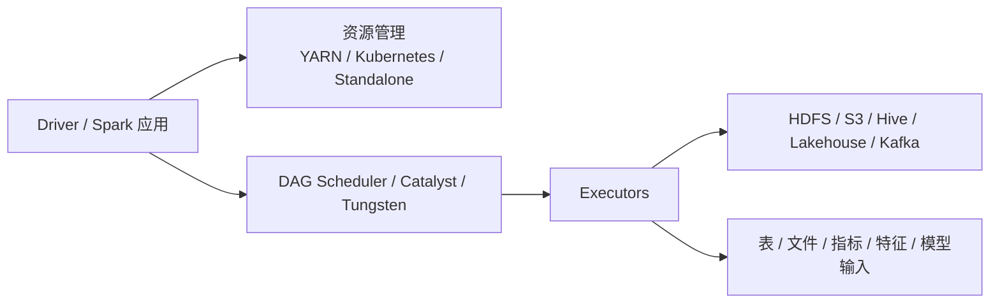

# Spark
## 知识点入口

- 本模块先看宏观流程，再看文章：[流程化知识点总览](knowledge/03_数据工程与数仓/0302_离线数仓/Spark/核心知识点/流程化知识点总览.md)。
- 新文章必须先归入流程节点，再判断是补充、冲突、不同层次还是降权。
- `文章/` 只保留原文锚点，长期知识必须沉淀到 `核心知识点/`。

## 技术定位

| 项 | 内容 |
|---|---|
| 技术名 | Apache Spark |
| 一级类目 | 数据工程与数仓 |
| 二级类目 | 离线数仓 |
| 技术本体 | 大规模数据处理统一计算引擎 |
| 全局架构位置 | 位于数据存储和上层数仓/分析应用之间，承担批处理、SQL、流处理、机器学习等计算任务 |
| 主要使用者 | 数据开发、平台工程师、算法工程师、分析工程师 |
| 主要产出 | Spark 作业、DataFrame/Dataset、Spark SQL 结果、特征数据、批处理产物 |

## 官方锚点

- 官网：[Apache Spark](https://spark.apache.org/)
- GitHub：[apache/spark](https://github.com/apache/spark)
- 官方文档：[Spark Documentation](https://spark.apache.org/docs/latest/)

## 架构图

## 关键理解

- Spark 是计算引擎，不是数仓表格式，也不是调度系统。
- Spark SQL 在数仓中常替代或补充 Hive 的执行层。
- Spark 出现在机器学习场景时，不代表 Spark 本体归机器学习；要看文章主问题是计算引擎、SQL 优化，还是模型训练流水线。

## 横向对标

| 对标技术 | 对标点 | Spark 特点 |
|---|---|---|
| Hive | 离线 SQL 与数仓加工 | Spark 更偏计算引擎，Hive 更偏表和元数据生态 |
| Flink | 流批计算 | Spark 批处理强，Flink 实时流处理和状态管理更强 |
| Trino | 查询分析 | Spark 更适合复杂批处理，Trino 更适合交互式联邦查询 |

## 已沉淀核心知识点

| 主题 | 文件 | 问题指纹 | 解决什么问题 | 认知增量 |
|---|---|---|---|---|
| Spark SQL Join 策略选择 | [SparkSQLJoin策略选择](核心知识点/SparkSQLJoin策略选择.md) | Spark SQL + Catalyst JoinSelection + BHJ/SHJ/SMJ/BNLJ + Join 策略选择 + 执行计划判断 | Spark SQL 最终如何选择 Join 物理策略，以及哪些 Join 容易慢或 OOM | 把“写 hint 就生效”校准为“Join 类型、统计信息、build side、key 可排序性和配置共同决定” |
| Spark Shuffle 与 Celeborn 远程 Shuffle 边界 | [SparkShuffle与Celeborn远程Shuffle边界](核心知识点/SparkShuffle与Celeborn远程Shuffle边界.md) | Spark + Shuffle + 远程中间数据服务/Celeborn + 大 Shuffle 稳定性/弹性 + 存算分离边界 | 大 Shuffle 的随机 I/O、Fetch Failure、OOM 和本地盘依赖如何治理 | 把 Celeborn 校准为中间数据服务，而不是 Spark 参数 |
| Spark 向量化执行与 Native Engine 边界 | [Spark向量化执行与NativeEngine边界](核心知识点/Spark向量化执行与NativeEngine边界.md) | Spark SQL + Gluten/Velox + Native 向量化算子 + 回退/内存/ORC/HDFS/Shuffle/一致性 + 降本增效边界 | Spark Native Engine 的收益来自哪些机制，失败边界在哪里 | 把“Native 更快”校准为算子覆盖、回退、内存和一致性治理问题 |

## 后续追查

- Spark AQE 对 Join 策略、Skew Join 和 Broadcast 的影响。
- Spark 统计信息、CBO 与 `EXPLAIN` 输出的关系。
- Spark Shuffle、Celeborn、资源治理对大 Join 的影响。
- Spark Native/Gluten/Velox 的算子覆盖率、回退比例和一致性验证。
