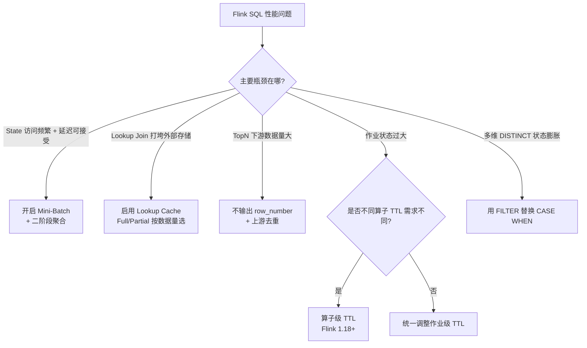

# Flink SQL 优化准则

> 验证版本：Flink 1.18+（算子级TTL）；Flink 1.13+（Lookup Join Cache）；其余特性 Flink 1.12+

## 来源
- [3年前的Flink任务优化，2025年还有效吗？](../文章/done-3年前的Flink任务优化，2025年还有效吗？.md)

## 核心问题
Flink SQL 作业性能不足时，哪些优化手段在 2025 年仍然有效？如何判断该用哪种优化？

## 判断准则

### 优先级排序（按推荐指数）

| 优化手段 | 推荐指数 | 适用场景 | 关键配置 |
|---|---|---|---|
| Mini-Batch + 二阶段聚合 | ★★★★★ | 聚合算子是 State 访问瓶颈；延迟要求分钟级（非秒级） | 见下方配置 |
| Lookup Join Cache | ★★★★★ | 维度表关联频繁；外部存储压力大 | Full/Partial Cache 按数据量选择 |
| TopN 优化 | ★★★★★ | 使用 row_number 做排名 | 不输出 row_number 字段可大幅减少下游数据量 |
| 算子级 TTL（细粒度状态 TTL） | ★★★ | 同一作业中不同算子对状态保留期要求不同 | Flink 1.18+ 支持 |
| 多维 DISTINCT 用 FILTER | ★★ | 多维度 count distinct；需注意热点问题 | 替换 CASE WHEN |

### Mini-Batch 配置与注意事项
```
table.exec.mini-batch.enabled: true
table.exec.mini-batch.allow-latency: 5s   # 按业务延迟要求调整
table.exec.mini-batch.size: 2000          # 按流量调整
```

**适用条件**（同时满足）：
- 作业对延迟无严格要求（mini-batch 会引入额外延迟）
- Aggregate 算子的 State 访问存在瓶颈
- 下游算子处理能力有限（mini-batch 减少输出量）

**关键风险**：
- Mini-batch 开/关会**改变 DAG 拓扑**，导致状态不兼容，升级时需要全量重置状态
- 开启 mini-batch 会增加内存消耗（缓存未处理数据）
- Checkpoint 时缓冲中未处理的数据可能导致恢复后重复计算

**二阶段聚合配置**：
```sql
'table.optimizer.agg-phase-strategy': 'TWO_PHASE'
'table.optimizer.distinct-agg.split.enabled' = 'true'
'table.optimizer.distinct-agg.split.bucket-num' = '2048'  -- 按数据倾斜程度调整
```

验证是否生效：执行计划中出现 `LocalAggregate` + `GlobalAggregate` 则已生效。

### Lookup Join Cache 选择
| Cache 类型 | 适用场景 | 注意事项 |
|---|---|---|
| Full Caching | 维度表数据量小（可全量放内存） | 数据量大会造成 OOM |
| Partial Caching (LRU) | 维度表数据量大 | 设置合理的 TTL 和缓存大小，避免缓存击穿 |
| No Caching | 强一致性要求（每次都需最新数据） | 对外部存储压力最大 |

### TopN 三个实用准则
1. **不要在 SELECT 中输出 row_number 字段**：不输出 row_number 可大幅减少下游数据量（每次排名变化都会发送 UPDATE 消息，含 row_number 时每个 update 都携带字段）
2. **row_number 可与 mini-batch 搭配使用**，进一步降低 State 访问
3. **在最上游（ODS 层）用 row_number 去重**：越早去重，下游处理数据量越小

### 算子级 TTL（Flink 1.18+）
**解决问题**：同一作业中排序算子需要 24 小时 TTL 保证不乱序，但聚合算子只需 4 小时 TTL。

如果只能设置作业级 TTL，则两者都用最长 TTL，状态浪费。

**配置方式（SQL Hint）**：
```sql
-- 在 SQL 中用 Hint 为特定算子指定 TTL
SELECT /*+ STATE_TTL('orders'='4h', 'state'='24h') */ ...
```

效果：对特定算子单独控制生命周期，可大幅降低大状态作业的 State 大小。

### 多维 DISTINCT 用 FILTER 替换 CASE WHEN
```sql
-- 不推荐（3 个独立 State 实例）
SELECT a,
  COUNT(DISTINCT CASE WHEN c IN ('A','B') THEN b ELSE NULL END) AS ab,
  COUNT(DISTINCT CASE WHEN c IN ('C','D') THEN b ELSE NULL END) AS cd
FROM T GROUP BY a

-- 推荐（共享 1 个 State 实例）
SELECT a,
  COUNT(DISTINCT b) FILTER (WHERE c IN ('A','B')) AS ab,
  COUNT(DISTINCT b) FILTER (WHERE c IN ('C','D')) AS cd
FROM T GROUP BY a
```

**风险**：FILTER 使用不当可能产生数据热点（多维组合分区）；需提前过滤数据，按实际情况选用。

## 认知偏差
| 常见错误认知 | 正确理解 |
|---|---|
| Mini-batch 对所有算子都有效 | 只对有状态算子（聚合、关联）有效；对无状态算子（map/filter）无效 |
| 开关 Mini-batch 是无损操作 | Mini-batch 改变 DAG 结构，状态不兼容，需重建状态 |
| TopN 一定要输出 row_number 字段 | 不输出 row_number 可减少大量 UPDATE 消息传播到下游 |
| Lookup Join 不加 Cache 也没问题 | 高并发 Lookup 不加 Cache 会打垮外部存储（如 Redis/HBase） |
| 两阶段聚合适合所有场景 | 只对满足条件的算子生效；通过执行计划确认是否真正启用 |

## 架构/流程图



## 待验证缺口
- Mini-batch allow-latency 和 size 的合理取值经验（不同流量规模）
- Partial Cache 的 LRU 大小和 TTL 如何与业务数据更新频率对齐
- 两阶段聚合的 bucket-num 设置原则（当前文章未给出具体推荐）
