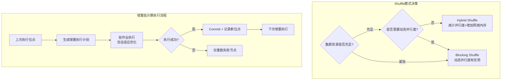

# Batch Processing 批处理调度

> 验证版本：Flink 1.15（Adaptive Batch Scheduler）/ Flink 1.16（Hybrid Shuffle, Speculative Execution）/ Flink 1.18（Runtime Filter）

## 来源
- [Hybrid Shuffle 测试分析和使用建议](../文章/done-Hybrid%20Shuffle%20测试分析和使用建议.md)
- [更快更稳更易用：Flink 自适应批处理能力演进](../文章/done-更快更稳更易用_%20Flink%20自适应批处理能力演进.md)
- [基于 Flink 进行增量批计算的探索与实践](../文章/done-基于%20Flink%20进行增量批计算的探索与实践.md)

## 核心问题
Flink 批处理有哪些新的调度优化能力？Hybrid Shuffle 和 Blocking Shuffle 如何选择？增量批计算相比流计算有什么优势和适用场景？

## 判断准则

### Shuffle 模式选择

| 维度 | Blocking Shuffle | Hybrid Shuffle |
|---|---|---|
| 数据落盘 | 全量落盘 | 内存优先，内存不足时 Spill |
| 调度约束 | 必须分 Stage（上游全完成才启动下游）| 资源充足时上下游可同时运行 |
| 资源需求 | 低（1 Slot 也能跑完）| 资源充足时效果更好 |
| 磁盘 IO | 高（读写各一次）| 低（选择性落盘大幅减少磁盘写）|
| 网络内存需求 | 固定（与并行度无关）| 与并行度线性相关 |
| 最优并行度 | = 总 Slot 数 | 约为总 Slot 数的 1/2~2/3 |
| 动态并行度 | 可配合使用且有性能优势 | 动态并行度会消除 Hybrid Shuffle 的调度优势 |

**Hybrid Shuffle 的两种落盘策略**：
- **全落盘**：适合集群不稳定 / 易 failover 场景，重启只需重跑失败节点及下游
- **选择性落盘**：适合资源多、追求高性能场景，内存中直接传输，减少磁盘写

**Hybrid Shuffle 网络内存最小需求**：
```
Write: 下游并行度 * 32KB + 1
Read:  2 * 上游并行度 * 32KB
```
（Blocking Shuffle 网络内存需求与并行度无关，默认 512 * 32KB Write + 1000 * 32KB Read）

### Hybrid Shuffle 使用建议（TPC-DS 实测）

1. **适当减少并行度**：让 2~3 个 Stage 同时运行，最优并行度通常为总 Slot 数的 1/2 或 2/3
   - 例外：存在计算重的瓶颈算子时，提高并行度反而更好（如某 Query 并行度 1500 vs 500 执行时间减少 47%）
2. **增加网络层内存**：每增加 1G 网络层内存（TM 内存同步增大），Hybrid Shuffle 吞吐提升明显；Blocking Shuffle 对此不敏感
3. **避免与动态并行度同时使用**：动态并行度要求 Stage 严格顺序执行，Hybrid Shuffle 的提前调度优势无法发挥

### 预测执行（Speculative Execution，Flink 1.16+）

解决慢节点（热点机器）拖慢批作业完成时间的问题。

**机制**：
1. `SlowTaskDetector` 检测执行时间超过同 Stage 中位数一定倍数的慢任务
2. 将慢任务所在机器加入黑名单（`BlocklistHandler`）
3. 在未加黑的节点上启动预测执行实例（与慢任务消费相同数据）
4. 最先完成的实例被认可，其他实例被取消并清理数据

**限制**：Sink 节点暂不支持预测执行（需确保 commit 只发生一次）

### 动态分区裁剪（Dynamic Partition Pruning，Flink 1.16+）

对 Join 中有 Filter 作用在维表上的场景，在运行时将维表 Filter 结果传给事实表 Scan，跳过无效分区。

**典型收益**：基于 TPC-DS 10T 数据集，分区表查询时间减少约 30%。

**实现关键**：
- 引入 `DynamicFilterDataCollector` 节点收集 Filter 数据并传给 Source
- 引入 `OrderEnforce` 节点确保维表侧先于事实表侧执行

### 增量批计算

**适用场景**：需要近实时（分钟级）数据产出，但不需要秒级时效性；重状态（如双流 Join）且希望节省资源。

**与流计算、全量批计算的对比**：

| 维度 | 流计算 | 增量批计算 | 全量批计算 |
|---|---|---|---|
| 时效性 | 秒级 | 分钟级 | 小时/天级 |
| 资源占用 | 持续占用 | 按需，执行完释放 | 按需 |
| 状态开销 | 高（需维护状态）| 无内置状态 | 无 |
| 成本随时效性变化 | 基本固定（持续运行）| 随间隔调整灵活 | 时效性高时急剧上升 |
| 回刷成本 | 高 | 低（只重算变更数据）| 高（全量重算）|

**增量批计算核心机制（基于 Flink + Paimon）**：
1. **执行进度记录**：作业成功 Commit 后持久化各 Source 位点（轻量级，无需 Barrier 对齐）
2. **增量执行计划生成**：在 Logical RelNode Tree 阶段改写，生成 delta 执行计划
3. **Inner Join 的增量改写**：`delta(A JOIN B) = (delta_A JOIN B_prev) UNION (A_latest JOIN delta_B)`（因此依赖全量数据，需要 Runtime Filter 控制实际数据量级）
4. **Runtime Filter**：将小表的 Join Key 构建过滤器下推到大表 Scan，控制读取数据量至增量级别

**典型性能测评（有限流作业）**：
- 简单 ETL：增量计算（5分钟）比流计算快约 20%
- 双流 Join：增量计算执行耗时不足流计算的 1/2，随间隔增大降至 1/3

**配置示例**：
```yaml
table.materialized-table.refresh-mode: auto  # Auto 模式自动选增量/全量
incremental.checkpoint.path: hdfs://...       # 存储执行位点
scan.watermark.begin: auto                    # 自动续接上次位点
scan.watermark.end: latest                    # 处理到当前时间点
```

## 认知偏差

| 常见错误认知 | 正确理解 |
|---|---|
| Hybrid Shuffle 并行度越大越好 | Hybrid Shuffle 最优并行度通常是总 Slot 数的 1/2~2/3（让更多 Stage 并行），除非存在计算瓶颈算子 |
| Hybrid Shuffle 和动态并行度可以一起用获取双重收益 | 动态并行度要求 Stage 顺序执行，消除了 Hybrid Shuffle 的调度优势，两者不应同时使用 |
| 增量批计算只需要增量数据，不涉及全量 | Inner Join 的增量改写依然需要全量数据；Runtime Filter 是控制实际读取量的关键手段 |
| Blocking Shuffle 在所有批作业中性能都比 Hybrid 差 | Hybrid Shuffle 对广播处理场景性能有待优化（1.16 版本），需根据作业特征选择 |
| 增量批计算可以替代流计算 | 增量批计算适合分钟级时效，无法替代需要秒级甚至毫秒级时效的流计算场景 |

## 架构/流程图



## 待验证缺口
- Hybrid Shuffle 广播处理场景的优化是否在 1.17 中完成（文章提到 1.17 预计总体减少 17%）
- Runtime Filter 对 Bloom Filter Pushdown 的支持进展（文章提到计划支持）
- 增量批计算的 Retract 数据（Delete/Update）支持进展
