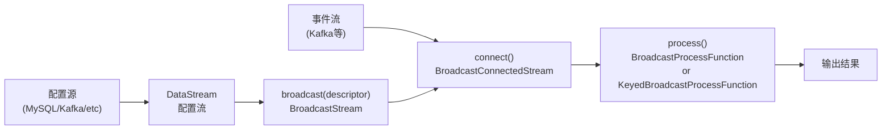

# Broadcast State 动态配置更新模式

> 验证版本：Flink 1.5+

## 来源
- [基于Flink Broadcast State实现动态更新配置](../文章/done-基于Flink%20Broadcast%20State实现动态更新配置.md)
- [Flink技术实践-90%都会踩的状态坑](../文章/done-Flink技术实践-90%25都会踩的状态坑.md)

## 核心问题
当一条数据流需要根据规则或配置处理数据，而规则/配置又随时变化时，如何实现不停作业地动态更新这些规则？Broadcast State 解决的就是"将一个小的配置流广播到所有并行实例，让主流能实时按最新规则处理数据"这个模式。

## 判断准则

### 适用场景判断
- 需要动态规则/配置（维表、黑白名单、事件规则引擎）且配置量不大（可放内存）
- 不能简单用 Open 方法加载静态配置（因为需要热更新）
- 不希望重启作业来刷新配置

### 核心约束（必须记住）

| 约束 | 说明 |
|---|---|
| 数据类型 | Broadcast State 只支持 Map 类型（Key-Value） |
| 写入权限 | 只能在 `processBroadcastElement` 方法（广播侧）中修改；`processElement`（主流侧）只读 |
| 顺序不保证 | 同一广播消息在各 Task 中的处理顺序可能不同，基于顺序的逻辑需注意 |
| Checkpoint 行为 | 每个 Task 都会 Checkpoint 广播状态（N 个并行度 = N 份状态副本） |
| 存储限制 | Broadcast State 保存在内存中，不能使用 RocksDB State Backend |

### 使用流程



### 两种 BroadcastProcessFunction 选择

| 函数类型 | 适用场景 | 主流侧状态 |
|---|---|---|
| `BroadcastProcessFunction` | 主流无需按 key 分区 | 无 Keyed State |
| `KeyedBroadcastProcessFunction` | 主流已经 keyBy 过 | 可访问 Keyed State |

### 标准实现骨架

```java
// 1. 定义 MapStateDescriptor
MapStateDescriptor<Void, Map<String, UserInfo>> configDescriptor =
    new MapStateDescriptor<>("config", Types.VOID,
        Types.MAP(Types.STRING, Types.POJO(UserInfo.class)));

// 2. 将配置流广播
BroadcastStream<Map<String, UserInfo>> broadcastStream =
    configStream.broadcast(configDescriptor);

// 3. 主流 connect 广播流
BroadcastConnectedStream<Event, Map<String, UserInfo>> connectedStream =
    eventStream.connect(broadcastStream);

// 4. process 方法中：广播侧写，主流侧只读
connectedStream.process(new BroadcastProcessFunction<Event, Map<String,UserInfo>, Output>() {

    @Override
    public void processElement(Event value, ReadOnlyContext ctx,
                               Collector<Output> out) throws Exception {
        // 只读广播状态
        ReadOnlyBroadcastState<Void, Map<String, UserInfo>> state =
            ctx.getBroadcastState(configDescriptor);
        Map<String, UserInfo> config = state.get(null);
        // 按配置处理事件...
    }

    @Override
    public void processBroadcastElement(Map<String, UserInfo> value,
                                        Context ctx,
                                        Collector<Output> out) throws Exception {
        // 唯一可以写广播状态的地方
        BroadcastState<Void, Map<String, UserInfo>> state =
            ctx.getBroadcastState(configDescriptor);
        state.clear();      // 先清空旧配置
        state.put(null, value); // 写入新配置
    }
});
```

### Broadcast State 扩缩容行为
扩容或缩容时，广播状态会被复制到所有新的并行实例中（每个实例持有完整副本）。这与 ListState 的均分分配不同。

## 认知偏差

| 常见错误认知 | 正确理解 |
|---|---|
| 主流侧可以修改广播状态 | 只有 `processBroadcastElement` 中可以写，主流侧是 `ReadOnlyBroadcastState` |
| 广播状态可以用 RocksDB 后端 | 不行，广播状态只存内存，与 State Backend 配置无关 |
| 广播到所有实例是有序的 | 各 Task 处理广播消息顺序可能不同，不要依赖到达顺序做逻辑 |
| Checkpoint 时广播状态只存一份 | 每个 Task 都各存一份，N 并行度 = N 倍存储 |
| 用 Broadcast State 存大量配置 | Broadcast State 在内存中，配置量过大会 OOM；大规模配置应考虑维表 Join 或外部存储 |

## 待验证缺口
- 广播配置流的并行度设置对正确性的影响（并行度 > 1 时能否保证所有实例看到同一版本配置）
- `processBroadcastElement` 抛出异常时，广播状态是否部分更新（是否有事务语义）
- 广播状态 Checkpoint 时的实际存储放大系数（并行度 50 时，1MB 配置 = 50MB 状态空间）

## 重新蒸馏补充（2026-06-18）

| 来源 | 认知增量 | 处理 |
|---|---|---|
| [[03_数据工程与数仓/0303_实时计算/030301_Flink/文章/done-Flink 多流广播（上）]] | 补充该主题的生产案例、机制边界或排重样例。 | 重新判断后补入目标知识产物 |
