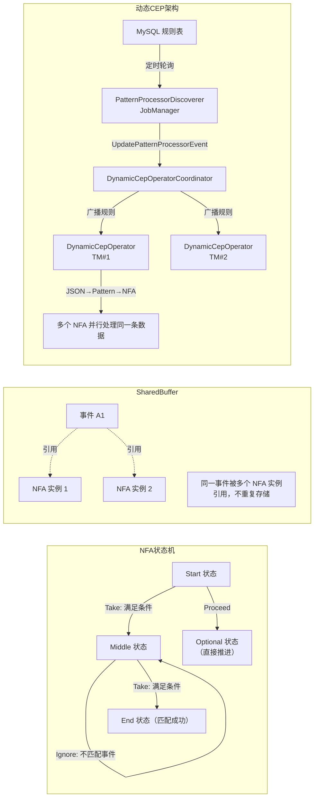

# CEP 复杂事件处理：NFA 模型、状态控制与动态规则更新

## 来源
- [拒绝状态爆炸！一文看透 Flink CEP 复杂事件处理机制](../文章/done-拒绝状态爆炸！一文看透 Flink CEP 复杂事件处理机制.md)
- [深入浅出Flink CEP丨如何通过Flink SQL作业动态更新Flink CEP作业](../文章/done-深入浅出Flink CEP丨如何通过Flink SQL作业动态更新Flink CEP作业.md)

## 核心问题
用 DataStream API 自己维护多步事件序列匹配时，需要手写 KeyedProcessFunction + 多个 State + Timer 超时，代码冗长且难以维护。这个知识点回答：CEP 底层如何自动管理状态（NFA 模型）？连续性策略（next/followedBy/followedByAny）有哪些性能差异？如何避免状态无限膨胀？以及如何在不重启任务的情况下动态更新匹配规则？

## 判断准则

### NFA 状态流转三种动作

| 动作 | 说明 | 触发场景 |
|---|---|---|
| Take（采纳） | 接受当前事件，进入下一状态 | 事件满足当前 Pattern 条件 |
| Ignore（忽略） | 忽略当前事件，停留当前状态 | 宽松匹配策略（followedBy）等待匹配 |
| Proceed（推进） | 不依赖事件直接进入下一状态 | 处理 `optional()` 可选状态 |

### 连续性策略对比

| 策略 | API | 含义 | 性能 |
|---|---|---|---|
| 严格连续 | `next()` | 中间不能有其他事件 | 最低开销 |
| 松散连续 | `followedBy()` | 允许中间有不匹配事件，不回溯 | 中等 |
| 非确定性松散连续 | `followedByAny()` | 允许中间有不匹配事件，且回溯所有可能分支 | 最高开销 |
| 否定模式 | `notNext()` / `notFollowedBy()` | 指定不期望出现的事件 | — |

**示例**（数据流：`[a1, c, b1, b2]`）：
- `begin("a").next("b")` → 无匹配（c 隔断了 a1 和 b1）
- `begin("a").followedBy("b")` → 匹配 `[a1, b1]`
- `begin("a").followedByAny("b")` → 匹配 `[a1, b1]` 和 `[a1, b2]`

性能开销：`followedByAny > followedBy > next`（`followedByAny` 为每个可能匹配创建新的 NFA 分支）

### 量词（控制匹配次数）

```java
.times(3)          // 恰好 3 次
.times(2, 4)       // 2 到 4 次
.oneOrMore()       // 1 次或更多（无上限！慎用）
.timesOrMore(2)    // 2 次或更多
.optional()        // 0 次或 1 次
.oneOrMore().greedy()  // 贪婪：尽可能多匹配
```

### 条件类型

```java
// 简单条件：只看当前事件
.where(SimpleCondition.of(e -> e.getPrice() > 100))

// 迭代条件：可访问之前已匹配事件（有内存开销）
.where(new IterativeCondition<>() {
    public boolean filter(Event v, Context<Event> ctx) {
        double sum = 0;
        for (Event e : ctx.getEventsForPattern("prev")) sum += e.getAmount();
        return sum + v.getAmount() > 1000;
    }
})

// 组合：OR / AND（链式 where 等于 AND）
.where(c1).or(c2)    // OR
.where(c1).where(c2) // AND
```

### 状态控制最佳实践

```java
// 1. 必须 keyBy，按业务主键分区
inputStream.keyBy(Event::getUserId)

// 2. 设置 within 上限——不设置会导致部分匹配状态永久存活
pattern.within(Time.minutes(30))

// 3. oneOrMore 加 until 终止条件（否则状态无上限）
// ❌ 危险
.oneOrMore()
// ✅ 安全
.oneOrMore().until(SimpleCondition.of(e -> e.getType().equals("end")))

// 4. 大状态场景用 RocksDB
env.setStateBackend(new EmbeddedRocksDBStateBackend())

// 5. 前置过滤减少 NFA 压力
DataStream<Event> filtered = inputStream.filter(e -> relevantTypes.contains(e.getType()));
PatternStream<Event> ps = CEP.pattern(filtered.keyBy(...), pattern);
```

### 超时处理（侧输出）

```java
OutputTag<TimeoutEvent> timeoutTag = new OutputTag<>("timeout"){};
SingleOutputStreamOperator<CompleteEvent> result = patternStream.select(
    timeoutTag,
    // 超时处理
    (Map<String, List<Event>> p, long ts) -> new TimeoutEvent(p.get("start").get(0)),
    // 正常匹配
    (Map<String, List<Event>> p) -> new CompleteEvent(p)
);
DataStream<TimeoutEvent> timeouts = result.getSideOutput(timeoutTag);
```

### CEP 时间语义

| 模式 | 行为 | 迟到事件 |
|---|---|---|
| Event Time | 依赖 Watermark 推进，保证有序处理 | Watermark 之后到达的迟到事件**默认丢弃** |
| Processing Time | 按到达顺序处理，不保证全局有序 | 无迟到概念 |

生产建议：**优先使用 Event Time**，迟到事件丢弃行为是预期行为，不需要"捞回"。

### 动态规则更新架构

静态 CEP 的问题：规则改变必须重启任务，影响服务可用性；一个事件流需要匹配多个规则时需部署多个作业，浪费资源。

**动态 CEP 核心组件**：

| 组件 | 职责 |
|---|---|
| `PatternProcessorDiscoverer` | 运行在 JobManager，定时轮询数据库（如 MySQL）获取规则变更，通知 PatternProcessorManager |
| `DynamicCepOperatorCoordinator` | 实现 OperatorCoordinator，接收变更后通过 `UpdatePatternProcessorEvent` 发送给所有 DynamicCep 算子 |
| `DynamicCepOperator` | 接收 `UpdatePatternProcessorEvent`，将 JSON/SQL 规则转为 Pattern → NFA，多规则存入 Map；同一条数据被所有 NFA 并行处理 |
| `PatternProcessFunction` | 处理匹配结果；在 JobManager 初始化后序列化发送到 TaskManager |

**关键限制**：
- 多个 `PatternProcessFunction` 的输出结构必须一致（统一发下游）
- 如需替换 `PatternProcessFunction` 的 JAR，仍需重启（热加载不支持）
- 使用 `DYNAMIC MATCH_RECOGNIZE` 语法在 Flink SQL 中接入动态 CEP

```sql
INSERT INTO sink
SELECT id_total as id
FROM source
    DYNAMIC MATCH_RECOGNIZE (
        PARTITION BY productionId
        ORDER BY procTime
        OUTPUT (id_total int)
        WITH_PATTERN (
            'tableName' = 'dynamic_cep',
            'jdbcUrl' = 'jdbc:mysql://...',
            'jdbcIntervalMillis' = '1000'
        )
    ) AS T;
```

## 认知偏差

| 常见错误认知 | 正确理解 |
|---|---|
| `oneOrMore()` 是安全的量词 | 无上限量词会导致大量部分匹配状态积压，必须配合 `within()` 或 `until()` |
| `followedBy` 和 `followedByAny` 功能一样 | `followedByAny` 回溯所有可能分支，开销远高于 `followedBy`，高并发场景要谨慎 |
| CEP 不需要 keyBy，全局匹配即可 | 不 keyBy 会导致所有数据发到同一算子，既无法并行又会混淆不同用户的事件序列 |
| 动态 CEP 完全零停机 | 规则数据（Pattern）可热更新，但替换 `PatternProcessFunction` 实现类仍需重启 |
| Event Time 模式下迟到事件会等待处理 | CEP Event Time 模式下迟到事件**默认丢弃**，不同于普通窗口的 `allowedLateness` |

## 架构/流程图



## 待验证缺口
- `SharedBuffer` 在高并发匹配场景下的实际内存放大倍数
- `DYNAMIC MATCH_RECOGNIZE` 是 Flink 官方语法还是特定平台扩展（袋鼠云/数栈）
- 动态 CEP 在 Checkpoint 期间规则变更的一致性保证
- `notFollowedBy` 在 Event Time 模式下与 Processing Time 的行为差异
- 多规则同时匹配时 `PatternProcessFunction` 输出结构统一的具体实现方式
