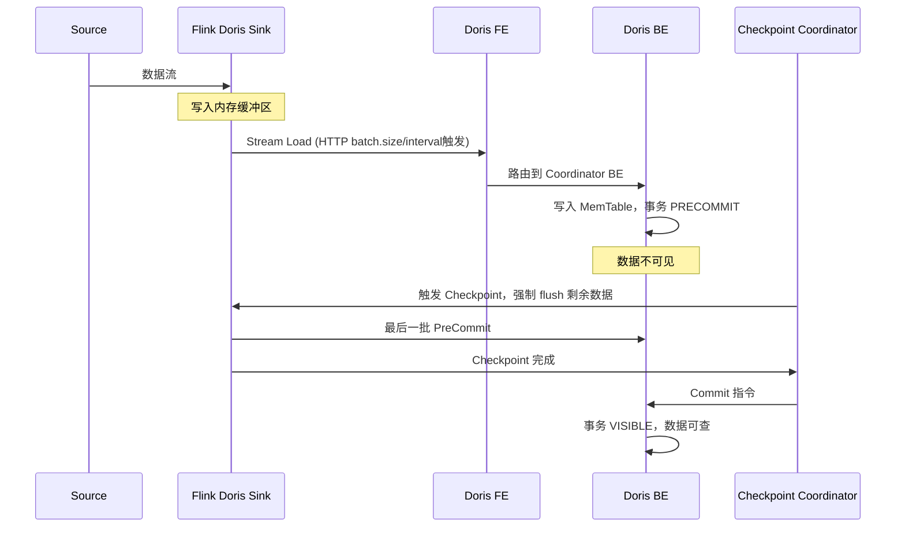

# FlinkDorisConnector写入机制

> 验证版本：flink-doris-connector 1.5.0+（batch-sink），2PC 机制适用所有版本

## 来源
- [Flink 写Doris原理解析和性能调优](../文章/done-Flink 写Doris原理解析和性能调优.md)
- [了解Flink-doris-connector sink实现逻辑，这一篇就够了！](../文章/done-了解Flink-doris-connector sink实现逻辑，这一篇就够了！.md)
- [从被产品经理"支配"到独当一面，"蚁人"Flink Doris Connector带我起飞](../文章/done-从被产品经理_支配_到独当一面，_蚁人_Flink Doris Connector带我起飞.md)

## 核心问题
Flink 写 Doris 如何保证高吞吐与 Exactly-Once 一致性？Checkpoint 与 Doris 事务的关系是什么？batch-sink 和 checkpoint-dependent sink 有何区别？

## 判断准则

### 写入架构选择
| 场景 | 推荐模式 | 说明 |
|---|---|---|
| 需要 Exactly-Once | Checkpoint 模式（2PC）| sink 写入依赖 Checkpoint 触发 Commit |
| 高吞吐批量写入、可接受 At-Least-Once | batch-sink 模式（1.5.0+）| 独立双队列，不依赖 Checkpoint |
| 跨 VPC / 存算分离 Doris | copy 模式（1.6.0+）| 先写对象存储再 LOAD |

### 2PC（Checkpoint 协同）完整流程
1. **数据缓存阶段**：数据进入 Sink 内存缓冲区，满足以下任一条件才 flush 发送到 Doris：
   - `sink.batch.size` 条数触发（默认 10w 条，旧版 100 条）
   - `sink.batch.interval` 时间触发（默认 1s）
   - `sink.batch.byte.size` 字节触发（默认 100MB）
   - Checkpoint 触发时强制 flush 所有剩余数据
2. **PreCommit 阶段**：数据写入 Doris BE MemTable，事务状态 PRECOMMIT，数据不可见
3. **Checkpoint 成功 → Commit**：Doris 发布数据版本，状态 VISIBLE，数据可查
4. **Checkpoint 失败 → Abort**：Doris 清理所有预提交数据，防止脏写

关键结论：**一个 Checkpoint 周期内可以有多个批次 PreCommit，但只触发一次 Doris Commit**

### batch-sink 双队列机制（1.5.0+）
- `writeQueue`：存放 `BatchRecordBuffer`，每个 buffer 申请 `sink.buffer-flush.max-bytes` 大小的内存
- `readQueue`：buffer 满后移入此队列，由 `LoadAsyncExecutor` 异步线程消费，调用 Stream Load
- 触发条件：buffer 占用 > max-bytes×80% 或 行数 > `sink.buffer-flush.max-rows`
- 后台定时任务：`sink.buffer-flush.interval` 控制强制 flush 间隔
- 优化（24.0.0）：write-queue 和 read-queue 合并为 flush-queue，减少内存拷贝延迟

### Stream Load 底层机制
- 协议：HTTP，访问 Doris FE 8030 端口
- FE 路由请求到 Coordinator BE（按分区分桶规则）
- Coordinator BE 接收数据，按分桶分发到各 BE
- BE 写入 MemTable，满后异步落盘为 Rowset
- **Label 幂等性**：每批次生成唯一 Label（格式 `flink_ckp_{ckpId}_{subtaskId}`），重复 Label 直接跳过，防止 Failover 重复写入
- 前提：Doris >= 0.14.0，且 `enable_http_server_v2 = true`

### 关键调优参数
```
# 批次控制（平衡吞吐与延迟）
sink.batch.size: 20000           # 建议 1w~5w
sink.batch.interval: 2s          # 建议 1s~3s
sink.batch.byte.size: 30MB       # 建议 10MB~50MB
sink.flush.queue-size: 3         # 异步队列深度，默认 2

# Checkpoint 配置（flink-conf.yaml）
execution.checkpointing.interval: 10000      # 建议 10s~30s
execution.checkpointing.timeout: 30000       # 建议间隔 2~3 倍
execution.checkpointing.max-concurrent-checkpoints: 1  # 避免并发 CKP 压 Doris
execution.checkpointing.unaligned: true      # 反压场景必开（Flink 1.15+）

# 批次间隔与 Checkpoint 间隔关系
# 批次间隔 ≤ Checkpoint 间隔的 1/5 ~ 1/10，确保一个 CKP 内有多个批次
```

### Flink 端并发配置原则
- **全局并行度**：与 Doris 表分桶数、Kafka 分区数匹配
- **Sink 并行度**：建议 ≤ 全局并行度；单个 Doris BE 节点建议承载 3~5 个 Sink 并行度
- **数据倾斜**：热点 Key 用盐值打散（`key + "_" + random.nextInt(parallelism)`），二次聚合去盐

### Doris 端调优
- BE 写入线程：`stream_load_process_thread_num` = CPU 核数 × 1~2 倍
- 副本数：高可用场景 3 副本，写入优先场景可降至 1 副本
- Compaction：增大 `base_compaction_num_threads`，防止小文件堆积慢查询
- Label TTL：`label_ttl_second`（默认 3600s），避免过期 Label 堆积

## 认知偏差
| 常见错误认知 | 正确理解 |
|---|---|
| Checkpoint 成功即意味着数据已写入 Doris 且可见 | Checkpoint 成功时才触发 Doris Commit，之前的批次处于 PreCommit（不可见）状态 |
| batch-sink 模式也能保证 Exactly-Once | batch-sink 不依赖 Checkpoint，仅提供 At-Least-Once，需下游幂等处理 |
| batch.size 越大写入越快 | 批次过大会导致缓冲区 OOM 和 Doris Stream Load 超时，需与内存配置匹配 |
| Flink 写入成功但 Doris 查不到数据是 Bug | 可能是 Checkpoint 未成功，Doris 事务仍在 PreCommit 状态未 Commit |
| 并行度越高写入越快 | 超过 Doris BE 承载能力（每 BE 建议 3~5 个 Sink 并行度）反而导致超时和倾斜 |

## 架构/流程图


（基于原文描述重建）

## 常见问题与解决方案
| 问题 | 现象 | 解决方案 |
|---|---|---|
| Label 重复 | `Label [xxx] has already been used` | 更换 `sink.label-prefix`，加时间戳前缀 |
| 事务超时 | `transaction [xxx] not found` | 调大 FE 配置 `streaming_label_keep_max_second`（建议 43200，即 12h）|
| 并发写入超限 | `current running txns on db xxx is 100` | 调大 `max_running_txn_num_per_db`（建议 1000）|
| TM OOM | OutOfMemoryError，TaskManager 重启 | 减小 batch.size/byte.size，增大 TM 内存，控制 flush.queue-size |
| Doris Compaction 跟不上 | 写入变慢，BE 磁盘 IO 高 | 增大 Compaction 线程数，调大批次间隔减少小文件 |

## 待验证缺口
- copy 模式（对象存储 → Doris）的一致性保证机制是否也依赖 Checkpoint 2PC
- 24.0.0 合并 flush-queue 后，内存使用与原双队列相比实测提升数据
- 非对齐 Checkpoint（unaligned）与 Doris PreCommit 事务堆积是否存在交互问题
